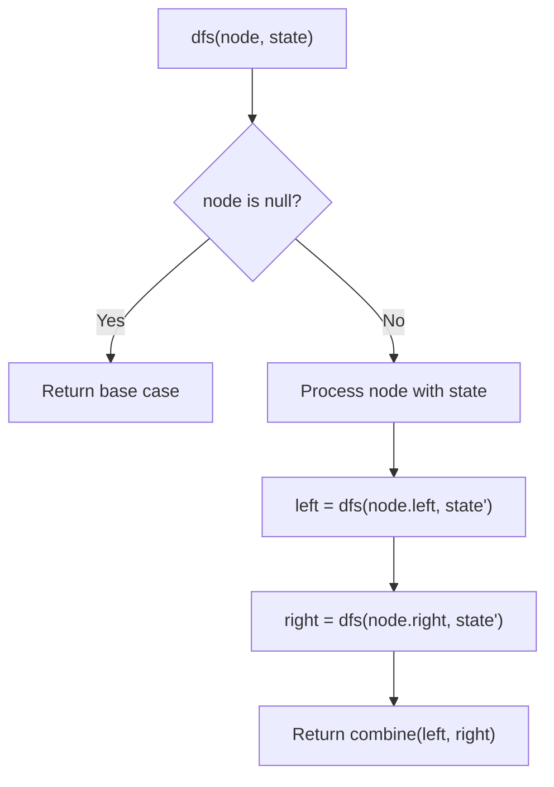
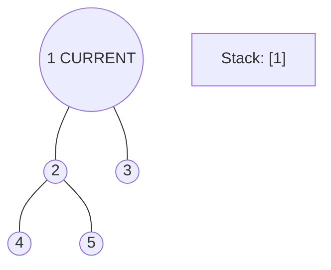
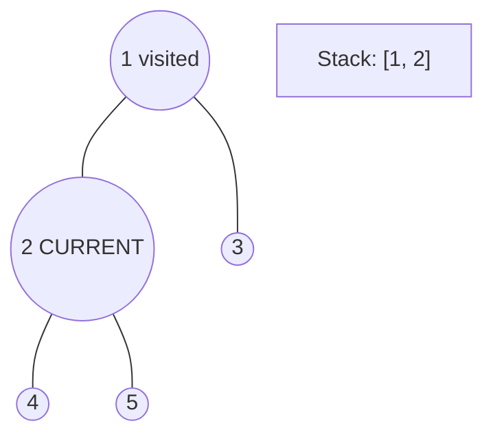
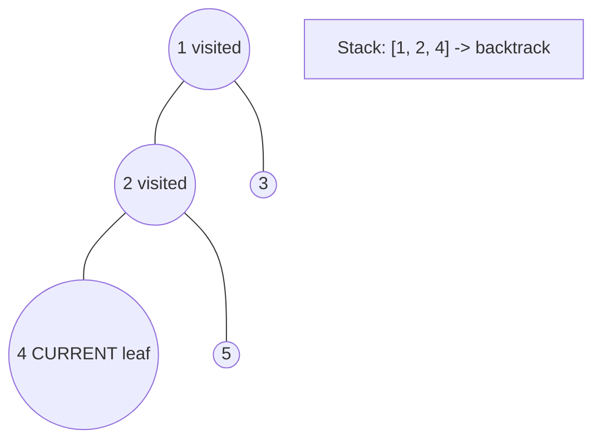
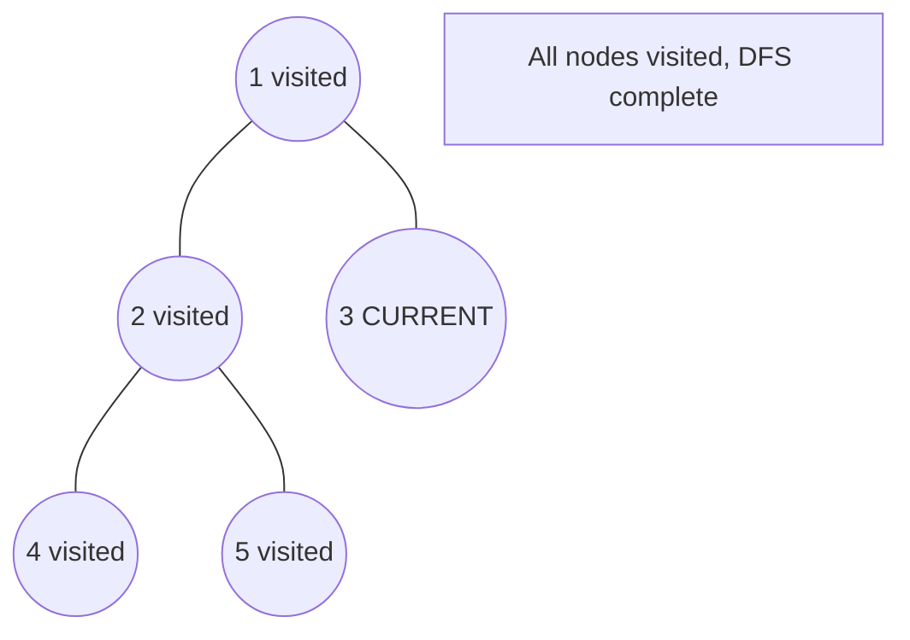

# Problem 563: Binary Tree Tilt

**Difficulty:** Easy  
**Tags:** Tree, Depth-First Search, Binary Tree  
**Pattern:** DFS Tree Traversal  
**Link:** [leetcode.com/problems/binary-tree-tilt](https://leetcode.com/problems/binary-tree-tilt/)

## Description

Given the `root` of a binary tree, return *the sum of every tree node's **tilt**.*

The **tilt** of a tree node is the **absolute difference** between the sum of all left subtree node **values** and all right subtree node **values**. If a node does not have a left child, then the sum of the left subtree node **values** is treated as `0`. The rule is similar if the node does not have a right child.

 

Example 1:

```

**Input:** root = [1,2,3]
**Output:** 1
**Explanation:** 
Tilt of node 2 : |0-0| = 0 (no children)
Tilt of node 3 : |0-0| = 0 (no children)
Tilt of node 1 : |2-3| = 1 (left subtree is just left child, so sum is 2; right subtree is just right child, so sum is 3)
Sum of every tilt : 0 + 0 + 1 = 1

```

Example 2:

```

**Input:** root = [4,2,9,3,5,null,7]
**Output:** 15
**Explanation:** 
Tilt of node 3 : |0-0| = 0 (no children)
Tilt of node 5 : |0-0| = 0 (no children)
Tilt of node 7 : |0-0| = 0 (no children)
Tilt of node 2 : |3-5| = 2 (left subtree is just left child, so sum is 3; right subtree is just right child, so sum is 5)
Tilt of node 9 : |0-7| = 7 (no left child, so sum is 0; right subtree is just right child, so sum is 7)
Tilt of node 4 : |(3+5+2)-(9+7)| = |10-16| = 6 (left subtree values are 3, 5, and 2, which sums to 10; right subtree values are 9 and 7, which sums to 16)
Sum of every tilt : 0 + 0 + 0 + 2 + 7 + 6 = 15

```

Example 3:

```

**Input:** root = [21,7,14,1,1,2,2,3,3]
**Output:** 9

```

 

**Constraints:**

	- The number of nodes in the tree is in the range `[0, 10^4]`.
	- `-1000 <= Node.val <= 1000`

## Approach: DFS Tree Traversal

Perform depth-first search on the tree. Recurse on left and right subtrees, combining results bottom-up. Track state (path, depth, sum) during traversal.

## Pseudocode

```
1. Define dfs(node, state):
   a. Base case: if null, return default
   b. Process node with current state
   c. left_result = dfs(node.left, updated_state)
   d. right_result = dfs(node.right, updated_state)
   e. Return combine(left_result, right_result)
2. Return dfs(root, initial_state)
```

## Algorithm Flow



## Visual State Transitions

**DFS Tree Traversal Step-by-Step:**

**Frame 1: Start at root**


**Frame 2: Go left - visit node 2**


**Frame 3: Go left - visit node 4 (leaf)**


**Frame 4: Backtrack, visit node 5, then node 3**



## Complexity Analysis

- **Time:** O(n)
- **Space:** O(h)

## Solution (Python3)

```python
class Solution:
    def findTilt(self, root: Optional[TreeNode]) -> int:
        # DFS on binary tree - O(n) time, O(h) space
        def dfs(node):
            if not node:
                return 0
            left = dfs(node.left)
            right = dfs(node.right)
            return 1 + max(left, right)
        
        result = dfs(root)
        return result
```

## Solution (C++)

```cpp
#include <algorithm>
#include <functional>
#include <string>
#include <vector>
using namespace std;

class Solution {
public:
    int findTilt(TreeNode* root) {
        // DFS on binary tree - O(n) time, O(h) space
        function<int(TreeNode*)> dfs = [&](TreeNode* node) -> int {
            if (!node) return 0;
            int left = dfs(node->left);
            int right = dfs(node->right);
            return 1 + max(left, right);
        };
        return dfs(root);
    }
};
```
