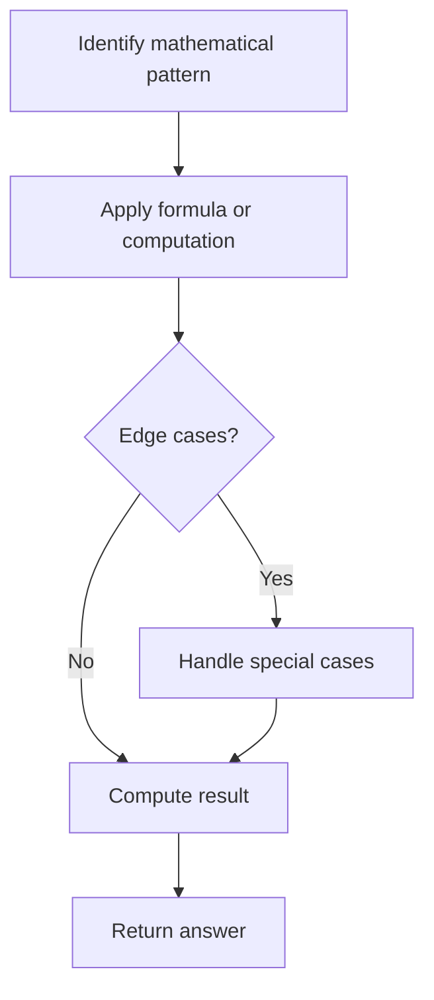

# Problem 564: Find the Closest Palindrome

**Difficulty:** Hard  
**Tags:** Math, String  
**Pattern:** Math  
**Link:** [leetcode.com/problems/find-the-closest-palindrome](https://leetcode.com/problems/find-the-closest-palindrome/)

## Description

Given a string `n` representing an integer, return *the closest integer (not including itself), which is a palindrome*. If there is a tie, return ***the smaller one***.

The closest is defined as the absolute difference minimized between two integers.

 

Example 1:

```

**Input:** n = "123"
**Output:** "121"

```

Example 2:

```

**Input:** n = "1"
**Output:** "0"
**Explanation:** 0 and 2 are the closest palindromes but we return the smallest which is 0.

```

 

**Constraints:**

	- `1 <= n.length <= 18`
	- `n` consists of only digits.
	- `n` does not have leading zeros.
	- `n` is representing an integer in the range `[1, 10^18 - 1]`.

## Approach: Math

Apply mathematical properties, formulas, or number-theoretic concepts. Look for patterns, modular arithmetic, or closed-form solutions.

## Pseudocode

```
1. Identify the mathematical pattern or formula
2. Apply computation:
   - Modular arithmetic for large numbers
   - GCD/LCM for divisibility
   - Sieve for primes
3. Handle edge cases
4. Return result
```

## Algorithm Flow



## Complexity Analysis

- **Time:** O(n) or O(sqrt(n))
- **Space:** O(1)

## Solution (Python3)

```python
class Solution:
    def nearestPalindromic(self, n: str) -> str:
        # Mathematical approach
        result = 0
        x = n
        while x != 0:
            result = result * 10 + x % 10
            x //= 10 if isinstance(x, int) else 1
        return result
```

## Solution (C++)

```cpp
#include <string>
#include <vector>
using namespace std;

class Solution {
public:
    string nearestPalindromic(string& n) {
        // Mathematical approach
        long long result = 0;
        int x = n;
        while (x != 0) {
            result = result * 10 + x % 10;
            x /= 10;
        }
        return (int)result;
    }
};
```
