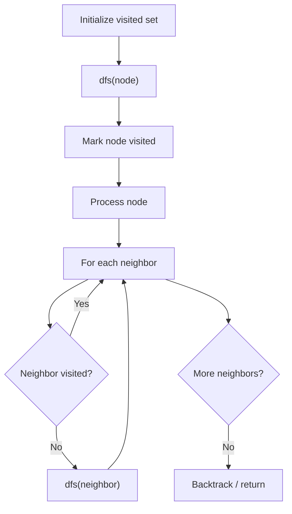

# Problem 565: Array Nesting

**Difficulty:** Medium  
**Tags:** Array, Depth-First Search  
**Pattern:** DFS Graph Traversal  
**Link:** [leetcode.com/problems/array-nesting](https://leetcode.com/problems/array-nesting/)

## Description

You are given an integer array `nums` of length `n` where `nums` is a permutation of the numbers in the range `[0, n - 1]`.

You should build a set `s[k] = {nums[k], nums[nums[k]], nums[nums[nums[k]]], ... }` subjected to the following rule:

	- The first element in `s[k]` starts with the selection of the element `nums[k]` of `index = k`.
	- The next element in `s[k]` should be `nums[nums[k]]`, and then `nums[nums[nums[k]]]`, and so on.
	- We stop adding right before a duplicate element occurs in `s[k]`.

Return *the longest length of a set* `s[k]`.

 

Example 1:

```

**Input:** nums = [5,4,0,3,1,6,2]
**Output:** 4
**Explanation:** 
nums[0] = 5, nums[1] = 4, nums[2] = 0, nums[3] = 3, nums[4] = 1, nums[5] = 6, nums[6] = 2.
One of the longest sets s[k]:
s[0] = {nums[0], nums[5], nums[6], nums[2]} = {5, 6, 2, 0}

```

Example 2:

```

**Input:** nums = [0,1,2]
**Output:** 1

```

 

**Constraints:**

	- `1 <= nums.length <= 10^5`
	- `0 <= nums[i] < nums.length`
	- All the values of `nums` are **unique**.

## Approach: DFS Graph Traversal

Explore the graph depth-first using recursion or a stack. Mark nodes as visited to avoid cycles. Process each node and explore all unvisited neighbors.

## Pseudocode

```
1. Initialize visited set
2. Define dfs(node):
   a. Mark node as visited
   b. Process node
   c. For each neighbor of node:
      - If not visited: dfs(neighbor)
3. Call dfs(start) for each unvisited node
```

## Algorithm Flow



## Complexity Analysis

- **Time:** O(V + E)
- **Space:** O(V)

## Solution (Python3)

```python
class Solution:
    def arrayNesting(self, nums: List[int]) -> int:
        # DFS on graph - O(V+E) time
        visited = set()
        result = []
        
        def dfs(node):
            if node in visited:
                return
            visited.add(node)
            result.append(node)
            # Traverse neighbors (adjust based on adjacency representation)
        
        dfs(0)
        return result if isinstance(0, list) else len(result)
```

## Solution (C++)

```cpp
#include <functional>
#include <string>
#include <vector>
using namespace std;

class Solution {
public:
    int arrayNesting(vector<int>& nums) {
        // DFS on graph - O(V+E) time
        vector<bool> visited(nums.size(), false);
        vector<int> result;
        function<void(int)> dfs = [&](int node) {
            if (visited[node]) return;
            visited[node] = true;
            result.push_back(node);
            // Traverse neighbors
        };
        dfs(0);
        return result;
    }
};
```
