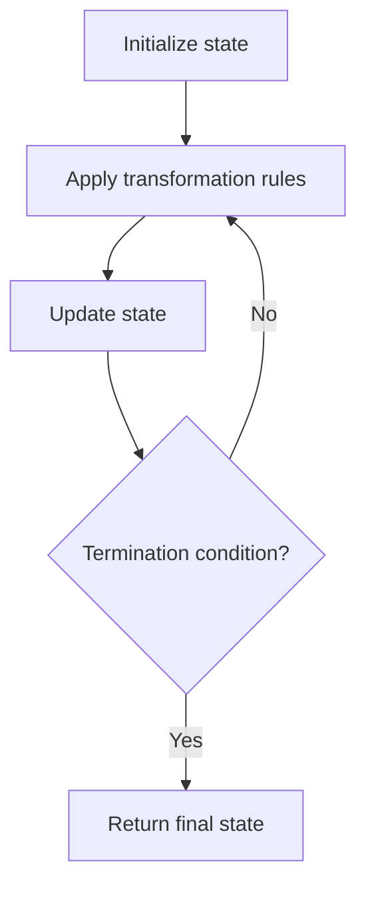

# Problem 566: Reshape the Matrix

**Difficulty:** Easy  
**Tags:** Array, Matrix, Simulation  
**Pattern:** Simulation  
**Link:** [leetcode.com/problems/reshape-the-matrix](https://leetcode.com/problems/reshape-the-matrix/)

## Description

In MATLAB, there is a handy function called `reshape` which can reshape an `m x n` matrix into a new one with a different size `r x c` keeping its original data.

You are given an `m x n` matrix `mat` and two integers `r` and `c` representing the number of rows and the number of columns of the wanted reshaped matrix.

The reshaped matrix should be filled with all the elements of the original matrix in the same row-traversing order as they were.

If the `reshape` operation with given parameters is possible and legal, output the new reshaped matrix; Otherwise, output the original matrix.

 

Example 1:

```

**Input:** mat = [[1,2],[3,4]], r = 1, c = 4
**Output:** [[1,2,3,4]]

```

Example 2:

```

**Input:** mat = [[1,2],[3,4]], r = 2, c = 4
**Output:** [[1,2],[3,4]]

```

 

**Constraints:**

	- `m == mat.length`
	- `n == mat[i].length`
	- `1 <= m, n <= 100`
	- `-1000 <= mat[i][j] <= 1000`
	- `1 <= r, c <= 300`

## Approach: Simulation

Simulate the process described in the problem step by step. Follow the rules exactly, tracking state at each step.

## Pseudocode

```
1. Initialize state (grid, pointers, counters)
2. For each step / iteration:
   a. Apply the transformation rules
   b. Update state
   c. Check termination condition
3. Return final state or result
```

## Algorithm Flow



## Complexity Analysis

- **Time:** O(n) or O(n * k)
- **Space:** O(n)

## Solution (Python3)

```python
class Solution:
    def matrixReshape(self, mat: List[List[int]], r: int, c: int) -> List[List[int]]:
        # Simulation approach - follow the rules step by step
        result = []
        for i in range(len(mat) if isinstance(mat, list) else mat):
            # Simulate each step
            pass
        return result
```

## Solution (C++)

```cpp
#include <string>
#include <vector>
using namespace std;

class Solution {
public:
    vector<vector<int>> matrixReshape(vector<vector<int>>& mat, int r, int c) {
        // Simulation approach
        int n = mat.size();
        for (int i = 0; i < n; i++) {
            // Simulate each step
        }
        return {};
    }
};
```
