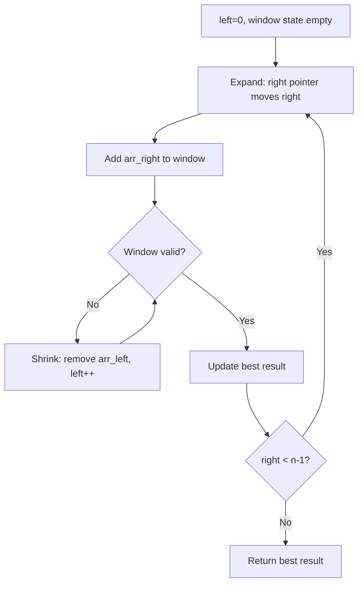
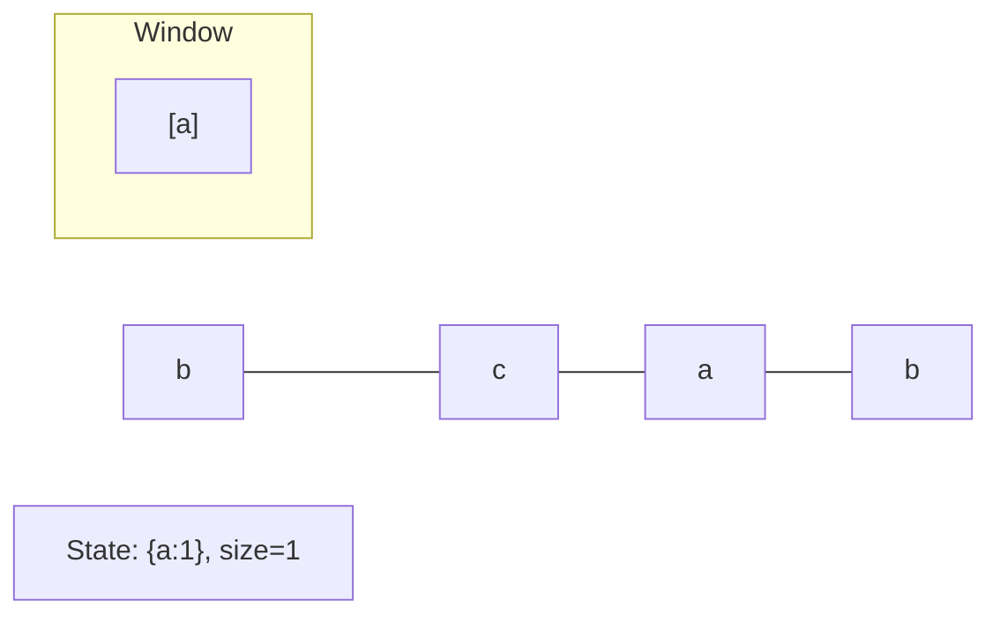
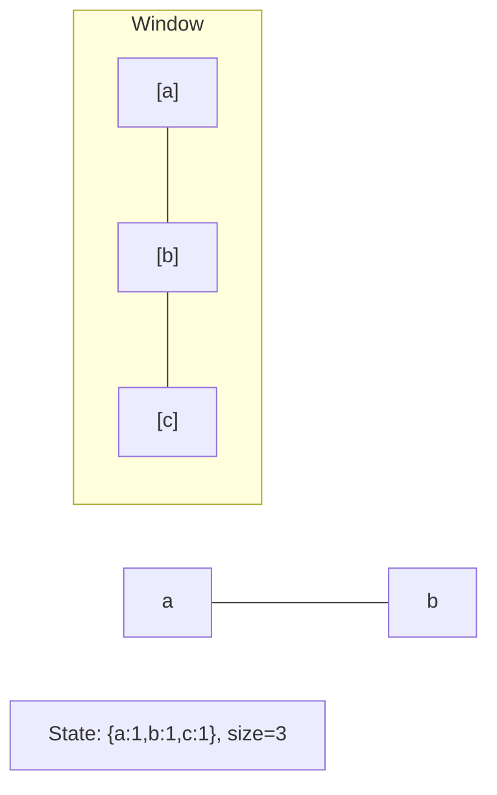
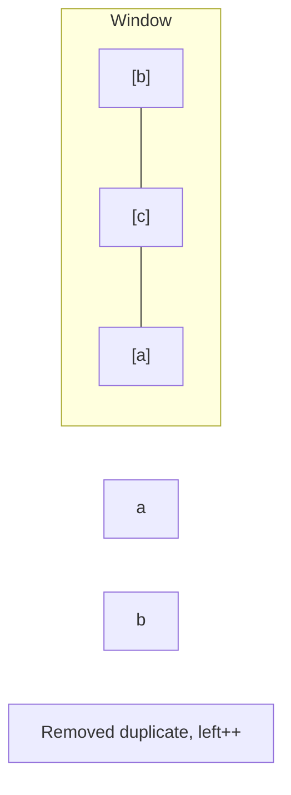
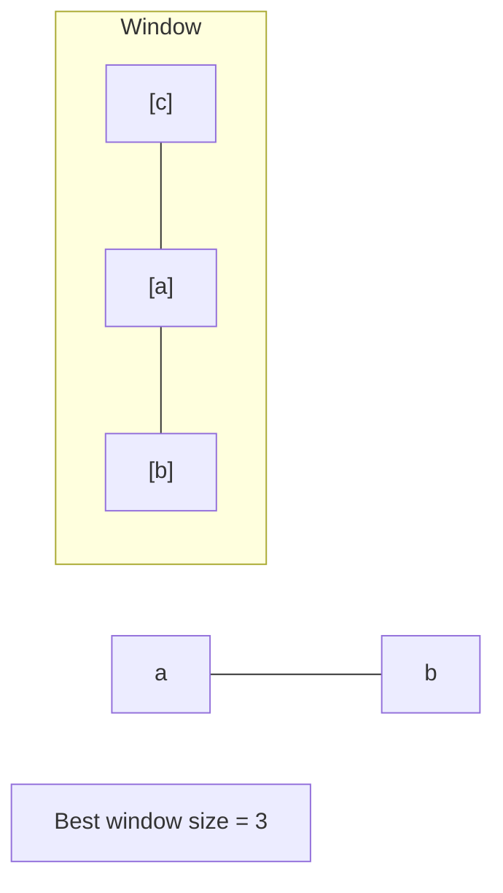

# Problem 567: Permutation in String

**Difficulty:** Medium  
**Tags:** Hash Table, Two Pointers, String, Sliding Window  
**Pattern:** Sliding Window  
**Link:** [leetcode.com/problems/permutation-in-string](https://leetcode.com/problems/permutation-in-string/)

## Description

Given two strings `s1` and `s2`, return `true` if `s2` contains a permutation of `s1`, or `false` otherwise.

In other words, return `true` if one of `s1`'s permutations is the substring of `s2`.

 

Example 1:

```

**Input:** s1 = "ab", s2 = "eidbaooo"
**Output:** true
**Explanation:** s2 contains one permutation of s1 ("ba").

```

Example 2:

```

**Input:** s1 = "ab", s2 = "eidboaoo"
**Output:** false

```

 

**Constraints:**

	- `1 <= s1.length, s2.length <= 10^4`
	- `s1` and `s2` consist of lowercase English letters.

## Approach: Sliding Window

Fixed-size sliding window with character frequency comparison.

## Pseudocode

```
1. Initialize left = 0, result = initial_value
2. For right in range(n):
   a. Add element at right to window state
   b. While window is invalid:
      - Remove element at left from window state
      - left++
   c. Update result = best of (result, window size/value)
3. Return result
```

## Algorithm Flow



## Visual State Transitions

**Sliding Window Step-by-Step:**

**Frame 1: Initial window (left=0, right=0)**


**Frame 2: Expand right (right=2)**


**Frame 3: Violation - shrink left**


**Frame 4: Continue expanding**



## Complexity Analysis

- **Time:** O(n)
- **Space:** O(1)

## Solution (Python3)

```python
from collections import Counter

class Solution:
    def checkInclusion(self, s1: str, s2: str) -> bool:
        if len(s1) > len(s2):
            return False
        s1_count = Counter(s1)
        window = Counter(s2[:len(s1)])
        if window == s1_count:
            return True
        for i in range(len(s1), len(s2)):
            window[s2[i]] += 1
            left = s2[i - len(s1)]
            window[left] -= 1
            if window[left] == 0:
                del window[left]
            if window == s1_count:
                return True
        return False
```

## Solution (C++)

```cpp
#include <algorithm>
#include <string>
#include <unordered_map>
#include <vector>
using namespace std;

class Solution {
public:
    bool checkInclusion(string& s1, string& s2) {
        // Sliding window approach - O(n) time, O(k) space
        unordered_map<char, int> window;
        int left = 0, result = 0;
        for (int right = 0; right < s1.size(); right++) {
            window[s1[right]]++;
            while ((int)window.size() > s2) {
                window[s1[left]]--;
                if (window[s1[left]] == 0)
                    window.erase(s1[left]);
                left++;
            }
            result = max(result, right - left + 1);
        }
        return result;
    }
};
```
