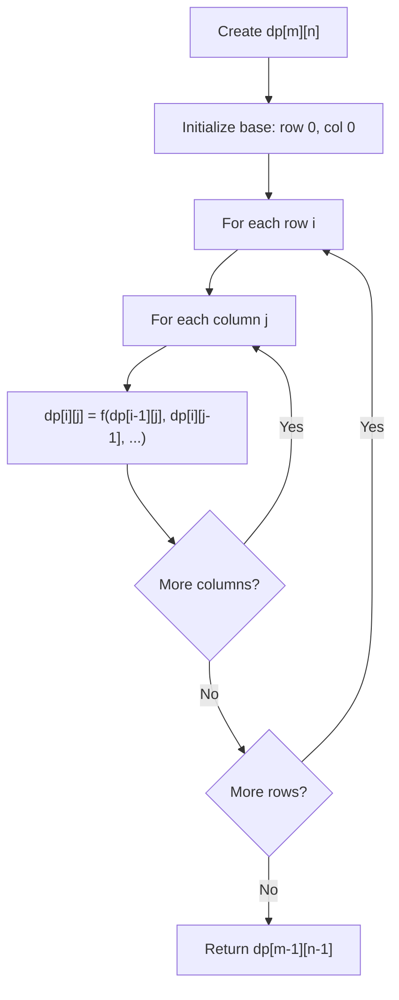
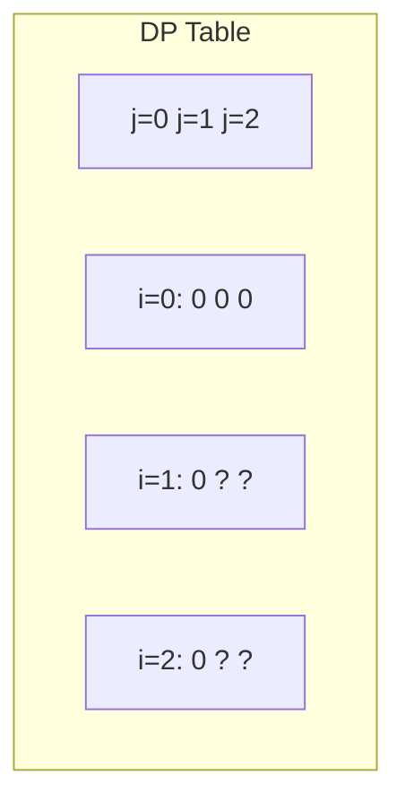
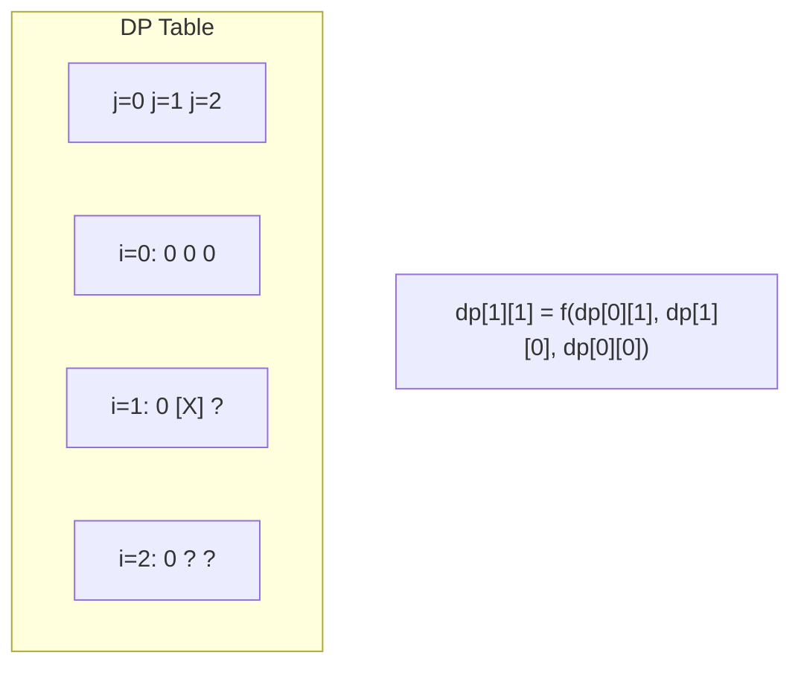
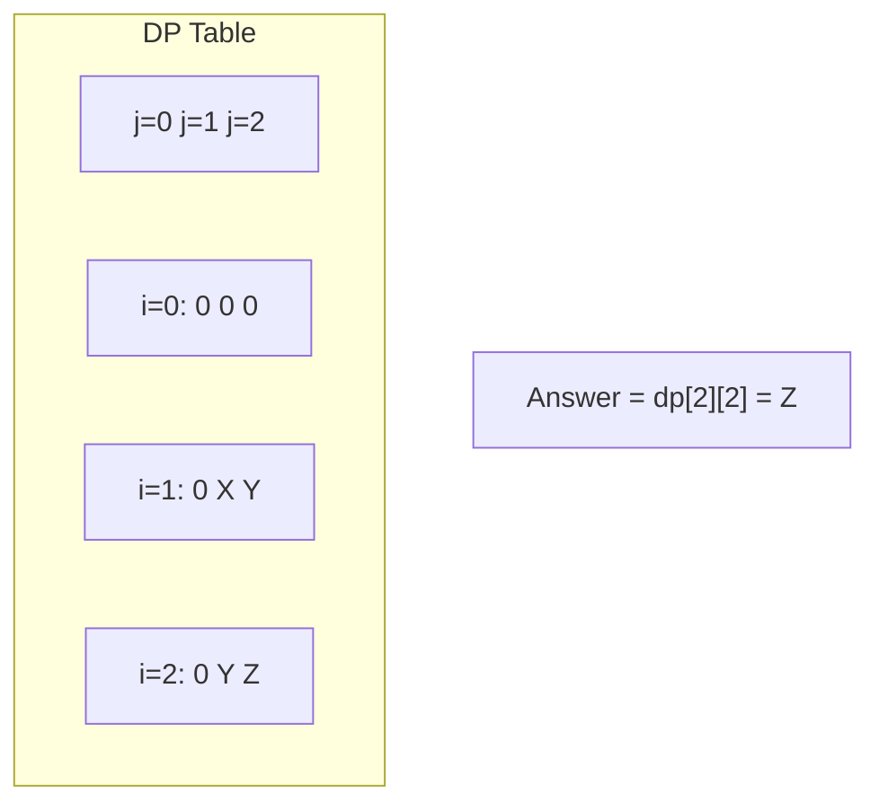

# Problem 568: Maximum Vacation Days

**Difficulty:** Hard  
**Tags:** Array, Dynamic Programming, Matrix  
**Pattern:** Dynamic Programming (2D Grid/Matrix)  
**Link:** [leetcode.com/problems/maximum-vacation-days](https://leetcode.com/problems/maximum-vacation-days/)

## Description

*(Premium problem -- description requires LeetCode subscription)*

## Approach: Dynamic Programming (2D Grid/Matrix)

Use a 2D DP table where dp[i][j] represents the optimal value for the subproblem defined by rows 0..i and columns 0..j. Fill row by row or column by column.

## Pseudocode

```
1. Create dp[m][n] table
2. Initialize base cases (first row, first column)
3. For i from 1 to m-1:
   For j from 1 to n-1:
     dp[i][j] = recurrence(dp[i-1][j], dp[i][j-1], dp[i-1][j-1])
4. Return dp[m-1][n-1]
```

## Algorithm Flow



## Visual State Transitions

**2D DP Table Build:**

**Frame 1: Initialize borders**


**Frame 2: Fill cell by cell**


**Frame 3: Table complete**



## Complexity Analysis

- **Time:** O(m * n)
- **Space:** O(m * n)

## Solution (Python3)

```python
class Solution:
    pass
```

## Solution (C++)

```cpp
class Solution {
public:
    // Design problem stub
};
```
