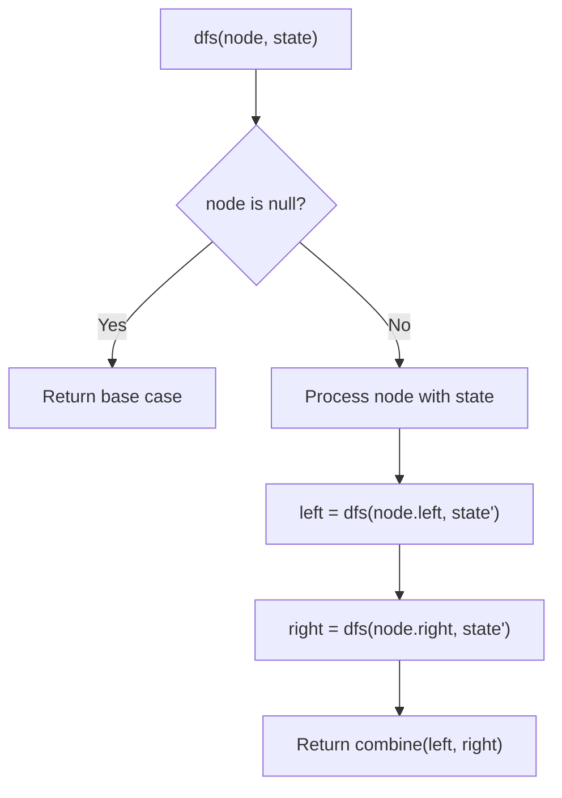
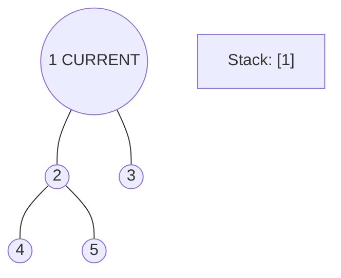
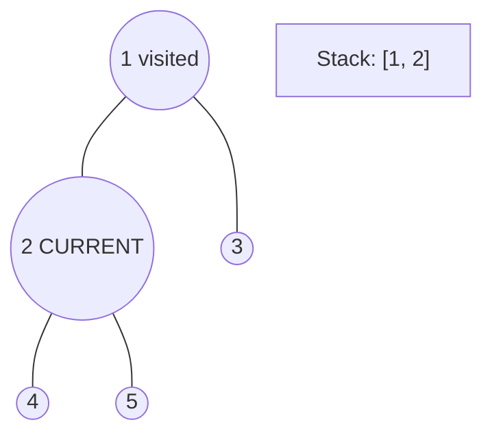
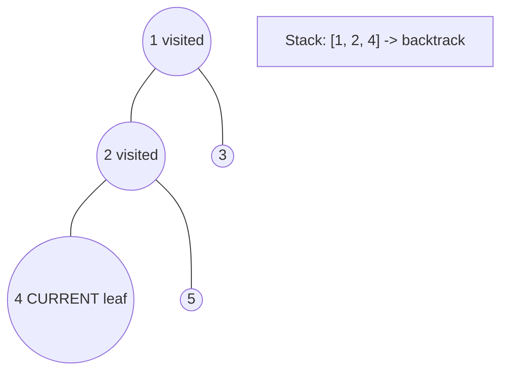
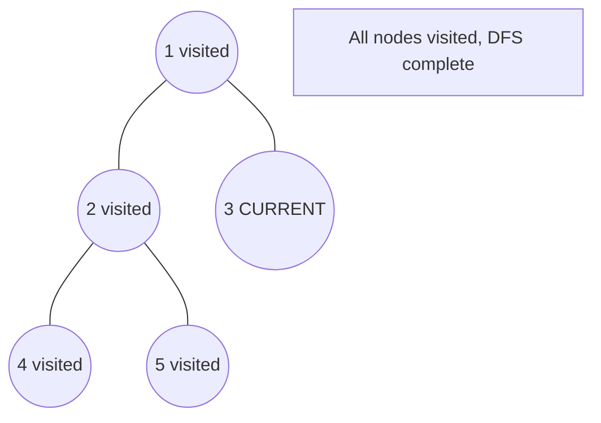

# Problem 572: Subtree of Another Tree

**Difficulty:** Easy  
**Tags:** Tree, Depth-First Search, String Matching, Binary Tree, Hash Function  
**Pattern:** Tree / DFS  
**Link:** [leetcode.com/problems/subtree-of-another-tree](https://leetcode.com/problems/subtree-of-another-tree/)

## Description

Given the roots of two binary trees `root` and `subRoot`, return `true` if there is a subtree of `root` with the same structure and node values of` subRoot` and `false` otherwise.

A subtree of a binary tree `tree` is a tree that consists of a node in `tree` and all of this node's descendants. The tree `tree` could also be considered as a subtree of itself.

 

Example 1:

```

**Input:** root = [3,4,5,1,2], subRoot = [4,1,2]
**Output:** true

```

Example 2:

```

**Input:** root = [3,4,5,1,2,null,null,null,null,0], subRoot = [4,1,2]
**Output:** false

```

 

**Constraints:**

	- The number of nodes in the `root` tree is in the range `[1, 2000]`.
	- The number of nodes in the `subRoot` tree is in the range `[1, 1000]`.
	- `-10^4 <= root.val <= 10^4`
	- `-10^4 <= subRoot.val <= 10^4`

## Approach: Tree / DFS

Check each node in root tree as potential match for subRoot.

## Pseudocode

```
1. Define dfs(node, state):
   a. Base case: if null, return default
   b. Process node with current state
   c. left_result = dfs(node.left, updated_state)
   d. right_result = dfs(node.right, updated_state)
   e. Return combine(left_result, right_result)
2. Return dfs(root, initial_state)
```

## Algorithm Flow



## Visual State Transitions

**DFS Tree Traversal Step-by-Step:**

**Frame 1: Start at root**


**Frame 2: Go left - visit node 2**


**Frame 3: Go left - visit node 4 (leaf)**


**Frame 4: Backtrack, visit node 5, then node 3**



## Complexity Analysis

- **Time:** O(m*n)
- **Space:** O(h)

## Solution (Python3)

```python
class Solution:
    def isSubtree(self, root, subRoot) -> bool:
        if not root:
            return False
        if self.isSame(root, subRoot):
            return True
        return self.isSubtree(root.left, subRoot) or self.isSubtree(root.right, subRoot)

    def isSame(self, p, q):
        if not p and not q:
            return True
        if not p or not q:
            return False
        return p.val == q.val and self.isSame(p.left, q.left) and self.isSame(p.right, q.right)
```

## Solution (C++)

```cpp
#include <algorithm>
#include <functional>
#include <string>
#include <vector>
using namespace std;

class Solution {
public:
    bool isSubtree(TreeNode* root, TreeNode* subRoot) {
        // DFS on binary tree - O(n) time, O(h) space
        function<int(TreeNode*)> dfs = [&](TreeNode* node) -> int {
            if (!node) return 0;
            int left = dfs(node->left);
            int right = dfs(node->right);
            return 1 + max(left, right);
        };
        return dfs(root);
    }
};
```
