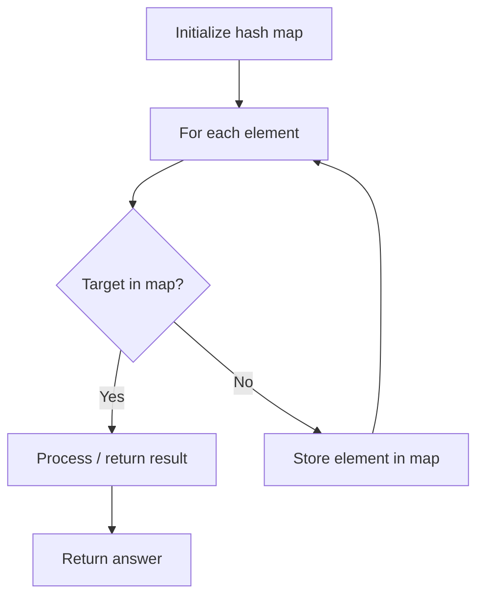

# Problem 575: Distribute Candies

**Difficulty:** Easy  
**Tags:** Array, Hash Table  
**Pattern:** Hash Map Lookup  
**Link:** [leetcode.com/problems/distribute-candies](https://leetcode.com/problems/distribute-candies/)

## Description

Alice has `n` candies, where the `i^th` candy is of type `candyType[i]`. Alice noticed that she started to gain weight, so she visited a doctor.

The doctor advised Alice to only eat `n / 2` of the candies she has (`n` is always even). Alice likes her candies very much, and she wants to eat the maximum number of different types of candies while still following the doctor's advice.

Given the integer array `candyType` of length `n`, return *the **maximum** number of different types of candies she can eat if she only eats *`n / 2`* of them*.

 

Example 1:

```

**Input:** candyType = [1,1,2,2,3,3]
**Output:** 3
**Explanation:** Alice can only eat 6 / 2 = 3 candies. Since there are only 3 types, she can eat one of each type.

```

Example 2:

```

**Input:** candyType = [1,1,2,3]
**Output:** 2
**Explanation:** Alice can only eat 4 / 2 = 2 candies. Whether she eats types [1,2], [1,3], or [2,3], she still can only eat 2 different types.

```

Example 3:

```

**Input:** candyType = [6,6,6,6]
**Output:** 1
**Explanation:** Alice can only eat 4 / 2 = 2 candies. Even though she can eat 2 candies, she only has 1 type.

```

 

**Constraints:**

	- `n == candyType.length`
	- `2 <= n <= 10^4`
	- `n` is even.
	- `-10^5 <= candyType[i] <= 10^5`

## Approach: Hash Map Lookup

Use a hash map (dictionary) to store elements for O(1) lookup. Iterate through the input, checking membership or counting frequencies in the map.

## Pseudocode

```
1. Initialize hash map
2. Iterate through elements:
   a. Check if target/complement exists in map
   b. If found: process result
   c. Otherwise: store element in map
3. Return result
```

## Algorithm Flow



## Complexity Analysis

- **Time:** O(n)
- **Space:** O(n)

## Solution (Python3)

```python
class Solution:
    def distributeCandies(self, candyType: List[int]) -> int:
        # Hash map approach - O(n) time, O(n) space
        seen = {}
        for i, val in enumerate(candyType):
            complement = candyType - val
            if complement in seen:
                return [seen[complement], i]
            seen[val] = i
        return 0
```

## Solution (C++)

```cpp
#include <string>
#include <unordered_map>
#include <vector>
using namespace std;

class Solution {
public:
    int distributeCandies(vector<int>& candyType) {
        // Hash map approach - O(n) time, O(n) space
        unordered_map<int, int> seen;
        for (int i = 0; i < candyType.size(); i++) {
            int complement = candyType - candyType[i];
            if (seen.count(complement)) {
                return {seen[complement], i};
            }
            seen[candyType[i]] = i;
        }
        return 0;
    }
};
```
