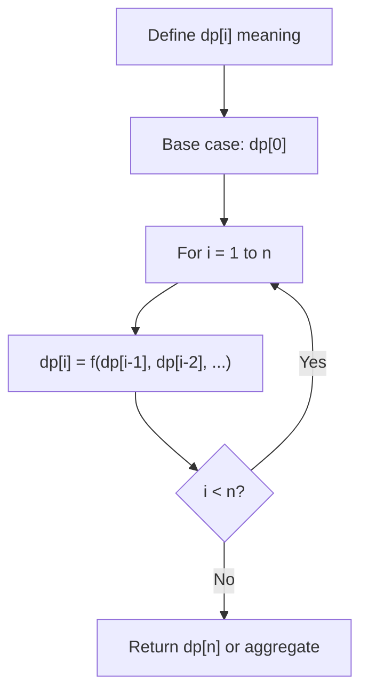
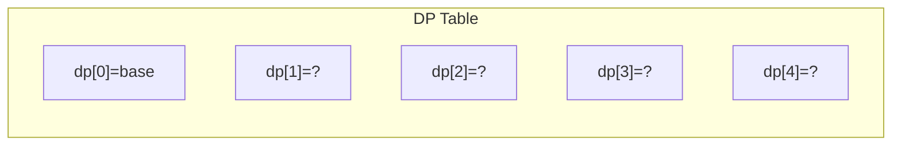
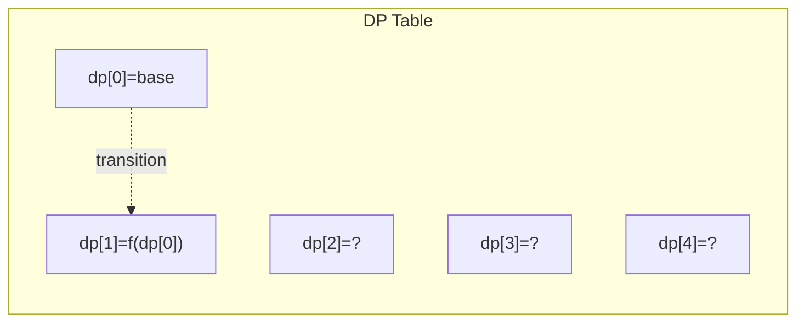
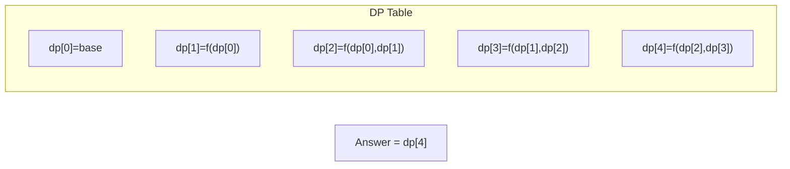

# Problem 576: Out of Boundary Paths

**Difficulty:** Medium  
**Tags:** Dynamic Programming  
**Pattern:** Dynamic Programming (1D)  
**Link:** [leetcode.com/problems/out-of-boundary-paths](https://leetcode.com/problems/out-of-boundary-paths/)

## Description

There is an `m x n` grid with a ball. The ball is initially at the position `[startRow, startColumn]`. You are allowed to move the ball to one of the four adjacent cells in the grid (possibly out of the grid crossing the grid boundary). You can apply **at most** `maxMove` moves to the ball.

Given the five integers `m`, `n`, `maxMove`, `startRow`, `startColumn`, return the number of paths to move the ball out of the grid boundary. Since the answer can be very large, return it **modulo** `10^9 + 7`.

 

Example 1:

```

**Input:** m = 2, n = 2, maxMove = 2, startRow = 0, startColumn = 0
**Output:** 6

```

Example 2:

```

**Input:** m = 1, n = 3, maxMove = 3, startRow = 0, startColumn = 1
**Output:** 12

```

 

**Constraints:**

	- `1 <= m, n <= 50`
	- `0 <= maxMove <= 50`
	- `0 <= startRow < m`
	- `0 <= startColumn < n`

## Approach: Dynamic Programming (1D)

Break the problem into overlapping subproblems. Define dp[i] as the optimal value for the subproblem ending at or considering index i. Build the solution bottom-up, using previously computed dp values.

## Pseudocode

```
1. Define dp[i] = optimal value for subproblem i
2. Base case: dp[0] = initial value
3. For i from 1 to n:
   a. dp[i] = recurrence(dp[i-1], dp[i-2], ...)
4. Return dp[n] or max/min of dp
```

## Algorithm Flow



## Visual State Transitions

**1D Dynamic Programming Table Build:**

**Frame 1: Initialize base cases**


**Frame 2: Fill dp[1] from dp[0]**


**Frame 3: Fill remaining cells**



## Complexity Analysis

- **Time:** O(n)
- **Space:** O(n)

## Solution (Python3)

```python
class Solution:
    def findPaths(self, m: int, n: int, maxMove: int, startRow: int, startColumn: int) -> int:
        # Dynamic programming (1D) - O(n) time, O(n) space
        if not m:
            return 0
        n = len(m) if isinstance(m, list) else m
        dp = [0] * (n + 1)
        dp[0] = 1  # base case
        for i in range(1, n + 1):
            dp[i] = dp[i-1]  # transition (customize per problem)
            if i >= 2:
                dp[i] += dp[i-2]
        return dp[n]
```

## Solution (C++)

```cpp
#include <string>
#include <vector>
using namespace std;

class Solution {
public:
    int findPaths(int m, int n, int maxMove, int startRow, int startColumn) {
        // Dynamic programming (1D) - O(n) time, O(n) space
        int n = m;
        if (n <= 0) return 0;
        vector<int> dp(n + 1, 0);
        dp[0] = 1;
        for (int i = 1; i <= n; i++) {
            dp[i] = dp[i-1];
            if (i >= 2) dp[i] += dp[i-2];
        }
        return dp[n];
    }
};
```
