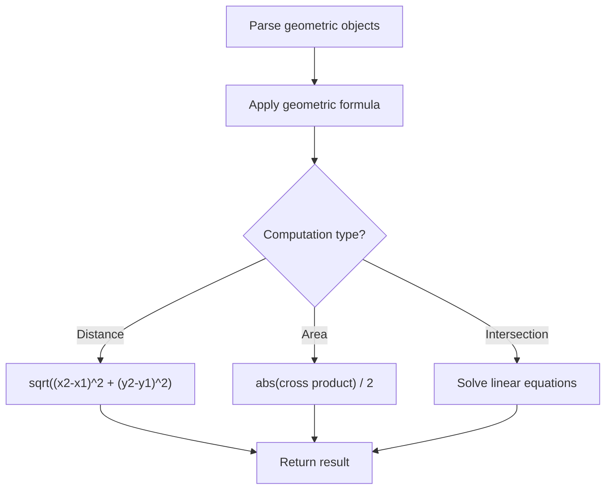

# Problem 587: Erect the Fence

**Difficulty:** Hard  
**Tags:** Array, Math, Geometry  
**Pattern:** Geometry  
**Link:** [leetcode.com/problems/erect-the-fence](https://leetcode.com/problems/erect-the-fence/)

## Description

You are given an array `trees` where `trees[i] = [xi, yi]` represents the location of a tree in the garden.

Fence the entire garden using the minimum length of rope, as it is expensive. The garden is well-fenced only if **all the trees are enclosed**.

Return *the coordinates of trees that are exactly located on the fence perimeter*. You may return the answer in **any order**.

 

Example 1:

```

**Input:** trees = [[1,1],[2,2],[2,0],[2,4],[3,3],[4,2]]
**Output:** [[1,1],[2,0],[4,2],[3,3],[2,4]]
**Explanation:** All the trees will be on the perimeter of the fence except the tree at [2, 2], which will be inside the fence.

```

Example 2:

```

**Input:** trees = [[1,2],[2,2],[4,2]]
**Output:** [[4,2],[2,2],[1,2]]
**Explanation:** The fence forms a line that passes through all the trees.

```

 

**Constraints:**

	- `1 <= trees.length <= 3000`
	- `trees[i].length == 2`
	- `0 <= xi, yi <= 100`
	- All the given positions are **unique**.

## Approach: Geometry

Apply geometric formulas: distance, area, cross product, convex hull, line intersection. Handle floating-point precision carefully.

## Pseudocode

```
1. Parse geometric objects (points, lines, shapes)
2. Apply geometric operations:
   - Distance formula
   - Cross/dot product
   - Area computation
3. Handle precision and edge cases
4. Return result
```

## Algorithm Flow



## Complexity Analysis

- **Time:** O(n^2) or O(n log n)
- **Space:** O(n)

## Solution (Python3)

```python
class Solution:
    def outerTrees(self, trees: List[List[int]]) -> List[List[int]]:
        # Geometry approach
        import math
        result = 0
        for i in range(len(trees)):
            for j in range(i + 1, len(trees)):
                dx = trees[i][0] - trees[j][0]
                dy = trees[i][1] - trees[j][1]
                dist = math.sqrt(dx*dx + dy*dy)
                result = max(result, dist)
        return result
```

## Solution (C++)

```cpp
#include <algorithm>
#include <cmath>
#include <string>
#include <vector>
using namespace std;

class Solution {
public:
    vector<vector<int>> outerTrees(vector<vector<int>>& trees) {
        // Geometry approach
        double result = 0;
        for (int i = 0; i < (int)trees.size(); i++) {
            for (int j = i + 1; j < (int)trees.size(); j++) {
                double dx = trees[i][0] - trees[j][0];
                double dy = trees[i][1] - trees[j][1];
                result = max(result, sqrt(dx*dx + dy*dy));
            }
        }
        return result;
    }
};
```
