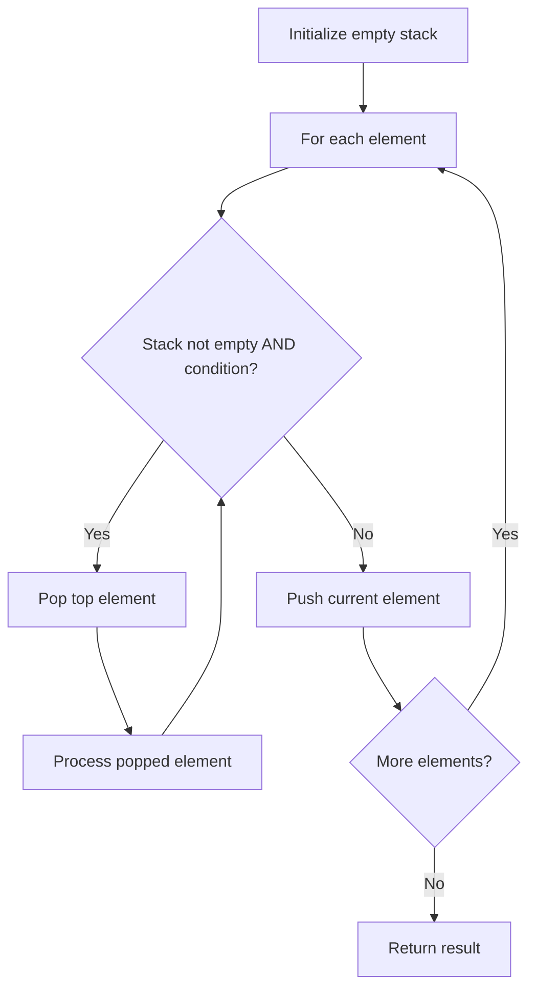

# Problem 591: Tag Validator

**Difficulty:** Hard  
**Tags:** String, Stack  
**Pattern:** Stack  
**Link:** [leetcode.com/problems/tag-validator](https://leetcode.com/problems/tag-validator/)

## Description

Given a string representing a code snippet, implement a tag validator to parse the code and return whether it is valid.

A code snippet is valid if all the following rules hold:

	- The code must be wrapped in a **valid closed tag**. Otherwise, the code is invalid.
	- A **closed tag** (not necessarily valid) has exactly the following format : `<TAG_NAME>TAG_CONTENT</TAG_NAME>`. Among them, `<TAG_NAME>` is the start tag, and `</TAG_NAME>` is the end tag. The TAG_NAME in start and end tags should be the same. A closed tag is **valid** if and only if the TAG_NAME and TAG_CONTENT are valid.
	- A **valid** `TAG_NAME` only contain **upper-case letters**, and has length in range [1,9]. Otherwise, the `TAG_NAME` is **invalid**.
	- A **valid** `TAG_CONTENT` may contain other **valid closed tags**, **cdata** and any characters (see note1) **EXCEPT** unmatched `<`, unmatched start and end tag, and unmatched or closed tags with invalid TAG_NAME. Otherwise, the `TAG_CONTENT` is **invalid**.
	- A start tag is unmatched if no end tag exists with the same TAG_NAME, and vice versa. However, you also need to consider the issue of unbalanced when tags are nested.
	- A `<` is unmatched if you cannot find a subsequent `>`. And when you find a `<` or `</`, all the subsequent characters until the next `>` should be parsed as TAG_NAME (not necessarily valid).
	- The cdata has the following format : `<![CDATA[CDATA_CONTENT]]>`. The range of `CDATA_CONTENT` is defined as the characters between `<![CDATA[` and the **first subsequent** `]]>`.
	- `CDATA_CONTENT` may contain **any characters**. The function of cdata is to forbid the validator to parse `CDATA_CONTENT`, so even it has some characters that can be parsed as tag (no matter valid or invalid), you should treat it as **regular characters**.

 

Example 1:

```

**Input:** code = "<DIV>This is the first line <![CDATA[<div>]]></DIV>"
**Output:** true
**Explanation:** 
The code is wrapped in a closed tag : <DIV> and </DIV>. 
The TAG_NAME is valid, the TAG_CONTENT consists of some characters and cdata. 
Although CDATA_CONTENT has an unmatched start tag with invalid TAG_NAME, it should be considered as plain text, not parsed as a tag.
So TAG_CONTENT is valid, and then the code is valid. Thus return true.

```

Example 2:

```

**Input:** code = "<DIV>>>  ![cdata[]] <![CDATA[<div>]>]]>]]>>]</DIV>"
**Output:** true
**Explanation:**
We first separate the code into : start_tag|tag_content|end_tag.
start_tag -> **"<DIV>"**
end_tag -> **"</DIV>"**
tag_content could also be separated into : text1|cdata|text2.
text1 -> **">>  ![cdata[]] "**
cdata -> **"<![CDATA[<div>]>]]>"**, where the CDATA_CONTENT is **"<div>]>"**
text2 -> **"]]>>]"**
The reason why start_tag is NOT **"<DIV>>>"** is because of the rule 6.
The reason why cdata is NOT **"<![CDATA[<div>]>]]>]]>"** is because of the rule 7.

```

Example 3:

```

**Input:** code = "<A>  <B> </A>   </B>"
**Output:** false
**Explanation:** Unbalanced. If "<A>" is closed, then "<B>" must be unmatched, and vice versa.

```

 

**Constraints:**

	- `1 <= code.length <= 500`
	- `code` consists of English letters, digits, `'<'`, `'>'`, `'/'`, `'!'`, `'['`, `']'`, `'.'`, and `' '`.

## Approach: Stack

Use a stack (LIFO) to process elements. Push elements when they might be needed later; pop when a matching or resolving condition is found. Common uses: parentheses matching, expression evaluation, next greater element.

## Pseudocode

```
1. Initialize empty stack
2. For each element:
   a. While stack is not empty and condition met:
      - Pop and process top element
   b. Push current element onto stack
3. Process remaining elements in stack if needed
4. Return result
```

## Algorithm Flow



## Complexity Analysis

- **Time:** O(n)
- **Space:** O(n)

## Solution (Python3)

```python
class Solution:
    def isValid(self, code: str) -> bool:
        # Stack-based approach - O(n) time
        stack = []
        for ch in code:
            if stack and self._matches(stack[-1], ch):
                stack.pop()
            else:
                stack.append(ch)
        return len(stack) == 0 if isinstance(False, bool) else stack

    def _matches(self, a, b):
        pairs = {'(': ')', '[': ']', '{': '}'}
        return pairs.get(a) == b
```

## Solution (C++)

```cpp
#include <stack>
#include <string>
#include <unordered_map>
#include <vector>
using namespace std;

class Solution {
public:
    bool isValid(string& code) {
        // Stack-based approach - O(n) time
        stack<char> st;
        unordered_map<char, char> pairs = {{'(', ')'}, {'[', ']'}, {'{', '}'}};
        for (char ch : code) {
            if (!st.empty() && pairs.count(st.top()) && pairs[st.top()] == ch) {
                st.pop();
            } else {
                st.push(ch);
            }
        }
        return st.empty();
    }
};
```
