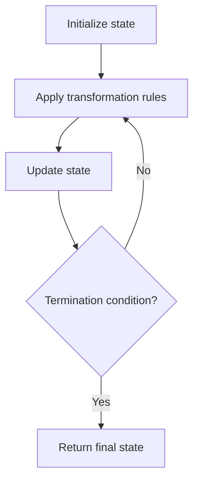

# Problem 592: Fraction Addition and Subtraction

**Difficulty:** Medium  
**Tags:** Math, String, Simulation  
**Pattern:** Simulation  
**Link:** [leetcode.com/problems/fraction-addition-and-subtraction](https://leetcode.com/problems/fraction-addition-and-subtraction/)

## Description

Given a string `expression` representing an expression of fraction addition and subtraction, return the calculation result in string format.

The final result should be an irreducible fraction. If your final result is an integer, change it to the format of a fraction that has a denominator `1`. So in this case, `2` should be converted to `2/1`.

 

Example 1:

```

**Input:** expression = "-1/2+1/2"
**Output:** "0/1"

```

Example 2:

```

**Input:** expression = "-1/2+1/2+1/3"
**Output:** "1/3"

```

Example 3:

```

**Input:** expression = "1/3-1/2"
**Output:** "-1/6"

```

 

**Constraints:**

	- The input string only contains `'0'` to `'9'`, `'/'`, `'+'` and `'-'`. So does the output.
	- Each fraction (input and output) has the format `±numerator/denominator`. If the first input fraction or the output is positive, then `'+'` will be omitted.
	- The input only contains valid **irreducible fractions**, where the **numerator** and **denominator** of each fraction will always be in the range `[1, 10]`. If the denominator is `1`, it means this fraction is actually an integer in a fraction format defined above.
	- The number of given fractions will be in the range `[1, 10]`.
	- The numerator and denominator of the **final result** are guaranteed to be valid and in the range of **32-bit** int.

## Approach: Simulation

Simulate the process described in the problem step by step. Follow the rules exactly, tracking state at each step.

## Pseudocode

```
1. Initialize state (grid, pointers, counters)
2. For each step / iteration:
   a. Apply the transformation rules
   b. Update state
   c. Check termination condition
3. Return final state or result
```

## Algorithm Flow



## Complexity Analysis

- **Time:** O(n) or O(n * k)
- **Space:** O(n)

## Solution (Python3)

```python
class Solution:
    def fractionAddition(self, expression: str) -> str:
        # Simulation approach - follow the rules step by step
        result = ""
        for i in range(len(expression) if isinstance(expression, list) else expression):
            # Simulate each step
            pass
        return result
```

## Solution (C++)

```cpp
#include <string>
#include <vector>
using namespace std;

class Solution {
public:
    string fractionAddition(string& expression) {
        // Simulation approach
        int n = expression.size();
        for (int i = 0; i < n; i++) {
            // Simulate each step
        }
        return "";
    }
};
```
