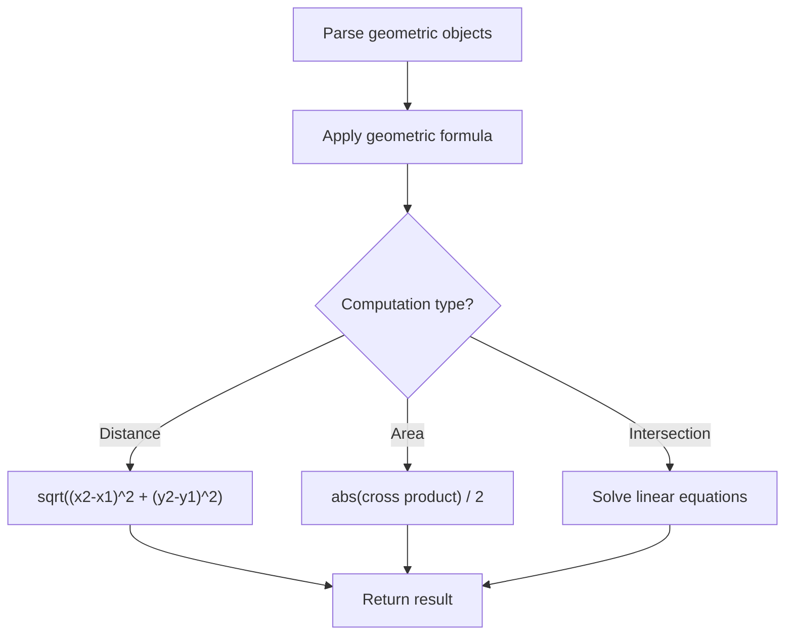

# Problem 593: Valid Square

**Difficulty:** Medium  
**Tags:** Math, Geometry  
**Pattern:** Geometry  
**Link:** [leetcode.com/problems/valid-square](https://leetcode.com/problems/valid-square/)

## Description

Given the coordinates of four points in 2D space `p1`, `p2`, `p3` and `p4`, return `true` *if the four points construct a square*.

The coordinate of a point `pi` is represented as `[xi, yi]`. The input is **not** given in any order.

A **valid square** has four equal sides with positive length and four equal angles (90-degree angles).

 

Example 1:

```

**Input:** p1 = [0,0], p2 = [1,1], p3 = [1,0], p4 = [0,1]
**Output:** true

```

Example 2:

```

**Input:** p1 = [0,0], p2 = [1,1], p3 = [1,0], p4 = [0,12]
**Output:** false

```

Example 3:

```

**Input:** p1 = [1,0], p2 = [-1,0], p3 = [0,1], p4 = [0,-1]
**Output:** true

```

 

**Constraints:**

	- `p1.length == p2.length == p3.length == p4.length == 2`
	- `-10^4 <= xi, yi <= 10^4`

## Approach: Geometry

Apply geometric formulas: distance, area, cross product, convex hull, line intersection. Handle floating-point precision carefully.

## Pseudocode

```
1. Parse geometric objects (points, lines, shapes)
2. Apply geometric operations:
   - Distance formula
   - Cross/dot product
   - Area computation
3. Handle precision and edge cases
4. Return result
```

## Algorithm Flow



## Complexity Analysis

- **Time:** O(n^2) or O(n log n)
- **Space:** O(n)

## Solution (Python3)

```python
class Solution:
    def validSquare(self, p1: List[int], p2: List[int], p3: List[int], p4: List[int]) -> bool:
        # Geometry approach
        import math
        result = 0
        for i in range(len(p1)):
            for j in range(i + 1, len(p1)):
                dx = p1[i][0] - p1[j][0]
                dy = p1[i][1] - p1[j][1]
                dist = math.sqrt(dx*dx + dy*dy)
                result = max(result, dist)
        return result
```

## Solution (C++)

```cpp
#include <algorithm>
#include <cmath>
#include <string>
#include <vector>
using namespace std;

class Solution {
public:
    bool validSquare(vector<int>& p1, vector<int>& p2, vector<int>& p3, vector<int>& p4) {
        // Geometry approach
        double result = 0;
        for (int i = 0; i < (int)p1.size(); i++) {
            for (int j = i + 1; j < (int)p1.size(); j++) {
                double dx = p1[i][0] - p1[j][0];
                double dy = p1[i][1] - p1[j][1];
                result = max(result, sqrt(dx*dx + dy*dy));
            }
        }
        return result;
    }
};
```
