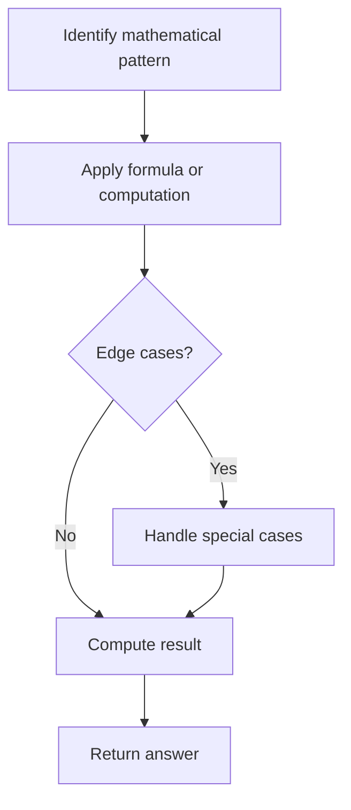

# Problem 598: Range Addition II

**Difficulty:** Easy  
**Tags:** Array, Math  
**Pattern:** Math  
**Link:** [leetcode.com/problems/range-addition-ii](https://leetcode.com/problems/range-addition-ii/)

## Description

You are given an `m x n` matrix `M` initialized with all `0`'s and an array of operations `ops`, where `ops[i] = [ai, bi]` means `M[x][y]` should be incremented by one for all `0 <= x < ai` and `0 <= y < bi`.

Count and return *the number of maximum integers in the matrix after performing all the operations*.

 

Example 1:

```

**Input:** m = 3, n = 3, ops = [[2,2],[3,3]]
**Output:** 4
**Explanation:** The maximum integer in M is 2, and there are four of it in M. So return 4.

```

Example 2:

```

**Input:** m = 3, n = 3, ops = [[2,2],[3,3],[3,3],[3,3],[2,2],[3,3],[3,3],[3,3],[2,2],[3,3],[3,3],[3,3]]
**Output:** 4

```

Example 3:

```

**Input:** m = 3, n = 3, ops = []
**Output:** 9

```

 

**Constraints:**

	- `1 <= m, n <= 4 * 10^4`
	- `0 <= ops.length <= 10^4`
	- `ops[i].length == 2`
	- `1 <= ai <= m`
	- `1 <= bi <= n`

## Approach: Math

Apply mathematical properties, formulas, or number-theoretic concepts. Look for patterns, modular arithmetic, or closed-form solutions.

## Pseudocode

```
1. Identify the mathematical pattern or formula
2. Apply computation:
   - Modular arithmetic for large numbers
   - GCD/LCM for divisibility
   - Sieve for primes
3. Handle edge cases
4. Return result
```

## Algorithm Flow



## Complexity Analysis

- **Time:** O(n) or O(sqrt(n))
- **Space:** O(1)

## Solution (Python3)

```python
class Solution:
    def maxCount(self, m: int, n: int, ops: List[List[int]]) -> int:
        # Mathematical approach
        result = 0
        x = m
        while x != 0:
            result = result * 10 + x % 10
            x //= 10 if isinstance(x, int) else 1
        return result
```

## Solution (C++)

```cpp
#include <string>
#include <vector>
using namespace std;

class Solution {
public:
    int maxCount(int m, int n, vector<vector<int>>& ops) {
        // Mathematical approach
        long long result = 0;
        int x = m;
        while (x != 0) {
            result = result * 10 + x % 10;
            x /= 10;
        }
        return (int)result;
    }
};
```
