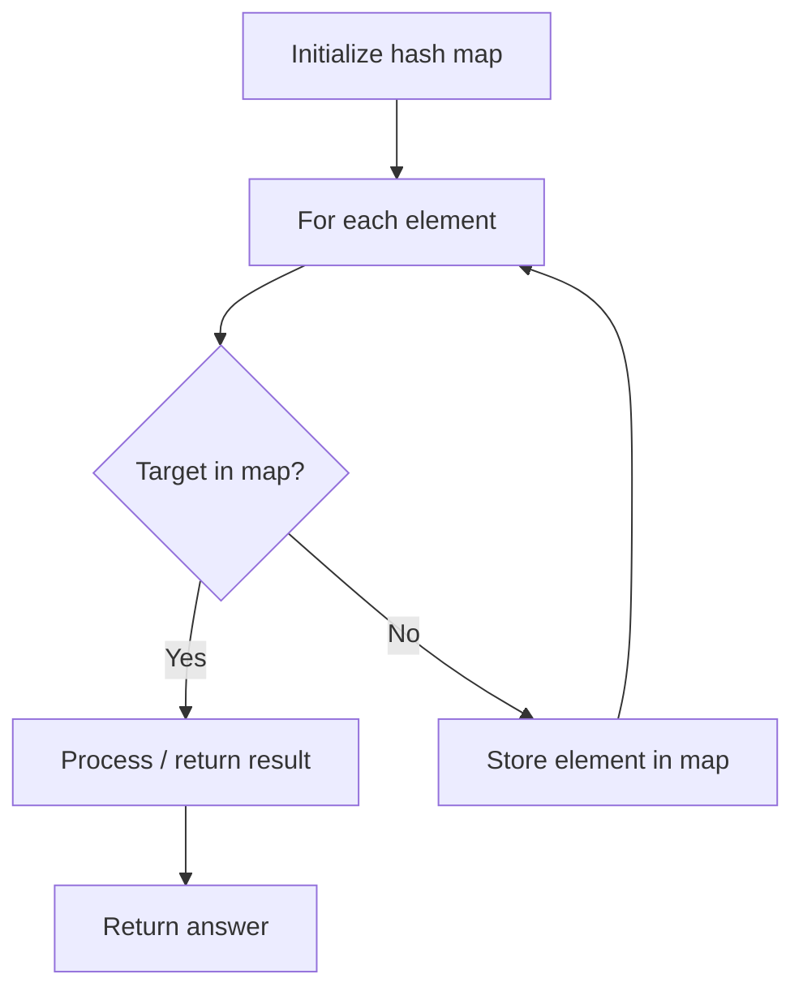

# Problem 599: Minimum Index Sum of Two Lists

**Difficulty:** Easy  
**Tags:** Array, Hash Table, String  
**Pattern:** Hash Map Lookup  
**Link:** [leetcode.com/problems/minimum-index-sum-of-two-lists](https://leetcode.com/problems/minimum-index-sum-of-two-lists/)

## Description

Given two arrays of strings `list1` and `list2`, find the **common strings with the least index sum**.

A **common string** is a string that appeared in both `list1` and `list2`.

A **common string with the least index sum** is a common string such that if it appeared at `list1[i]` and `list2[j]` then `i + j` should be the minimum value among all the other **common strings**.

Return *all the **common strings with the least index sum***. Return the answer in **any order**.

 

Example 1:

```

**Input:** list1 = ["Shogun","Tapioca Express","Burger King","KFC"], list2 = ["Piatti","The Grill at Torrey Pines","Hungry Hunter Steakhouse","Shogun"]
**Output:** ["Shogun"]
**Explanation:** The only common string is "Shogun".

```

Example 2:

```

**Input:** list1 = ["Shogun","Tapioca Express","Burger King","KFC"], list2 = ["KFC","Shogun","Burger King"]
**Output:** ["Shogun"]
**Explanation:** The common string with the least index sum is "Shogun" with index sum = (0 + 1) = 1.

```

Example 3:

```

**Input:** list1 = ["happy","sad","good"], list2 = ["sad","happy","good"]
**Output:** ["sad","happy"]
**Explanation:** There are three common strings:
"happy" with index sum = (0 + 1) = 1.
"sad" with index sum = (1 + 0) = 1.
"good" with index sum = (2 + 2) = 4.
The strings with the least index sum are "sad" and "happy".

```

 

**Constraints:**

	- `1 <= list1.length, list2.length <= 1000`
	- `1 <= list1[i].length, list2[i].length <= 30`
	- `list1[i]` and `list2[i]` consist of spaces `' '` and English letters.
	- All the strings of `list1` are **unique**.
	- All the strings of `list2` are **unique**.
	- There is at least a common string between `list1` and `list2`.

## Approach: Hash Map Lookup

Use a hash map (dictionary) to store elements for O(1) lookup. Iterate through the input, checking membership or counting frequencies in the map.

## Pseudocode

```
1. Initialize hash map
2. Iterate through elements:
   a. Check if target/complement exists in map
   b. If found: process result
   c. Otherwise: store element in map
3. Return result
```

## Algorithm Flow



## Complexity Analysis

- **Time:** O(n)
- **Space:** O(n)

## Solution (Python3)

```python
class Solution:
    def findRestaurant(self, list1: List[str], list2: List[str]) -> List[str]:
        # Hash map approach - O(n) time, O(n) space
        seen = {}
        for i, val in enumerate(list1):
            complement = list2 - val
            if complement in seen:
                return [seen[complement], i]
            seen[val] = i
        return []
```

## Solution (C++)

```cpp
#include <string>
#include <unordered_map>
#include <vector>
using namespace std;

class Solution {
public:
    vector<string> findRestaurant(vector<string>& list1, vector<string>& list2) {
        // Hash map approach - O(n) time, O(n) space
        unordered_map<int, int> seen;
        for (int i = 0; i < list1.size(); i++) {
            int complement = list2 - list1[i];
            if (seen.count(complement)) {
                return {seen[complement], i};
            }
            seen[list1[i]] = i;
        }
        return {};
    }
};
```
