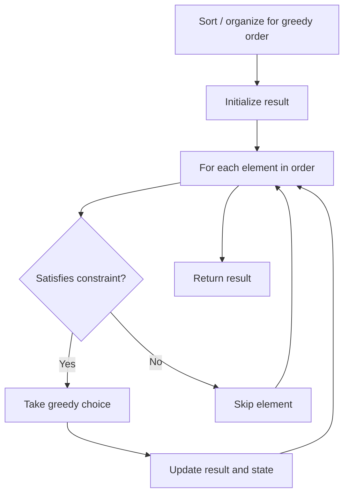

# Problem 605: Can Place Flowers

**Difficulty:** Easy  
**Tags:** Array, Greedy  
**Pattern:** Greedy  
**Link:** [leetcode.com/problems/can-place-flowers](https://leetcode.com/problems/can-place-flowers/)

## Description

You have a long flowerbed in which some of the plots are planted, and some are not. However, flowers cannot be planted in **adjacent** plots.

Given an integer array `flowerbed` containing `0`'s and `1`'s, where `0` means empty and `1` means not empty, and an integer `n`, return `true` *if* `n` *new flowers can be planted in the* `flowerbed` *without violating the no-adjacent-flowers rule and* `false` *otherwise*.

 

Example 1:

```
**Input:** flowerbed = [1,0,0,0,1], n = 1
**Output:** true

```
Example 2:

```
**Input:** flowerbed = [1,0,0,0,1], n = 2
**Output:** false

```

 

**Constraints:**

	- `1 <= flowerbed.length <= 2 * 10^4`
	- `flowerbed[i]` is `0` or `1`.
	- There are no two adjacent flowers in `flowerbed`.
	- `0 <= n <= flowerbed.length`

## Approach: Greedy

Greedily plant flower if both neighbors are empty.

## Pseudocode

```
1. Sort or organize data for greedy ordering
2. Initialize result
3. For each element in greedy order:
   a. If element satisfies constraint:
      - Take the greedy choice
      - Update result and state
4. Return result
```

## Algorithm Flow



## Complexity Analysis

- **Time:** O(n)
- **Space:** O(1)

## Solution (Python3)

```python
class Solution:
    def canPlaceFlowers(self, flowerbed: list[int], n: int) -> bool:
        count = 0
        for i in range(len(flowerbed)):
            if flowerbed[i] == 0:
                left = (i == 0) or (flowerbed[i-1] == 0)
                right = (i == len(flowerbed)-1) or (flowerbed[i+1] == 0)
                if left and right:
                    flowerbed[i] = 1
                    count += 1
        return count >= n
```

## Solution (C++)

```cpp
#include <algorithm>
#include <string>
#include <vector>
using namespace std;

class Solution {
public:
    bool canPlaceFlowers(vector<int>& flowerbed, int n) {
        // Greedy approach - O(n) time
        int result = 0, curr_max = 0;
        for (int i = 0; i < (int)flowerbed.size(); i++) {
            curr_max = max(curr_max, flowerbed[i]);
            result = max(result, curr_max);
        }
        return result;
    }
};
```
