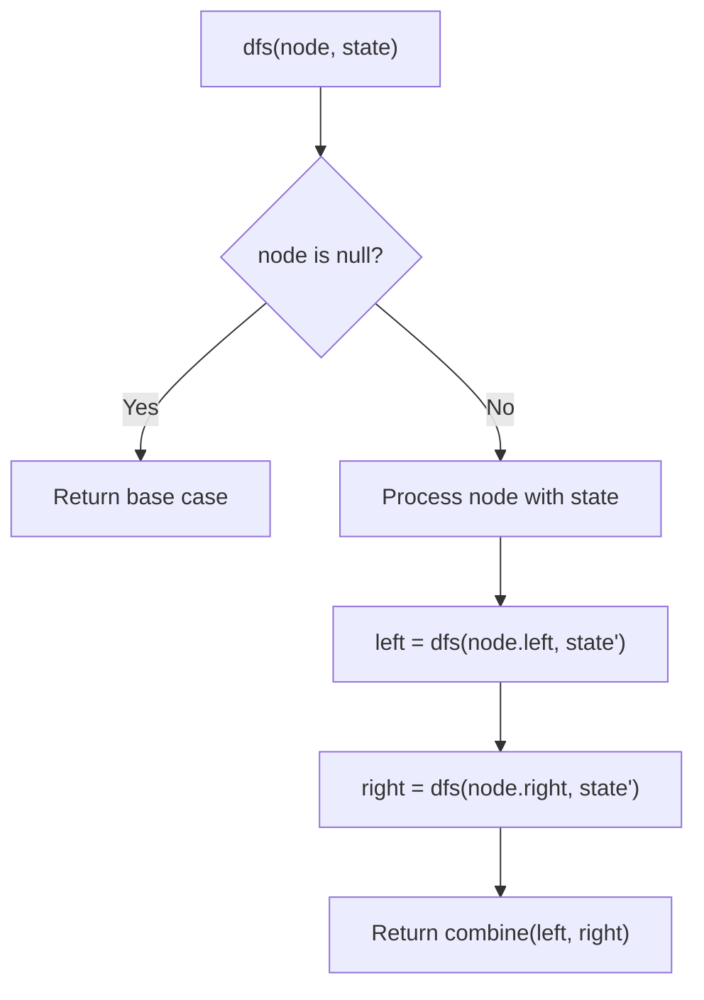
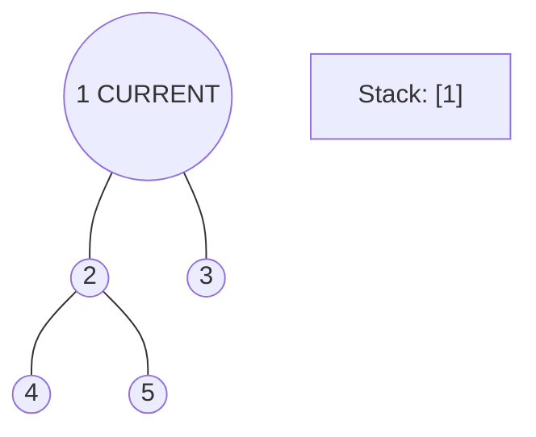
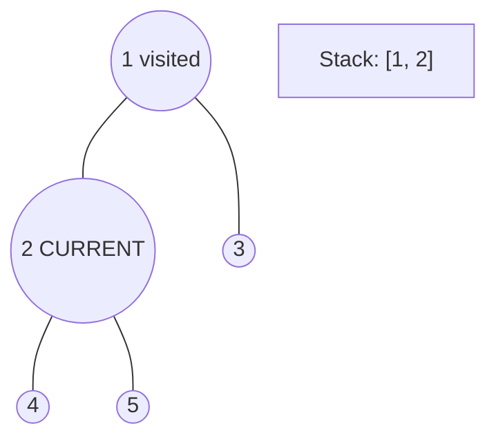
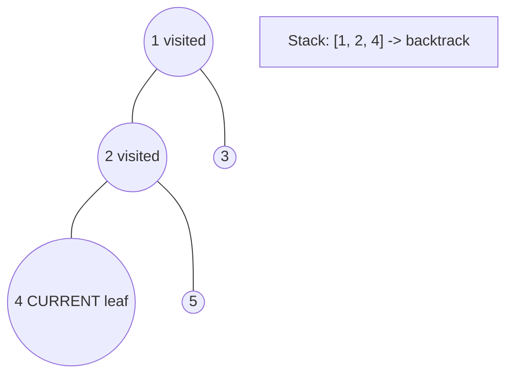
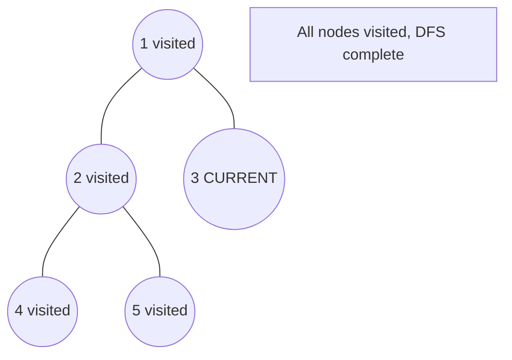

# Problem 606: Construct String from Binary Tree

**Difficulty:** Medium  
**Tags:** String, Tree, Depth-First Search, Binary Tree  
**Pattern:** DFS Tree Traversal  
**Link:** [leetcode.com/problems/construct-string-from-binary-tree](https://leetcode.com/problems/construct-string-from-binary-tree/)

## Description

Given the `root` node of a binary tree, your task is to create a string representation of the tree following a specific set of formatting rules. The representation should be based on a preorder traversal of the binary tree and must adhere to the following guidelines:

	- 
	**Node Representation**: Each node in the tree should be represented by its integer value.

	
	- 
	**Parentheses for Children**: If a node has at least one child (either left or right), its children should be represented inside parentheses. Specifically:

	
		If a node has a left child, the value of the left child should be enclosed in parentheses immediately following the node's value.
		- If a node has a right child, the value of the right child should also be enclosed in parentheses. The parentheses for the right child should follow those of the left child.
	
	
	- 
	**Omitting Empty Parentheses**: Any empty parentheses pairs (i.e., `()`) should be omitted from the final string representation of the tree, with one specific exception: when a node has a right child but no left child. In such cases, you must include an empty pair of parentheses to indicate the absence of the left child. This ensures that the one-to-one mapping between the string representation and the original binary tree structure is maintained.

	In summary, empty parentheses pairs should be omitted when a node has only a left child or no children. However, when a node has a right child but no left child, an empty pair of parentheses must precede the representation of the right child to reflect the tree's structure accurately.

	

 

Example 1:

```

**Input:** root = [1,2,3,4]
**Output:** "1(2(4))(3)"
**Explanation:** Originally, it needs to be "1(2(4)())(3()())", but you need to omit all the empty parenthesis pairs. And it will be "1(2(4))(3)".

```

Example 2:

```

**Input:** root = [1,2,3,null,4]
**Output:** "1(2()(4))(3)"
**Explanation:** Almost the same as the first example, except the `()` after `2` is necessary to indicate the absence of a left child for `2` and the presence of a right child.

```

 

**Constraints:**

	- The number of nodes in the tree is in the range `[1, 10^4]`.
	- `-1000 <= Node.val <= 1000`

## Approach: DFS Tree Traversal

Perform depth-first search on the tree. Recurse on left and right subtrees, combining results bottom-up. Track state (path, depth, sum) during traversal.

## Pseudocode

```
1. Define dfs(node, state):
   a. Base case: if null, return default
   b. Process node with current state
   c. left_result = dfs(node.left, updated_state)
   d. right_result = dfs(node.right, updated_state)
   e. Return combine(left_result, right_result)
2. Return dfs(root, initial_state)
```

## Algorithm Flow



## Visual State Transitions

**DFS Tree Traversal Step-by-Step:**

**Frame 1: Start at root**


**Frame 2: Go left - visit node 2**


**Frame 3: Go left - visit node 4 (leaf)**


**Frame 4: Backtrack, visit node 5, then node 3**



## Complexity Analysis

- **Time:** O(n)
- **Space:** O(h)

## Solution (Python3)

```python
class Solution:
    def tree2str(self, root: Optional[TreeNode]) -> str:
        # DFS on binary tree - O(n) time, O(h) space
        def dfs(node):
            if not node:
                return 0
            left = dfs(node.left)
            right = dfs(node.right)
            return 1 + max(left, right)
        
        result = dfs(root)
        return result
```

## Solution (C++)

```cpp
#include <algorithm>
#include <functional>
#include <string>
#include <vector>
using namespace std;

class Solution {
public:
    string tree2str(TreeNode* root) {
        // DFS on binary tree - O(n) time, O(h) space
        function<int(TreeNode*)> dfs = [&](TreeNode* node) -> int {
            if (!node) return 0;
            int left = dfs(node->left);
            int right = dfs(node->right);
            return 1 + max(left, right);
        };
        return dfs(root);
    }
};
```
