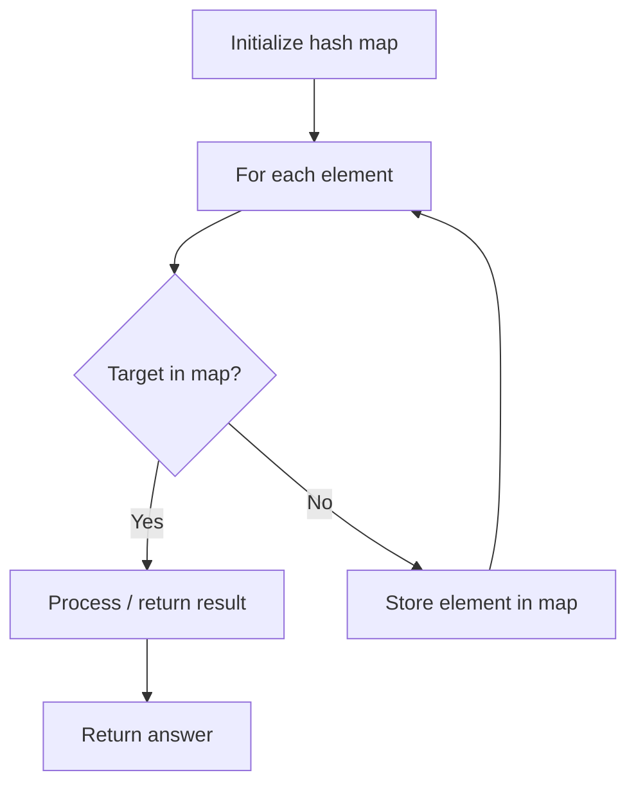

# Problem 609: Find Duplicate File in System

**Difficulty:** Medium  
**Tags:** Array, Hash Table, String  
**Pattern:** Hash Map Lookup  
**Link:** [leetcode.com/problems/find-duplicate-file-in-system](https://leetcode.com/problems/find-duplicate-file-in-system/)

## Description

Given a list `paths` of directory info, including the directory path, and all the files with contents in this directory, return *all the duplicate files in the file system in terms of their paths*. You may return the answer in **any order**.

A group of duplicate files consists of at least two files that have the same content.

A single directory info string in the input list has the following format:

	- `"root/d1/d2/.../dm f1.txt(f1_content) f2.txt(f2_content) ... fn.txt(fn_content)"`

It means there are `n` files `(f1.txt, f2.txt ... fn.txt)` with content `(f1_content, f2_content ... fn_content)` respectively in the directory "`root/d1/d2/.../dm"`. Note that `n >= 1` and `m >= 0`. If `m = 0`, it means the directory is just the root directory.

The output is a list of groups of duplicate file paths. For each group, it contains all the file paths of the files that have the same content. A file path is a string that has the following format:

	- `"directory_path/file_name.txt"`

 

Example 1:

```
**Input:** paths = ["root/a 1.txt(abcd) 2.txt(efgh)","root/c 3.txt(abcd)","root/c/d 4.txt(efgh)","root 4.txt(efgh)"]
**Output:** [["root/a/2.txt","root/c/d/4.txt","root/4.txt"],["root/a/1.txt","root/c/3.txt"]]

```
Example 2:

```
**Input:** paths = ["root/a 1.txt(abcd) 2.txt(efgh)","root/c 3.txt(abcd)","root/c/d 4.txt(efgh)"]
**Output:** [["root/a/2.txt","root/c/d/4.txt"],["root/a/1.txt","root/c/3.txt"]]

```

 

**Constraints:**

	- `1 <= paths.length <= 2 * 10^4`
	- `1 <= paths[i].length <= 3000`
	- `1 <= sum(paths[i].length) <= 5 * 10^5`
	- `paths[i]` consist of English letters, digits, `'/'`, `'.'`, `'('`, `')'`, and `' '`.
	- You may assume no files or directories share the same name in the same directory.
	- You may assume each given directory info represents a unique directory. A single blank space separates the directory path and file info.

 

**Follow up:**

	- Imagine you are given a real file system, how will you search files? DFS or BFS?
	- If the file content is very large (GB level), how will you modify your solution?
	- If you can only read the file by 1kb each time, how will you modify your solution?
	- What is the time complexity of your modified solution? What is the most time-consuming part and memory-consuming part of it? How to optimize?
	- How to make sure the duplicated files you find are not false positive?

## Approach: Hash Map Lookup

Use a hash map (dictionary) to store elements for O(1) lookup. Iterate through the input, checking membership or counting frequencies in the map.

## Pseudocode

```
1. Initialize hash map
2. Iterate through elements:
   a. Check if target/complement exists in map
   b. If found: process result
   c. Otherwise: store element in map
3. Return result
```

## Algorithm Flow



## Complexity Analysis

- **Time:** O(n)
- **Space:** O(n)

## Solution (Python3)

```python
class Solution:
    def findDuplicate(self, paths: List[str]) -> List[List[str]]:
        # Hash map approach - O(n) time, O(n) space
        seen = {}
        for i, val in enumerate(paths):
            complement = paths - val
            if complement in seen:
                return [seen[complement], i]
            seen[val] = i
        return []
```

## Solution (C++)

```cpp
#include <string>
#include <unordered_map>
#include <vector>
using namespace std;

class Solution {
public:
    vector<vector<string>> findDuplicate(vector<string>& paths) {
        // Hash map approach - O(n) time, O(n) space
        unordered_map<int, int> seen;
        for (int i = 0; i < paths.size(); i++) {
            int complement = paths - paths[i];
            if (seen.count(complement)) {
                return {seen[complement], i};
            }
            seen[paths[i]] = i;
        }
        return {};
    }
};
```
