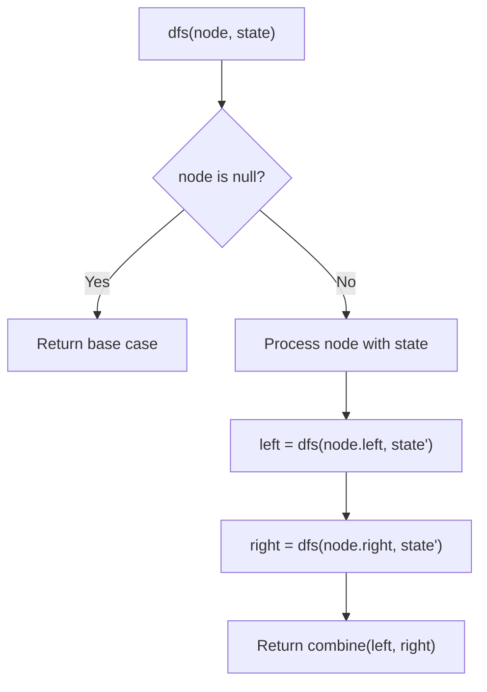
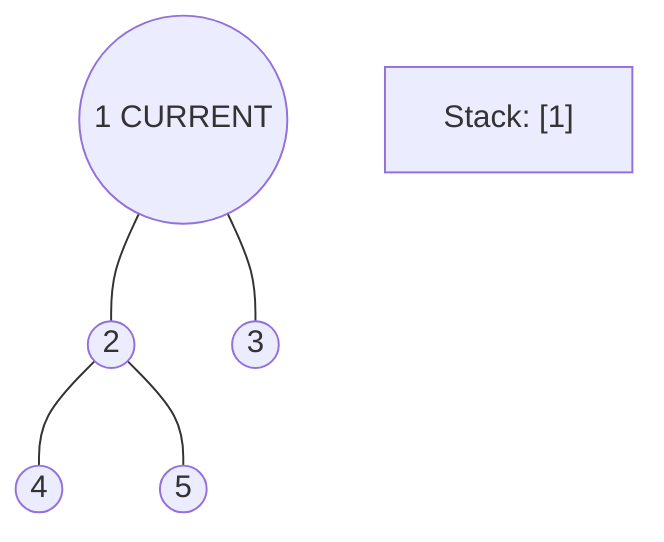
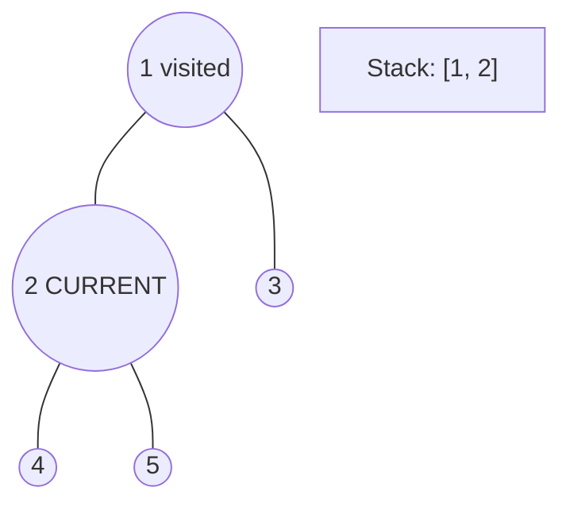
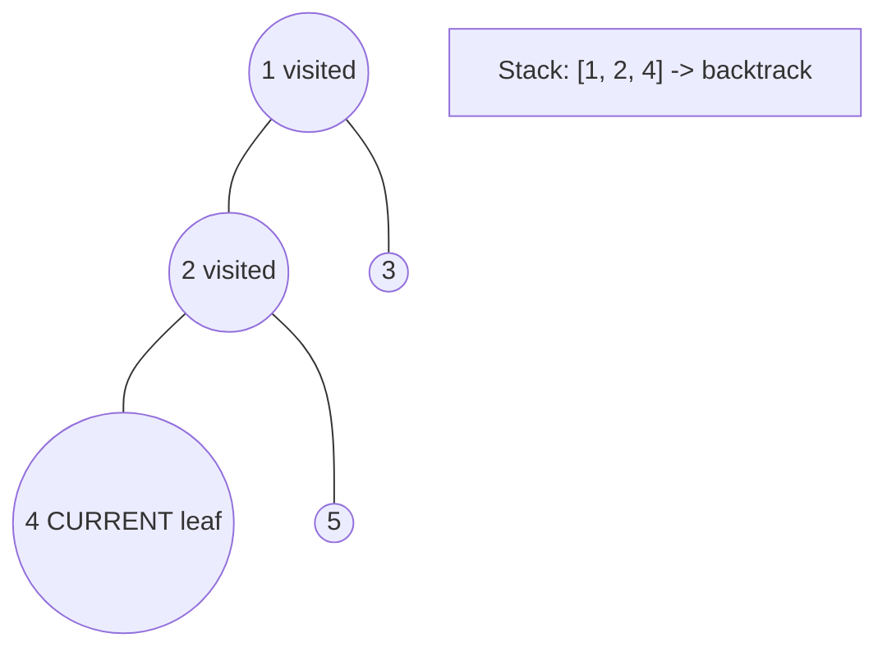
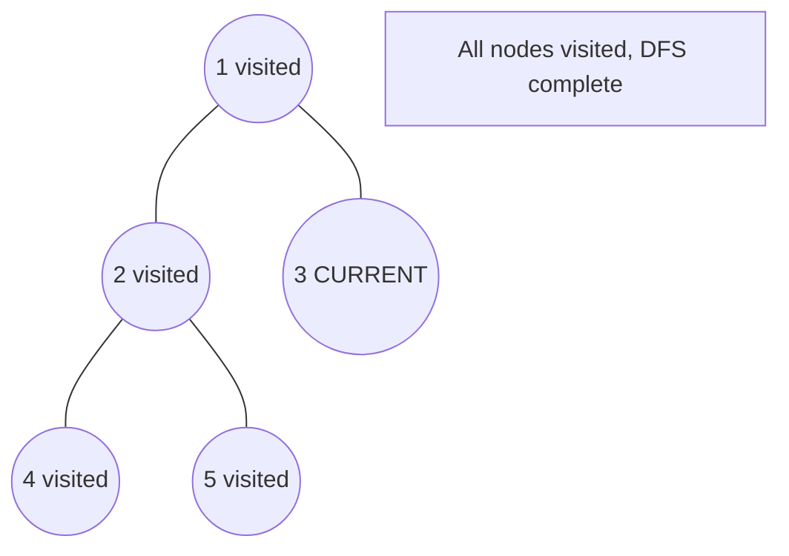

# Problem 617: Merge Two Binary Trees

**Difficulty:** Easy  
**Tags:** Tree, Depth-First Search, Breadth-First Search, Binary Tree  
**Pattern:** Tree / DFS  
**Link:** [leetcode.com/problems/merge-two-binary-trees](https://leetcode.com/problems/merge-two-binary-trees/)

## Description

You are given two binary trees `root1` and `root2`.

Imagine that when you put one of them to cover the other, some nodes of the two trees are overlapped while the others are not. You need to merge the two trees into a new binary tree. The merge rule is that if two nodes overlap, then sum node values up as the new value of the merged node. Otherwise, the NOT null node will be used as the node of the new tree.

Return *the merged tree*.

**Note:** The merging process must start from the root nodes of both trees.

 

Example 1:

```

**Input:** root1 = [1,3,2,5], root2 = [2,1,3,null,4,null,7]
**Output:** [3,4,5,5,4,null,7]

```

Example 2:

```

**Input:** root1 = [1], root2 = [1,2]
**Output:** [2,2]

```

 

**Constraints:**

	- The number of nodes in both trees is in the range `[0, 2000]`.
	- `-10^4 <= Node.val <= 10^4`

## Approach: Tree / DFS

Recursively merge: add values, recurse on left/right children.

## Pseudocode

```
1. Define dfs(node, state):
   a. Base case: if null, return default
   b. Process node with current state
   c. left_result = dfs(node.left, updated_state)
   d. right_result = dfs(node.right, updated_state)
   e. Return combine(left_result, right_result)
2. Return dfs(root, initial_state)
```

## Algorithm Flow



## Visual State Transitions

**DFS Tree Traversal Step-by-Step:**

**Frame 1: Start at root**


**Frame 2: Go left - visit node 2**


**Frame 3: Go left - visit node 4 (leaf)**


**Frame 4: Backtrack, visit node 5, then node 3**



## Complexity Analysis

- **Time:** O(n)
- **Space:** O(h)

## Solution (Python3)

```python
class Solution:
    def mergeTrees(self, root1, root2):
        if not root1:
            return root2
        if not root2:
            return root1
        root1.val += root2.val
        root1.left = self.mergeTrees(root1.left, root2.left)
        root1.right = self.mergeTrees(root1.right, root2.right)
        return root1
```

## Solution (C++)

```cpp
#include <algorithm>
#include <functional>
#include <string>
#include <vector>
using namespace std;

class Solution {
public:
    TreeNode* mergeTrees(TreeNode* root1, TreeNode* root2) {
        // DFS on binary tree - O(n) time, O(h) space
        function<int(TreeNode*)> dfs = [&](TreeNode* node) -> int {
            if (!node) return 0;
            int left = dfs(node->left);
            int right = dfs(node->right);
            return 1 + max(left, right);
        };
        return dfs(root1);
    }
};
```
