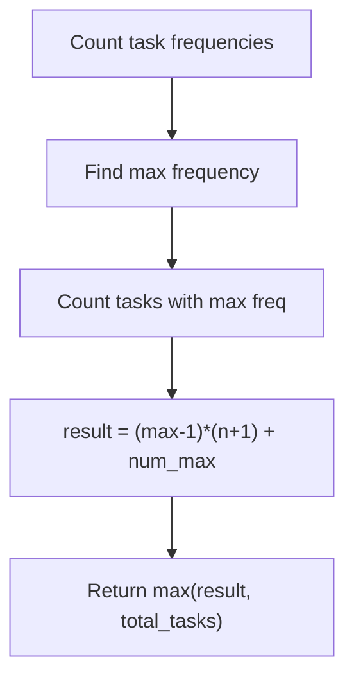
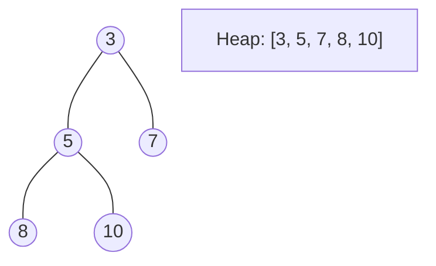
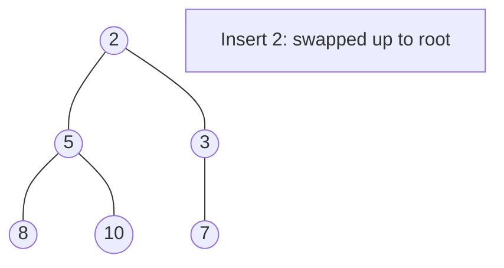
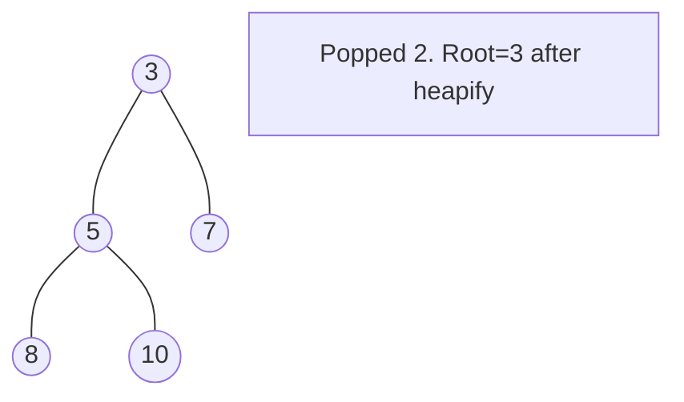

# Problem 621: Task Scheduler

**Difficulty:** Medium  
**Tags:** Array, Hash Table, Greedy, Sorting, Heap (Priority Queue), Counting  
**Pattern:** Greedy / Math  
**Link:** [leetcode.com/problems/task-scheduler](https://leetcode.com/problems/task-scheduler/)

## Description

You are given an array of CPU `tasks`, each labeled with a letter from A to Z, and a number `n`. Each CPU interval can be idle or allow the completion of one task. Tasks can be completed in any order, but there's a constraint: there has to be a gap of **at least** `n` intervals between two tasks with the same label.

Return the **minimum** number of CPU intervals required to complete all tasks.

 

Example 1:

**Input:** tasks = ["A","A","A","B","B","B"], n = 2

**Output:** 8

**Explanation:** A possible sequence is: A -> B -> idle -> A -> B -> idle -> A -> B.

After completing task A, you must wait two intervals before doing A again. The same applies to task B. In the 3^rd interval, neither A nor B can be done, so you idle. By the 4^th interval, you can do A again as 2 intervals have passed.

Example 2:

**Input:** tasks = ["A","C","A","B","D","B"], n = 1

**Output:** 6

**Explanation:** A possible sequence is: A -> B -> C -> D -> A -> B.

With a cooling interval of 1, you can repeat a task after just one other task.

Example 3:

**Input:** tasks = ["A","A","A", "B","B","B"], n = 3

**Output:** 10

**Explanation:** A possible sequence is: A -> B -> idle -> idle -> A -> B -> idle -> idle -> A -> B.

There are only two types of tasks, A and B, which need to be separated by 3 intervals. This leads to idling twice between repetitions of these tasks.

 

**Constraints:**

	- `1 <= tasks.length <= 10^4`
	- `tasks[i]` is an uppercase English letter.
	- `0 <= n <= 100`

## Approach: Greedy / Math

**Key Insight:** Most frequent task defines the frame. Result = (max_count-1)*(n+1) + num_tasks_with_max_count.

## Pseudocode

```
1. Initialize heap (min or max)
2. Push initial elements onto heap
3. While heap not empty and condition:
   a. Pop top element (min or max)
   b. Process element
   c. Push new elements if needed
4. Return result
```

## Algorithm Flow



## Visual State Transitions

**Heap Operations (Min-Heap):**

**Frame 1: Initial heap**


**Frame 2: Insert 2 - bubble up**


**Frame 3: Pop minimum (2) - heapify down**



## Complexity Analysis

- **Time:** O(n)
- **Space:** O(1)

## Solution (Python3)

```python
from collections import Counter

class Solution:
    def leastInterval(self, tasks: list[str], n: int) -> int:
        counts = Counter(tasks)
        max_count = max(counts.values())
        num_max = sum(1 for v in counts.values() if v == max_count)
        result = (max_count - 1) * (n + 1) + num_max
        return max(result, len(tasks))
```

## Solution (C++)

```cpp
#include <queue>
#include <string>
#include <vector>
using namespace std;

class Solution {
public:
    int leastInterval(vector<string>& tasks, int n) {
        // Heap/Priority Queue - O(n log k) time
        priority_queue<int, vector<int>, greater<int>> pq;
        for (int val : tasks) {
            pq.push(val);
            if ((int)pq.size() > n)
                pq.pop();
        }
        return pq.empty() ? 0 : pq.top();
    }
};
```
