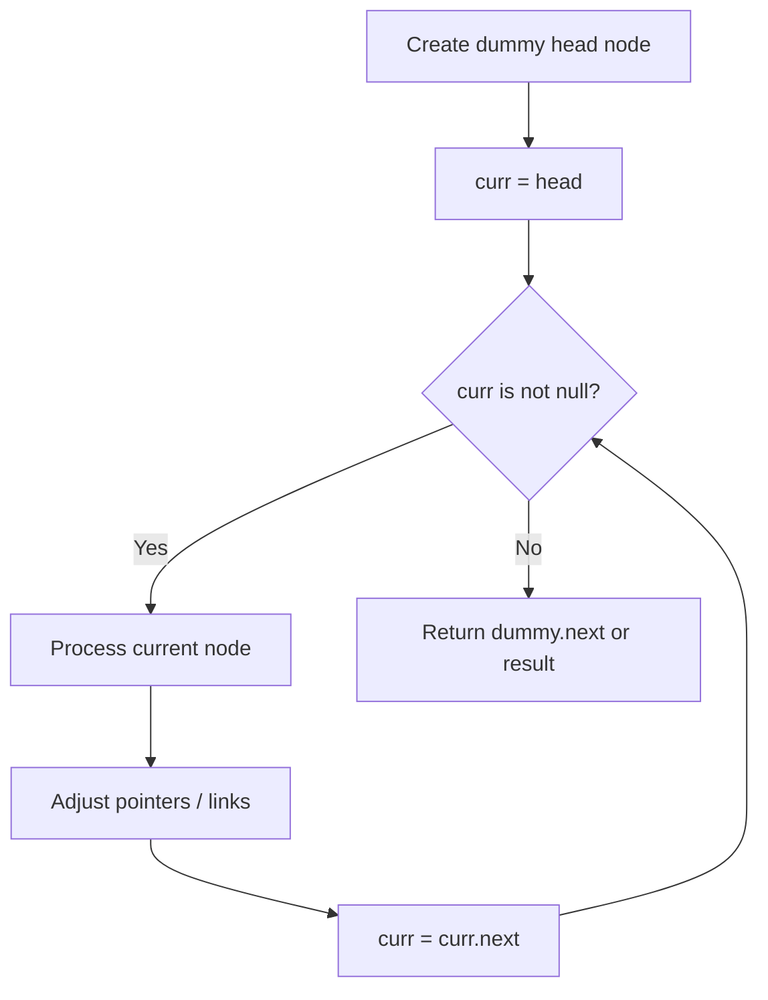
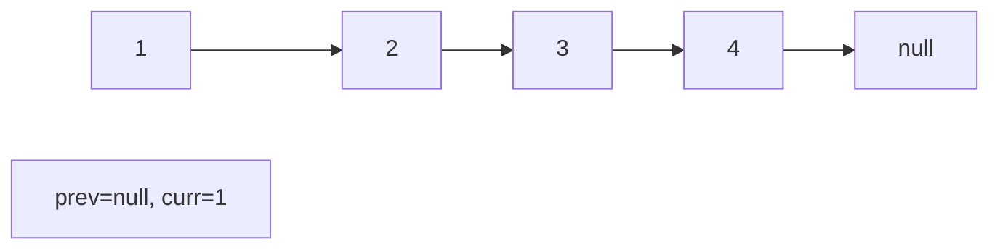
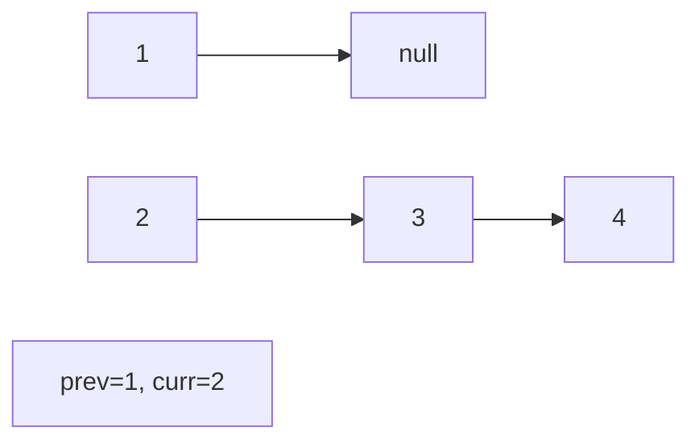
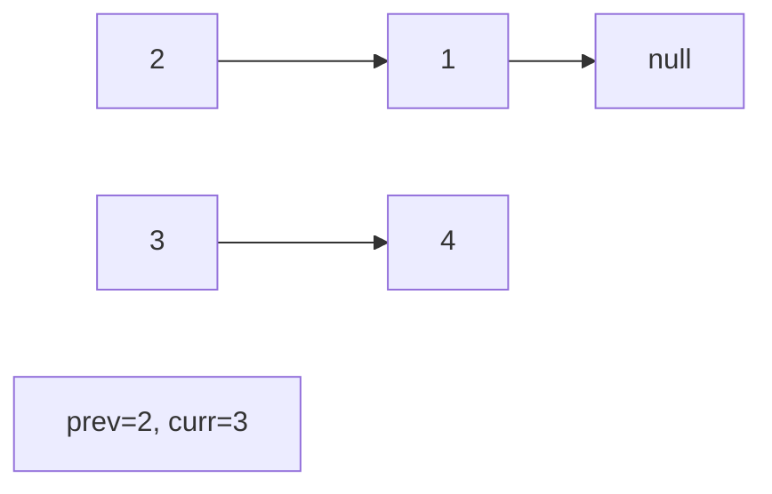
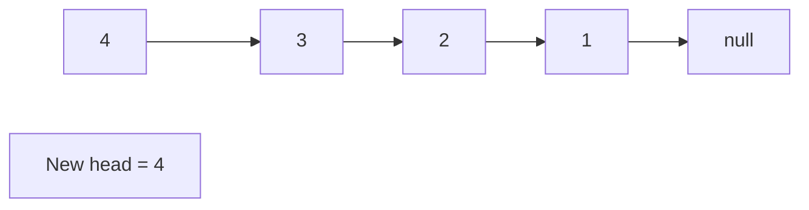

# Problem 622: Design Circular Queue

**Difficulty:** Medium  
**Tags:** Array, Linked List, Design, Queue  
**Pattern:** Linked List  
**Link:** [leetcode.com/problems/design-circular-queue](https://leetcode.com/problems/design-circular-queue/)

## Description

Design your implementation of the circular queue. The circular queue is a linear data structure in which the operations are performed based on FIFO (First In First Out) principle, and the last position is connected back to the first position to make a circle. It is also called "Ring Buffer".

One of the benefits of the circular queue is that we can make use of the spaces in front of the queue. In a normal queue, once the queue becomes full, we cannot insert the next element even if there is a space in front of the queue. But using the circular queue, we can use the space to store new values.

Implement the `MyCircularQueue` class:

	- `MyCircularQueue(k)` Initializes the object with the size of the queue to be `k`.
	- `int Front()` Gets the front item from the queue. If the queue is empty, return `-1`.
	- `int Rear()` Gets the last item from the queue. If the queue is empty, return `-1`.
	- `boolean enQueue(int value)` Inserts an element into the circular queue. Return `true` if the operation is successful.
	- `boolean deQueue()` Deletes an element from the circular queue. Return `true` if the operation is successful.
	- `boolean isEmpty()` Checks whether the circular queue is empty or not.
	- `boolean isFull()` Checks whether the circular queue is full or not.

You must solve the problem without using the built-in queue data structure in your programming language. 

 

Example 1:

```

**Input**
["MyCircularQueue", "enQueue", "enQueue", "enQueue", "enQueue", "Rear", "isFull", "deQueue", "enQueue", "Rear"]
[[3], [1], [2], [3], [4], [], [], [], [4], []]
**Output**
[null, true, true, true, false, 3, true, true, true, 4]

**Explanation**
MyCircularQueue myCircularQueue = new MyCircularQueue(3);
myCircularQueue.enQueue(1); // return True
myCircularQueue.enQueue(2); // return True
myCircularQueue.enQueue(3); // return True
myCircularQueue.enQueue(4); // return False
myCircularQueue.Rear();     // return 3
myCircularQueue.isFull();   // return True
myCircularQueue.deQueue();  // return True
myCircularQueue.enQueue(4); // return True
myCircularQueue.Rear();     // return 4

```

 

**Constraints:**

	- `1 <= k <= 1000`
	- `0 <= value <= 1000`
	- At most `3000` calls will be made to `enQueue`, `deQueue`, `Front`, `Rear`, `isEmpty`, and `isFull`.

## Approach: Linked List

Traverse or manipulate the linked list using pointer techniques. Common patterns: dummy head node for edge cases, fast/slow pointers for cycle detection or middle finding, in-place reversal, and merge operations.

## Pseudocode

```
1. Create dummy head if needed
2. Initialize pointer(s) at head
3. Traverse / modify list:
   a. Process current node
   b. Adjust next pointers as needed
   c. Move to next node
4. Return dummy.next or result
```

## Algorithm Flow



## Visual State Transitions

**Linked List Operation (Reverse):**

**Frame 1: Initial list**


**Frame 2: Reverse first link**


**Frame 3: Reverse second link**


**Frame 4: Fully reversed**



## Complexity Analysis

- **Time:** O(n)
- **Space:** O(1)

## Solution (Python3)

```python
class MyCircularQueue:
    def __init__(self, k: int):
        # Initialize data structure
        self.k = k

    def enQueue(self, value: int) -> bool:
        return False

    def deQueue(self) -> bool:
        return False

    def Front(self) -> int:
        return 0

    def Rear(self) -> int:
        return 0

    def isEmpty(self) -> bool:
        return False

    def isFull(self) -> bool:
        return False

```

## Solution (C++)

```cpp
#include <string>
#include <vector>
using namespace std;

class MyCircularQueue {
public:
    MyCircularQueue(int k) {
        // Initialize
    }

    bool enQueue(int value) {
        return false;
    }

    bool deQueue() {
        return false;
    }

    int Front() {
        return 0;
    }

    int Rear() {
        return 0;
    }

    bool isEmpty() {
        return false;
    }

    bool isFull() {
        return false;
    }

};
```
