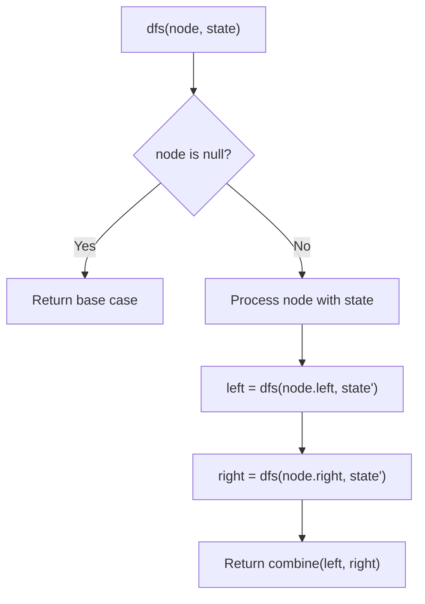
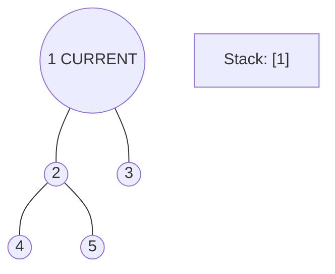
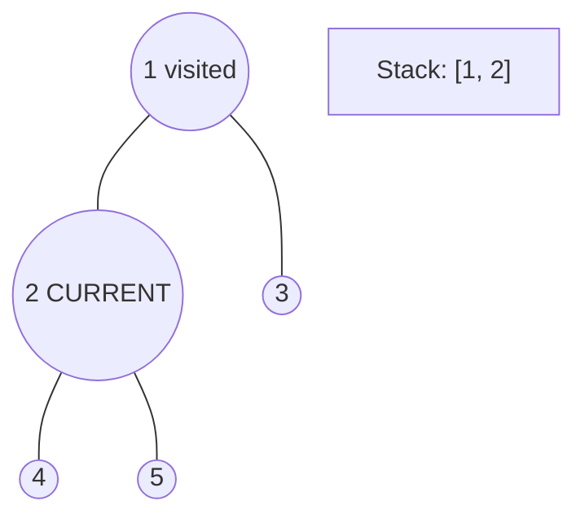
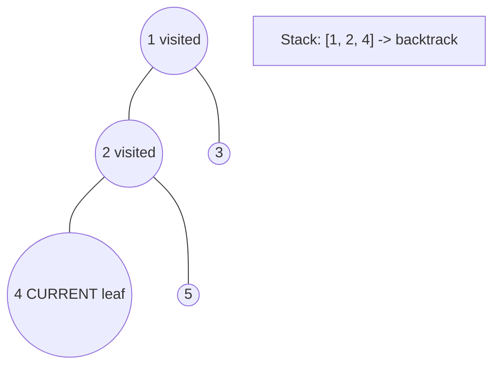
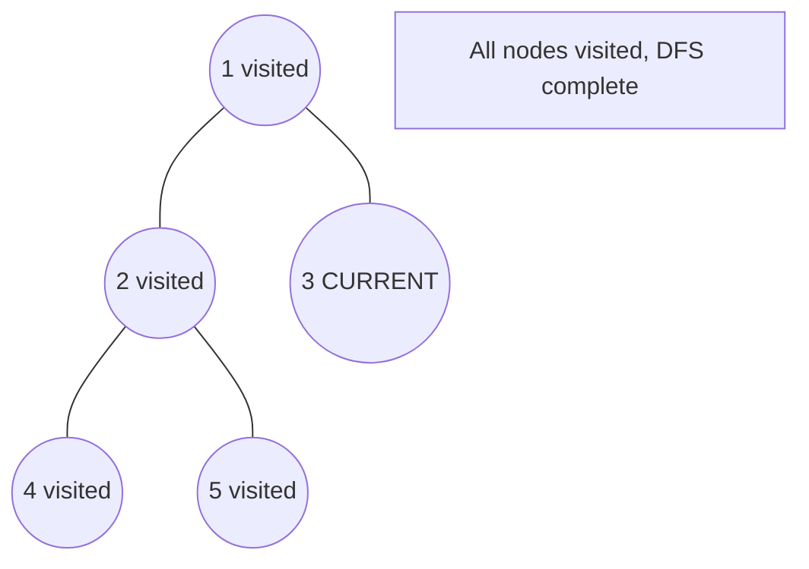

# Problem 623: Add One Row to Tree

**Difficulty:** Medium  
**Tags:** Tree, Depth-First Search, Breadth-First Search, Binary Tree  
**Pattern:** DFS Tree Traversal  
**Link:** [leetcode.com/problems/add-one-row-to-tree](https://leetcode.com/problems/add-one-row-to-tree/)

## Description

Given the `root` of a binary tree and two integers `val` and `depth`, add a row of nodes with value `val` at the given depth `depth`.

Note that the `root` node is at depth `1`.

The adding rule is:

	- Given the integer `depth`, for each not null tree node `cur` at the depth `depth - 1`, create two tree nodes with value `val` as `cur`'s left subtree root and right subtree root.
	- `cur`'s original left subtree should be the left subtree of the new left subtree root.
	- `cur`'s original right subtree should be the right subtree of the new right subtree root.
	- If `depth == 1` that means there is no depth `depth - 1` at all, then create a tree node with value `val` as the new root of the whole original tree, and the original tree is the new root's left subtree.

 

Example 1:

```

**Input:** root = [4,2,6,3,1,5], val = 1, depth = 2
**Output:** [4,1,1,2,null,null,6,3,1,5]

```

Example 2:

```

**Input:** root = [4,2,null,3,1], val = 1, depth = 3
**Output:** [4,2,null,1,1,3,null,null,1]

```

 

**Constraints:**

	- The number of nodes in the tree is in the range `[1, 10^4]`.
	- The depth of the tree is in the range `[1, 10^4]`.
	- `-100 <= Node.val <= 100`
	- `-10^5 <= val <= 10^5`
	- `1 <= depth <= the depth of tree + 1`

## Approach: DFS Tree Traversal

Perform depth-first search on the tree. Recurse on left and right subtrees, combining results bottom-up. Track state (path, depth, sum) during traversal.

## Pseudocode

```
1. Define dfs(node, state):
   a. Base case: if null, return default
   b. Process node with current state
   c. left_result = dfs(node.left, updated_state)
   d. right_result = dfs(node.right, updated_state)
   e. Return combine(left_result, right_result)
2. Return dfs(root, initial_state)
```

## Algorithm Flow



## Visual State Transitions

**DFS Tree Traversal Step-by-Step:**

**Frame 1: Start at root**


**Frame 2: Go left - visit node 2**


**Frame 3: Go left - visit node 4 (leaf)**


**Frame 4: Backtrack, visit node 5, then node 3**



## Complexity Analysis

- **Time:** O(n)
- **Space:** O(h)

## Solution (Python3)

```python
class Solution:
    def addOneRow(self, root: Optional[TreeNode], val: int, depth: int) -> Optional[TreeNode]:
        # DFS on binary tree - O(n) time, O(h) space
        def dfs(node):
            if not node:
                return 0
            left = dfs(node.left)
            right = dfs(node.right)
            return 1 + max(left, right)
        
        result = dfs(root)
        return result
```

## Solution (C++)

```cpp
#include <algorithm>
#include <functional>
#include <string>
#include <vector>
using namespace std;

class Solution {
public:
    TreeNode* addOneRow(TreeNode* root, int val, int depth) {
        // DFS on binary tree - O(n) time, O(h) space
        function<int(TreeNode*)> dfs = [&](TreeNode* node) -> int {
            if (!node) return 0;
            int left = dfs(node->left);
            int right = dfs(node->right);
            return 1 + max(left, right);
        };
        return dfs(root);
    }
};
```
