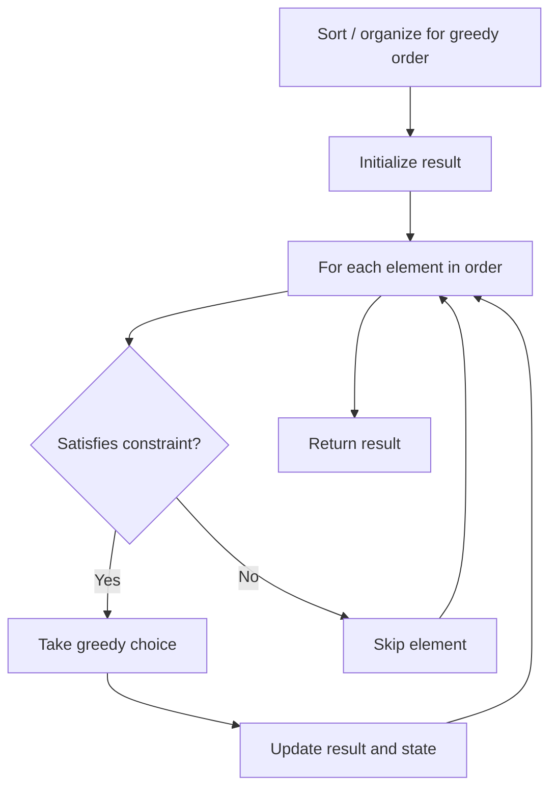

# Problem 624: Maximum Distance in Arrays

**Difficulty:** Medium  
**Tags:** Array, Greedy  
**Pattern:** Greedy  
**Link:** [leetcode.com/problems/maximum-distance-in-arrays](https://leetcode.com/problems/maximum-distance-in-arrays/)

## Description

You are given `m` `arrays`, where each array is sorted in **ascending order**.

You can pick up two integers from two different arrays (each array picks one) and calculate the distance. We define the distance between two integers `a` and `b` to be their absolute difference `|a - b|`.

Return *the maximum distance*.

 

Example 1:

```

**Input:** arrays = [[1,2,3],[4,5],[1,2,3]]
**Output:** 4
**Explanation:** One way to reach the maximum distance 4 is to pick 1 in the first or third array and pick 5 in the second array.

```

Example 2:

```

**Input:** arrays = [[1],[1]]
**Output:** 0

```

 

**Constraints:**

	- `m == arrays.length`
	- `2 <= m <= 10^5`
	- `1 <= arrays[i].length <= 500`
	- `-10^4 <= arrays[i][j] <= 10^4`
	- `arrays[i]` is sorted in **ascending order**.
	- There will be at most `10^5` integers in all the arrays.

## Approach: Greedy

Make the locally optimal choice at each step, trusting it leads to a global optimum. Greedy works when the problem has the greedy-choice property and optimal substructure.

## Pseudocode

```
1. Sort or organize data for greedy ordering
2. Initialize result
3. For each element in greedy order:
   a. If element satisfies constraint:
      - Take the greedy choice
      - Update result and state
4. Return result
```

## Algorithm Flow



## Complexity Analysis

- **Time:** O(n log n)
- **Space:** O(1)

## Solution (Python3)

```python
class Solution:
    def maxDistance(self, arrays: List[List[int]]) -> int:
        # Greedy approach - O(n) time
        result = 0
        curr_max = 0
        for i in range(len(arrays)):
            if isinstance(arrays[i], int):
                curr_max = max(curr_max, arrays[i])
                result = max(result, curr_max)
            else:
                result += 1
        return result
```

## Solution (C++)

```cpp
#include <algorithm>
#include <string>
#include <vector>
using namespace std;

class Solution {
public:
    int maxDistance(vector<vector<int>>& arrays) {
        // Greedy approach - O(n) time
        int result = 0, curr_max = 0;
        for (int i = 0; i < (int)arrays.size(); i++) {
            curr_max = max(curr_max, arrays[i]);
            result = max(result, curr_max);
        }
        return result;
    }
};
```
