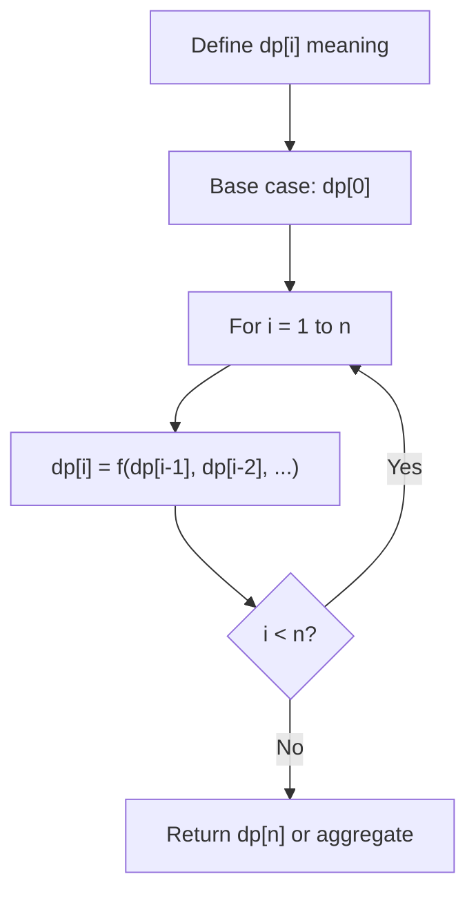
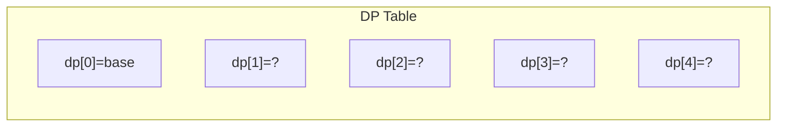
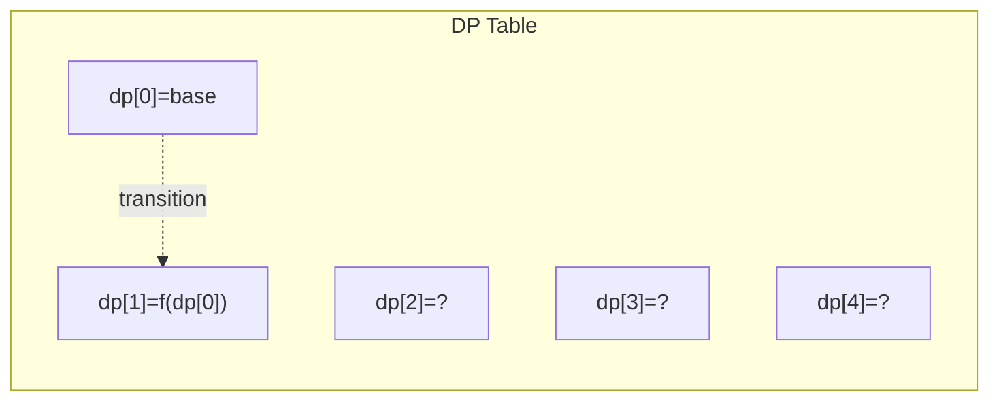
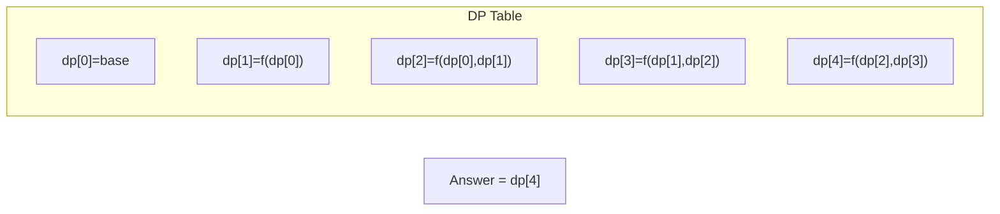

# Problem 629: K Inverse Pairs Array

**Difficulty:** Hard  
**Tags:** Dynamic Programming  
**Pattern:** Dynamic Programming (1D)  
**Link:** [leetcode.com/problems/k-inverse-pairs-array](https://leetcode.com/problems/k-inverse-pairs-array/)

## Description

For an integer array `nums`, an **inverse pair** is a pair of integers `[i, j]` where `0 <= i < j < nums.length` and `nums[i] > nums[j]`.

Given two integers n and k, return the number of different arrays consisting of numbers from `1` to `n` such that there are exactly `k` **inverse pairs**. Since the answer can be huge, return it **modulo** `10^9 + 7`.

 

Example 1:

```

**Input:** n = 3, k = 0
**Output:** 1
**Explanation:** Only the array [1,2,3] which consists of numbers from 1 to 3 has exactly 0 inverse pairs.

```

Example 2:

```

**Input:** n = 3, k = 1
**Output:** 2
**Explanation:** The array [1,3,2] and [2,1,3] have exactly 1 inverse pair.

```

 

**Constraints:**

	- `1 <= n <= 1000`
	- `0 <= k <= 1000`

## Approach: Dynamic Programming (1D)

Break the problem into overlapping subproblems. Define dp[i] as the optimal value for the subproblem ending at or considering index i. Build the solution bottom-up, using previously computed dp values.

## Pseudocode

```
1. Define dp[i] = optimal value for subproblem i
2. Base case: dp[0] = initial value
3. For i from 1 to n:
   a. dp[i] = recurrence(dp[i-1], dp[i-2], ...)
4. Return dp[n] or max/min of dp
```

## Algorithm Flow



## Visual State Transitions

**1D Dynamic Programming Table Build:**

**Frame 1: Initialize base cases**


**Frame 2: Fill dp[1] from dp[0]**


**Frame 3: Fill remaining cells**



## Complexity Analysis

- **Time:** O(n)
- **Space:** O(n)

## Solution (Python3)

```python
class Solution:
    def kInversePairs(self, n: int, k: int) -> int:
        # Dynamic programming (1D) - O(n) time, O(n) space
        if not n:
            return 0
        n = len(n) if isinstance(n, list) else n
        dp = [0] * (n + 1)
        dp[0] = 1  # base case
        for i in range(1, n + 1):
            dp[i] = dp[i-1]  # transition (customize per problem)
            if i >= 2:
                dp[i] += dp[i-2]
        return dp[n]
```

## Solution (C++)

```cpp
#include <string>
#include <vector>
using namespace std;

class Solution {
public:
    int kInversePairs(int n, int k) {
        // Dynamic programming (1D) - O(n) time, O(n) space
        int n = n;
        if (n <= 0) return 0;
        vector<int> dp(n + 1, 0);
        dp[0] = 1;
        for (int i = 1; i <= n; i++) {
            dp[i] = dp[i-1];
            if (i >= 2) dp[i] += dp[i-2];
        }
        return dp[n];
    }
};
```
