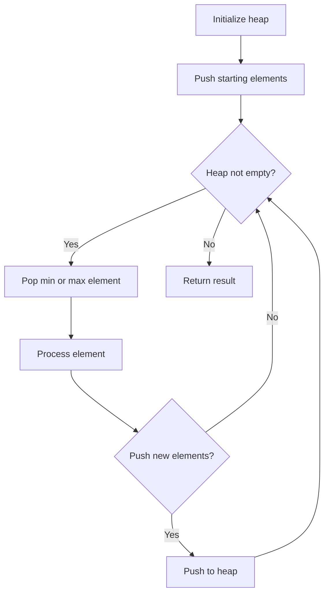
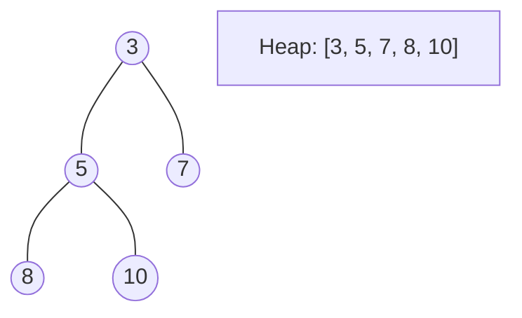
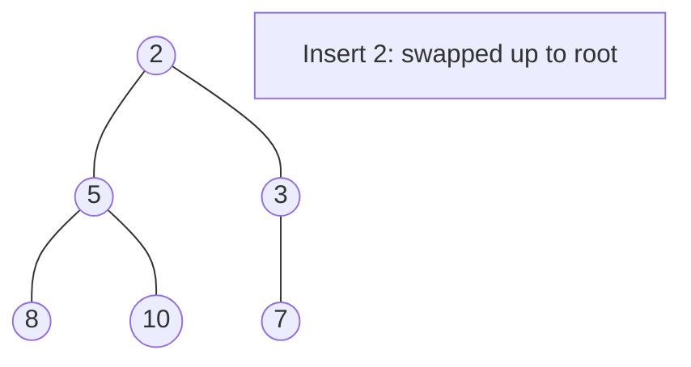
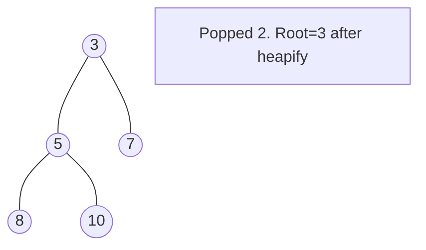

# Problem 630: Course Schedule III

**Difficulty:** Hard  
**Tags:** Array, Greedy, Sorting, Heap (Priority Queue)  
**Pattern:** Heap / Priority Queue  
**Link:** [leetcode.com/problems/course-schedule-iii](https://leetcode.com/problems/course-schedule-iii/)

## Description

There are `n` different online courses numbered from `1` to `n`. You are given an array `courses` where `courses[i] = [durationi, lastDayi]` indicate that the `i^th` course should be taken **continuously** for `durationi` days and must be finished before or on `lastDayi`.

You will start on the `1^st` day and you cannot take two or more courses simultaneously.

Return *the maximum number of courses that you can take*.

 

Example 1:

```

**Input:** courses = [[100,200],[200,1300],[1000,1250],[2000,3200]]
**Output:** 3
Explanation: 
There are totally 4 courses, but you can take 3 courses at most:
First, take the 1st course, it costs 100 days so you will finish it on the 100th day, and ready to take the next course on the 101st day.
Second, take the 3rd course, it costs 1000 days so you will finish it on the 1100th day, and ready to take the next course on the 1101st day. 
Third, take the 2nd course, it costs 200 days so you will finish it on the 1300th day. 
The 4th course cannot be taken now, since you will finish it on the 3300th day, which exceeds the closed date.

```

Example 2:

```

**Input:** courses = [[1,2]]
**Output:** 1

```

Example 3:

```

**Input:** courses = [[3,2],[4,3]]
**Output:** 0

```

 

**Constraints:**

	- `1 <= courses.length <= 10^4`
	- `1 <= durationi, lastDayi <= 10^4`

## Approach: Heap / Priority Queue

Use a min-heap or max-heap to efficiently access the smallest/largest element. Push elements and pop the top to process in priority order.

## Pseudocode

```
1. Initialize heap (min or max)
2. Push initial elements onto heap
3. While heap not empty and condition:
   a. Pop top element (min or max)
   b. Process element
   c. Push new elements if needed
4. Return result
```

## Algorithm Flow



## Visual State Transitions

**Heap Operations (Min-Heap):**

**Frame 1: Initial heap**


**Frame 2: Insert 2 - bubble up**


**Frame 3: Pop minimum (2) - heapify down**



## Complexity Analysis

- **Time:** O(n log n)
- **Space:** O(n)

## Solution (Python3)

```python
class Solution:
    def scheduleCourse(self, courses: List[List[int]]) -> int:
        # Heap/Priority Queue - O(n log k) time
        import heapq
        if not courses:
            return 0
        # Min heap (negate for max heap)
        heap = []
        for val in courses:
            heapq.heappush(heap, val)
            if len(heap) > (courses if isinstance(courses, int) else len(courses)):
                heapq.heappop(heap)
        return heap[0] if heap else 0
```

## Solution (C++)

```cpp
#include <queue>
#include <string>
#include <vector>
using namespace std;

class Solution {
public:
    int scheduleCourse(vector<vector<int>>& courses) {
        // Heap/Priority Queue - O(n log k) time
        priority_queue<int, vector<int>, greater<int>> pq;
        for (int val : courses) {
            pq.push(val);
            if ((int)pq.size() > courses)
                pq.pop();
        }
        return pq.empty() ? 0 : pq.top();
    }
};
```
