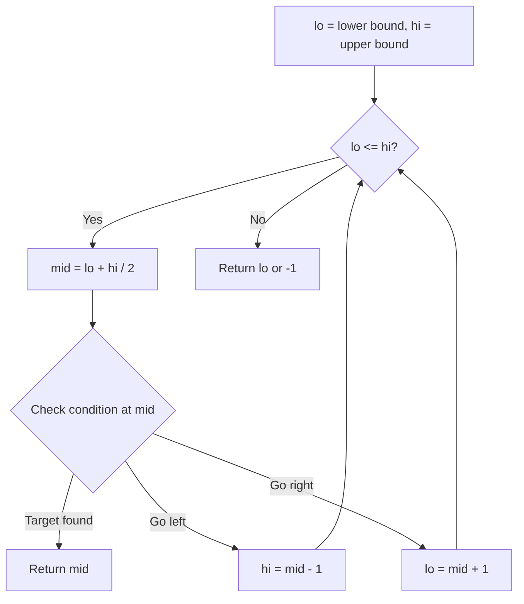
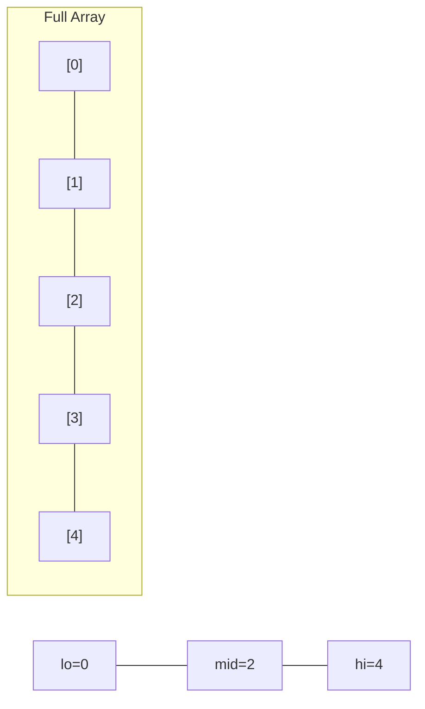
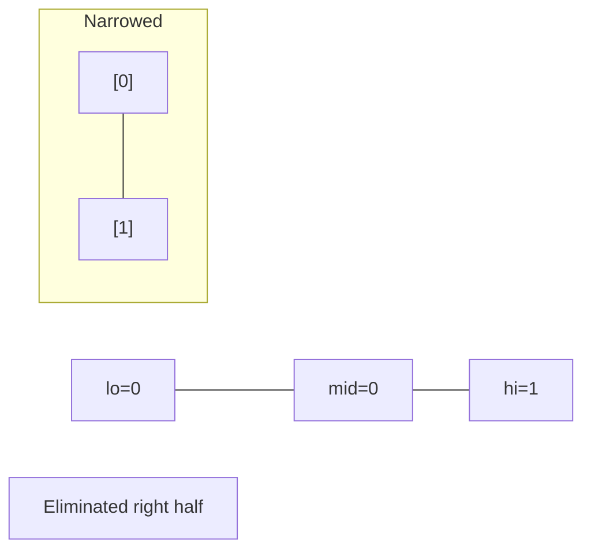
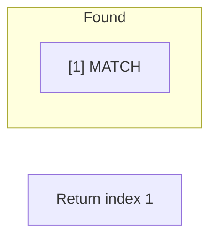

# Problem 633: Sum of Square Numbers

**Difficulty:** Medium  
**Tags:** Math, Two Pointers, Binary Search  
**Pattern:** Binary Search  
**Link:** [leetcode.com/problems/sum-of-square-numbers](https://leetcode.com/problems/sum-of-square-numbers/)

## Description

Given a non-negative integer `c`, decide whether there're two integers `a` and `b` such that `a^2 + b^2 = c`.

 

Example 1:

```

**Input:** c = 5
**Output:** true
**Explanation:** 1 * 1 + 2 * 2 = 5

```

Example 2:

```

**Input:** c = 3
**Output:** false

```

 

**Constraints:**

	- `0 <= c <= 2^31 - 1`

## Approach: Binary Search

Use binary search to halve the search space each iteration. Define the search range [lo, hi], compute mid, and decide which half to keep based on the problem's monotonic condition.

## Pseudocode

```
1. lo = lower_bound, hi = upper_bound
2. While lo <= hi (or lo < hi):
   a. mid = (lo + hi) // 2
   b. If condition(mid) is satisfied: record answer, search left half
   c. Else: search right half
3. Return answer
```

## Algorithm Flow



## Visual State Transitions

**Binary Search Step-by-Step:**

**Frame 1: Initial search space**


**Frame 2: Compare mid, narrow search**


**Frame 3: Found target**



## Complexity Analysis

- **Time:** O(log n)
- **Space:** O(1)

## Solution (Python3)

```python
class Solution:
    def judgeSquareSum(self, c: int) -> bool:
        # Binary search - O(log n) time, O(1) space
        lo, hi = 0, len(c) - 1
        while lo <= hi:
            mid = lo + (hi - lo) // 2
            if c[mid] == c:
                return mid
            elif c[mid] < c:
                lo = mid + 1
            else:
                hi = mid - 1
        return False
```

## Solution (C++)

```cpp
#include <string>
#include <vector>
using namespace std;

class Solution {
public:
    bool judgeSquareSum(int c) {
        // Binary search - O(log n) time, O(1) space
        int lo = 0, hi = c.size() - 1;
        while (lo <= hi) {
            int mid = lo + (hi - lo) / 2;
            if (c[mid] == c) {
                return mid;
            } else if (c[mid] < c) {
                lo = mid + 1;
            } else {
                hi = mid - 1;
            }
        }
        return false;
    }
};
```
