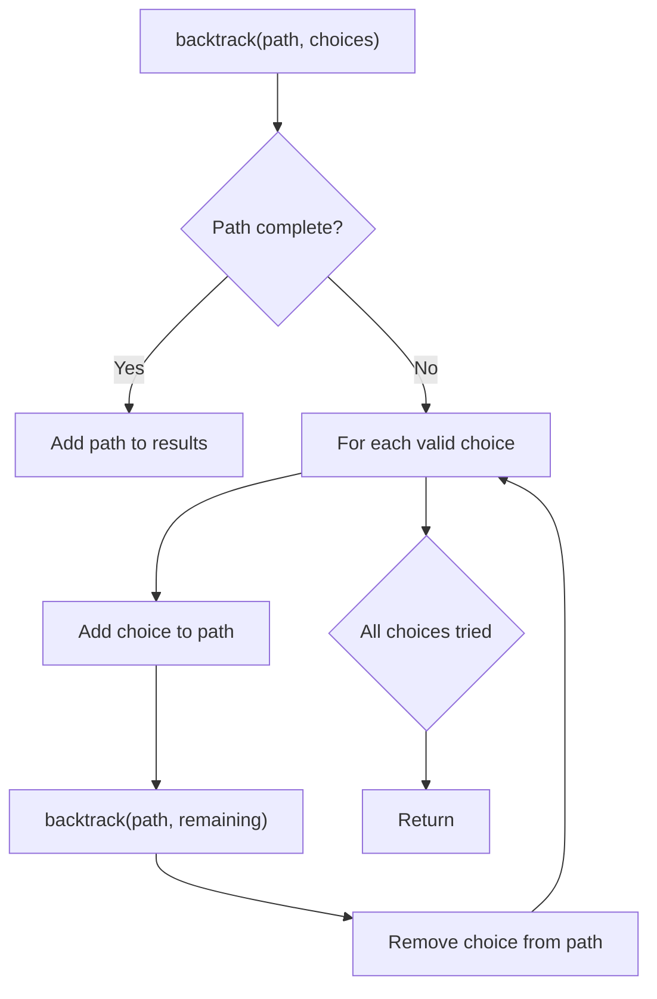
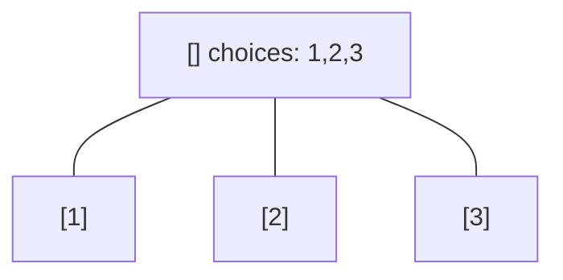
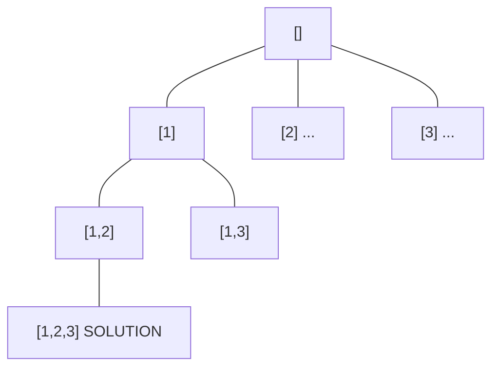
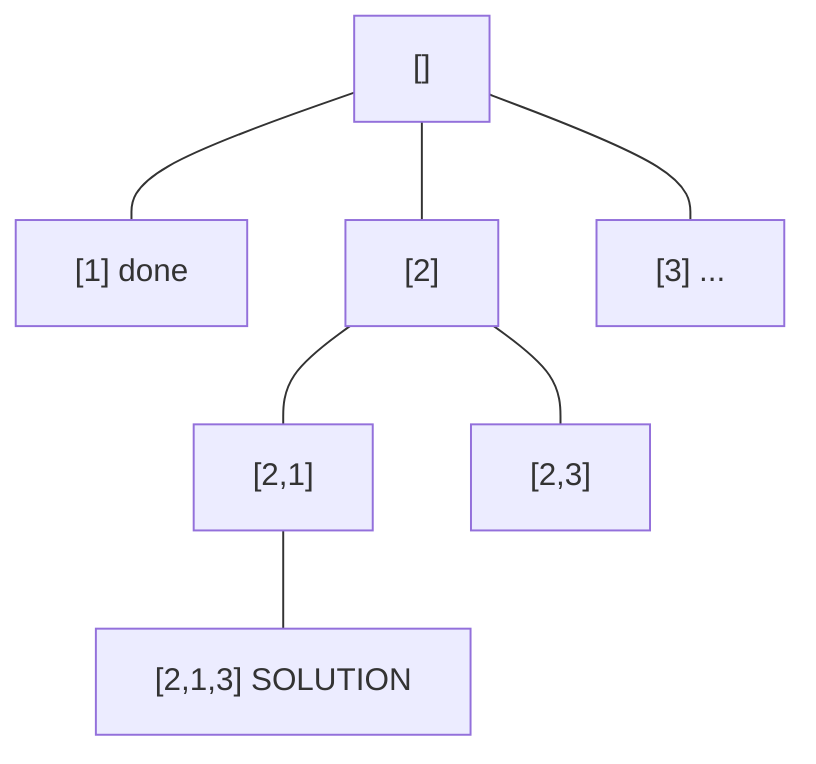
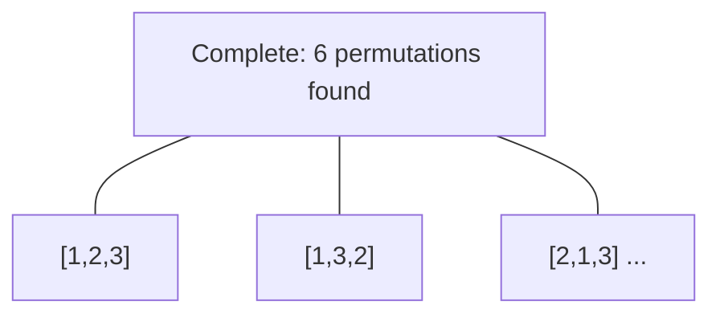

# Problem 638: Shopping Offers

**Difficulty:** Medium  
**Tags:** Array, Dynamic Programming, Backtracking, Bit Manipulation, Memoization, Bitmask  
**Pattern:** Backtracking  
**Link:** [leetcode.com/problems/shopping-offers](https://leetcode.com/problems/shopping-offers/)

## Description

In LeetCode Store, there are `n` items to sell. Each item has a price. However, there are some special offers, and a special offer consists of one or more different kinds of items with a sale price.

You are given an integer array `price` where `price[i]` is the price of the `i^th` item, and an integer array `needs` where `needs[i]` is the number of pieces of the `i^th` item you want to buy.

You are also given an array `special` where `special[i]` is of size `n + 1` where `special[i][j]` is the number of pieces of the `j^th` item in the `i^th` offer and `special[i][n]` (i.e., the last integer in the array) is the price of the `i^th` offer.

Return *the lowest price you have to pay for exactly certain items as given, where you could make optimal use of the special offers*. You are not allowed to buy more items than you want, even if that would lower the overall price. You could use any of the special offers as many times as you want.

 

Example 1:

```

**Input:** price = [2,5], special = [[3,0,5],[1,2,10]], needs = [3,2]
**Output:** 14
**Explanation:** There are two kinds of items, A and B. Their prices are $2 and $5 respectively. 
In special offer 1, you can pay $5 for 3A and 0B
In special offer 2, you can pay $10 for 1A and 2B. 
You need to buy 3A and 2B, so you may pay $10 for 1A and 2B (special offer #2), and $4 for 2A.

```

Example 2:

```

**Input:** price = [2,3,4], special = [[1,1,0,4],[2,2,1,9]], needs = [1,2,1]
**Output:** 11
**Explanation:** The price of A is $2, and $3 for B, $4 for C. 
You may pay $4 for 1A and 1B, and $9 for 2A ,2B and 1C. 
You need to buy 1A ,2B and 1C, so you may pay $4 for 1A and 1B (special offer #1), and $3 for 1B, $4 for 1C. 
You cannot add more items, though only $9 for 2A ,2B and 1C.

```

 

**Constraints:**

	- `n == price.length == needs.length`
	- `1 <= n <= 6`
	- `0 <= price[i], needs[i] <= 10`
	- `1 <= special.length <= 100`
	- `special[i].length == n + 1`
	- `0 <= special[i][j] <= 50`
	- The input is generated that at least one of `special[i][j]` is non-zero for `0 <= j <= n - 1`.

## Approach: Backtracking

Explore all possible solutions by building candidates incrementally. At each step, make a choice and recurse. If the choice leads to a dead end, undo the choice (backtrack) and try the next option.

## Pseudocode

```
1. Define backtrack(path, choices):
   a. If path is a complete solution: add to results
   b. For each choice in choices:
      - If choice is valid:
        * Add choice to path
        * backtrack(path, remaining_choices)
        * Remove choice from path (backtrack)
2. Call backtrack([], all_choices)
```

## Algorithm Flow



## Visual State Transitions

**Backtracking Decision Tree:**

**Frame 1: Root - start with empty path**


**Frame 2: Explore branch [1]**


**Frame 3: Backtrack, explore [2]**


**Frame 4: All solutions found**



## Complexity Analysis

- **Time:** O(k^n) or O(n!)
- **Space:** O(n)

## Solution (Python3)

```python
class Solution:
    def shoppingOffers(self, price: List[int], special: List[List[int]], needs: List[int]) -> int:
        # Backtracking - O(2^n) or O(n!) time
        result = []
        
        def backtrack(path, start):
            result.append(path[:])
            for i in range(start, len(price)):
                path.append(price[i])
                backtrack(path, i + 1)
                path.pop()
        
        backtrack([], 0)
        return result
```

## Solution (C++)

```cpp
#include <functional>
#include <string>
#include <vector>
using namespace std;

class Solution {
public:
    int shoppingOffers(vector<int>& price, vector<vector<int>>& special, vector<int>& needs) {
        // Backtracking - O(2^n) or O(n!) time
        vector<vector<int>> result;
        vector<int> path;
        function<void(int)> backtrack = [&](int start) {
            result.push_back(path);
            for (int i = start; i < (int)price.size(); i++) {
                path.push_back(price[i]);
                backtrack(i + 1);
                path.pop_back();
            }
        };
        backtrack(0);
        return result;
    }
};
```
