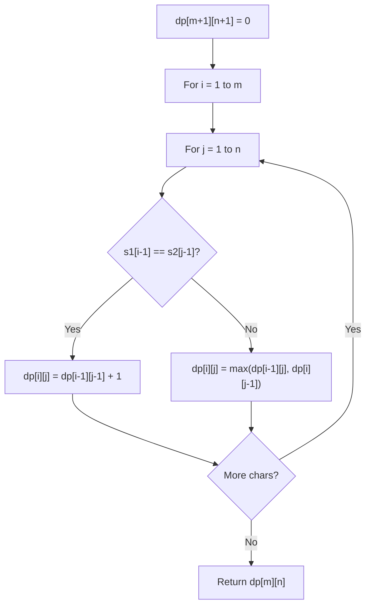

# Problem 639: Decode Ways II

**Difficulty:** Hard  
**Tags:** String, Dynamic Programming  
**Pattern:** Dynamic Programming (String)  
**Link:** [leetcode.com/problems/decode-ways-ii](https://leetcode.com/problems/decode-ways-ii/)

## Description

A message containing letters from `A-Z` can be **encoded** into numbers using the following mapping:

```

'A' -> "1"
'B' -> "2"
...
'Z' -> "26"

```

To **decode** an encoded message, all the digits must be grouped then mapped back into letters using the reverse of the mapping above (there may be multiple ways). For example, `"11106"` can be mapped into:

	- `"AAJF"` with the grouping `(1 1 10 6)`
	- `"KJF"` with the grouping `(11 10 6)`

Note that the grouping `(1 11 06)` is invalid because `"06"` cannot be mapped into `'F'` since `"6"` is different from `"06"`.

**In addition** to the mapping above, an encoded message may contain the `'*'` character, which can represent any digit from `'1'` to `'9'` (`'0'` is excluded). For example, the encoded message `"1*"` may represent any of the encoded messages `"11"`, `"12"`, `"13"`, `"14"`, `"15"`, `"16"`, `"17"`, `"18"`, or `"19"`. Decoding `"1*"` is equivalent to decoding **any** of the encoded messages it can represent.

Given a string `s` consisting of digits and `'*'` characters, return *the **number** of ways to **decode** it*.

Since the answer may be very large, return it **modulo** `10^9 + 7`.

 

Example 1:

```

**Input:** s = "*"
**Output:** 9
**Explanation:** The encoded message can represent any of the encoded messages "1", "2", "3", "4", "5", "6", "7", "8", or "9".
Each of these can be decoded to the strings "A", "B", "C", "D", "E", "F", "G", "H", and "I" respectively.
Hence, there are a total of 9 ways to decode "*".

```

Example 2:

```

**Input:** s = "1*"
**Output:** 18
**Explanation:** The encoded message can represent any of the encoded messages "11", "12", "13", "14", "15", "16", "17", "18", or "19".
Each of these encoded messages have 2 ways to be decoded (e.g. "11" can be decoded to "AA" or "K").
Hence, there are a total of 9 * 2 = 18 ways to decode "1*".

```

Example 3:

```

**Input:** s = "2*"
**Output:** 15
**Explanation:** The encoded message can represent any of the encoded messages "21", "22", "23", "24", "25", "26", "27", "28", or "29".
"21", "22", "23", "24", "25", and "26" have 2 ways of being decoded, but "27", "28", and "29" only have 1 way.
Hence, there are a total of (6 * 2) + (3 * 1) = 12 + 3 = 15 ways to decode "2*".

```

 

**Constraints:**

	- `1 <= s.length <= 10^5`
	- `s[i]` is a digit or `'*'`.

## Approach: Dynamic Programming (String)

Compare or match two strings using a 2D DP table. dp[i][j] represents the answer for substrings s1[0..i-1] and s2[0..j-1]. Common patterns: LCS, edit distance, regex matching.

## Pseudocode

```
1. Create dp[m+1][n+1]
2. Initialize base cases
3. For i from 1 to m:
   For j from 1 to n:
     If s1[i-1] == s2[j-1]: dp[i][j] = dp[i-1][j-1] + 1
     Else: dp[i][j] = best of (dp[i-1][j], dp[i][j-1], dp[i-1][j-1])
4. Return dp[m][n]
```

## Algorithm Flow



## Complexity Analysis

- **Time:** O(m * n)
- **Space:** O(m * n)

## Solution (Python3)

```python
class Solution:
    def numDecodings(self, s: str) -> int:
        # String DP - O(m*n) time and space
        m, n = len(s), len(s)
        dp = [[0] * (n + 1) for _ in range(m + 1)]
        for i in range(1, m + 1):
            for j in range(1, n + 1):
                if s[i-1] == s[j-1]:
                    dp[i][j] = dp[i-1][j-1] + 1
                else:
                    dp[i][j] = max(dp[i-1][j], dp[i][j-1])
        return dp[m][n]
```

## Solution (C++)

```cpp
#include <algorithm>
#include <string>
#include <vector>
using namespace std;

class Solution {
public:
    int numDecodings(string& s) {
        // String DP - O(m*n) time and space
        int m = s.size(), n = s.size();
        vector<vector<int>> dp(m + 1, vector<int>(n + 1, 0));
        for (int i = 1; i <= m; i++) {
            for (int j = 1; j <= n; j++) {
                if (s[i-1] == s[j-1])
                    dp[i][j] = dp[i-1][j-1] + 1;
                else
                    dp[i][j] = max(dp[i-1][j], dp[i][j-1]);
            }
        }
        return dp[m][n];
    }
};
```
