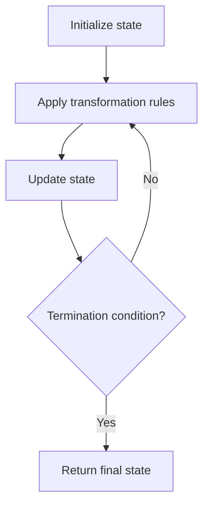

# Problem 640: Solve the Equation

**Difficulty:** Medium  
**Tags:** Math, String, Simulation  
**Pattern:** Simulation  
**Link:** [leetcode.com/problems/solve-the-equation](https://leetcode.com/problems/solve-the-equation/)

## Description

Solve a given equation and return the value of `'x'` in the form of a string `"x=#value"`. The equation contains only `'+'`, `'-'` operation, the variable `'x'` and its coefficient. You should return `"No solution"` if there is no solution for the equation, or `"Infinite solutions"` if there are infinite solutions for the equation.

If there is exactly one solution for the equation, we ensure that the value of `'x'` is an integer.

 

Example 1:

```

**Input:** equation = "x+5-3+x=6+x-2"
**Output:** "x=2"

```

Example 2:

```

**Input:** equation = "x=x"
**Output:** "Infinite solutions"

```

Example 3:

```

**Input:** equation = "2x=x"
**Output:** "x=0"

```

 

**Constraints:**

	- `3 <= equation.length <= 1000`
	- `equation` has exactly one `'='`.
	- `equation` consists of integers with an absolute value in the range `[0, 100]` without any leading zeros, and the variable `'x'`.
	- The input is generated that if there is a single solution, it will be an integer.

## Approach: Simulation

Simulate the process described in the problem step by step. Follow the rules exactly, tracking state at each step.

## Pseudocode

```
1. Initialize state (grid, pointers, counters)
2. For each step / iteration:
   a. Apply the transformation rules
   b. Update state
   c. Check termination condition
3. Return final state or result
```

## Algorithm Flow



## Complexity Analysis

- **Time:** O(n) or O(n * k)
- **Space:** O(n)

## Solution (Python3)

```python
class Solution:
    def solveEquation(self, equation: str) -> str:
        # Simulation approach - follow the rules step by step
        result = ""
        for i in range(len(equation) if isinstance(equation, list) else equation):
            # Simulate each step
            pass
        return result
```

## Solution (C++)

```cpp
#include <string>
#include <vector>
using namespace std;

class Solution {
public:
    string solveEquation(string& equation) {
        // Simulation approach
        int n = equation.size();
        for (int i = 0; i < n; i++) {
            // Simulate each step
        }
        return "";
    }
};
```
