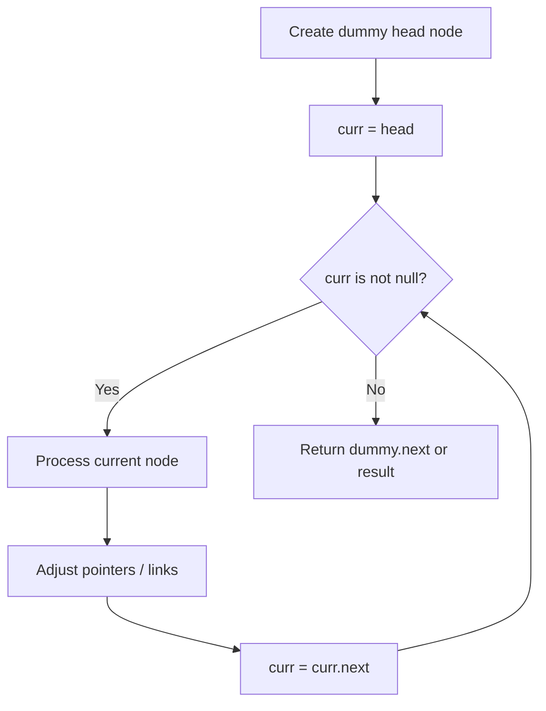
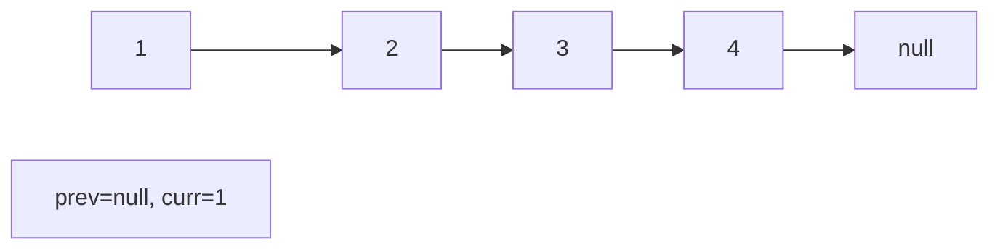
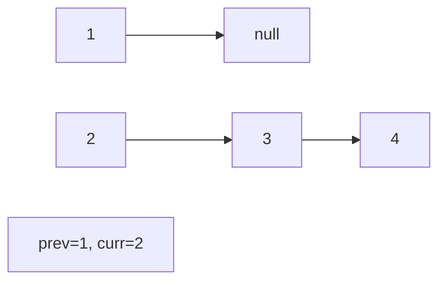
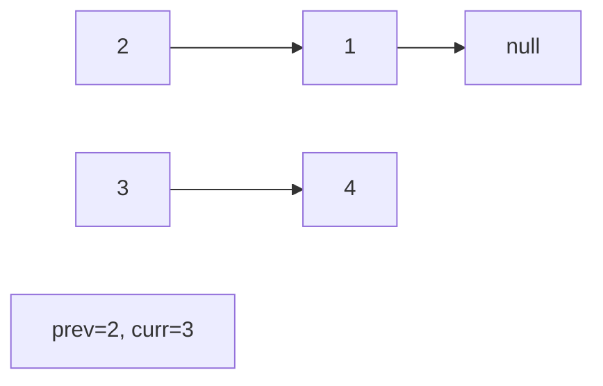
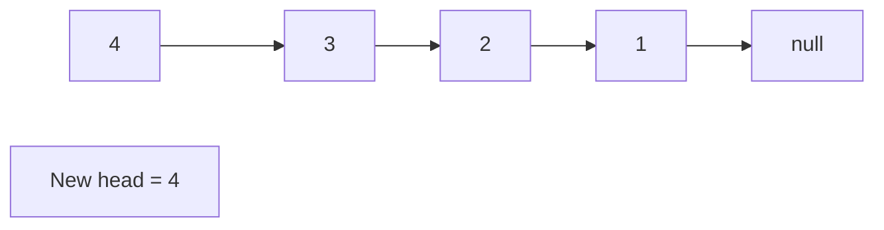

# Problem 641: Design Circular Deque

**Difficulty:** Medium  
**Tags:** Array, Linked List, Design, Queue  
**Pattern:** Linked List  
**Link:** [leetcode.com/problems/design-circular-deque](https://leetcode.com/problems/design-circular-deque/)

## Description

Design your implementation of the circular double-ended queue (deque).

Implement the `MyCircularDeque` class:

	- `MyCircularDeque(int k)` Initializes the deque with a maximum size of `k`.
	- `boolean insertFront()` Adds an item at the front of Deque. Returns `true` if the operation is successful, or `false` otherwise.
	- `boolean insertLast()` Adds an item at the rear of Deque. Returns `true` if the operation is successful, or `false` otherwise.
	- `boolean deleteFront()` Deletes an item from the front of Deque. Returns `true` if the operation is successful, or `false` otherwise.
	- `boolean deleteLast()` Deletes an item from the rear of Deque. Returns `true` if the operation is successful, or `false` otherwise.
	- `int getFront()` Returns the front item from the Deque. Returns `-1` if the deque is empty.
	- `int getRear()` Returns the last item from Deque. Returns `-1` if the deque is empty.
	- `boolean isEmpty()` Returns `true` if the deque is empty, or `false` otherwise.
	- `boolean isFull()` Returns `true` if the deque is full, or `false` otherwise.

 

Example 1:

```

**Input**
["MyCircularDeque", "insertLast", "insertLast", "insertFront", "insertFront", "getRear", "isFull", "deleteLast", "insertFront", "getFront"]
[[3], [1], [2], [3], [4], [], [], [], [4], []]
**Output**
[null, true, true, true, false, 2, true, true, true, 4]

**Explanation**
MyCircularDeque myCircularDeque = new MyCircularDeque(3);
myCircularDeque.insertLast(1);  // return True
myCircularDeque.insertLast(2);  // return True
myCircularDeque.insertFront(3); // return True
myCircularDeque.insertFront(4); // return False, the queue is full.
myCircularDeque.getRear();      // return 2
myCircularDeque.isFull();       // return True
myCircularDeque.deleteLast();   // return True
myCircularDeque.insertFront(4); // return True
myCircularDeque.getFront();     // return 4

```

 

**Constraints:**

	- `1 <= k <= 1000`
	- `0 <= value <= 1000`
	- At most `2000` calls will be made to `insertFront`, `insertLast`, `deleteFront`, `deleteLast`, `getFront`, `getRear`, `isEmpty`, `isFull`.

## Approach: Linked List

Traverse or manipulate the linked list using pointer techniques. Common patterns: dummy head node for edge cases, fast/slow pointers for cycle detection or middle finding, in-place reversal, and merge operations.

## Pseudocode

```
1. Create dummy head if needed
2. Initialize pointer(s) at head
3. Traverse / modify list:
   a. Process current node
   b. Adjust next pointers as needed
   c. Move to next node
4. Return dummy.next or result
```

## Algorithm Flow



## Visual State Transitions

**Linked List Operation (Reverse):**

**Frame 1: Initial list**


**Frame 2: Reverse first link**


**Frame 3: Reverse second link**


**Frame 4: Fully reversed**



## Complexity Analysis

- **Time:** O(n)
- **Space:** O(1)

## Solution (Python3)

```python
class MyCircularDeque:
    def __init__(self, k: int):
        # Initialize data structure
        self.k = k

    def insertFront(self, value: int) -> bool:
        return False

    def insertLast(self, value: int) -> bool:
        return False

    def deleteFront(self) -> bool:
        return False

    def deleteLast(self) -> bool:
        return False

    def getFront(self) -> int:
        return 0

    def getRear(self) -> int:
        return 0

    def isEmpty(self) -> bool:
        return False

    def isFull(self) -> bool:
        return False

```

## Solution (C++)

```cpp
#include <string>
#include <vector>
using namespace std;

class MyCircularDeque {
public:
    MyCircularDeque(int k) {
        // Initialize
    }

    bool insertFront(int value) {
        return false;
    }

    bool insertLast(int value) {
        return false;
    }

    bool deleteFront() {
        return false;
    }

    bool deleteLast() {
        return false;
    }

    int getFront() {
        return 0;
    }

    int getRear() {
        return 0;
    }

    bool isEmpty() {
        return false;
    }

    bool isFull() {
        return false;
    }

};
```
