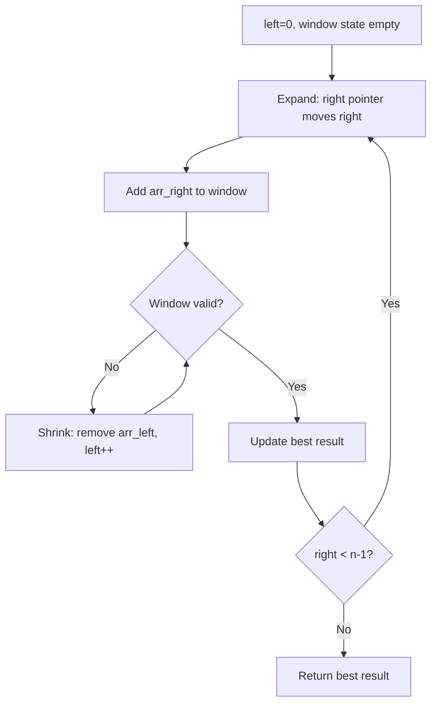
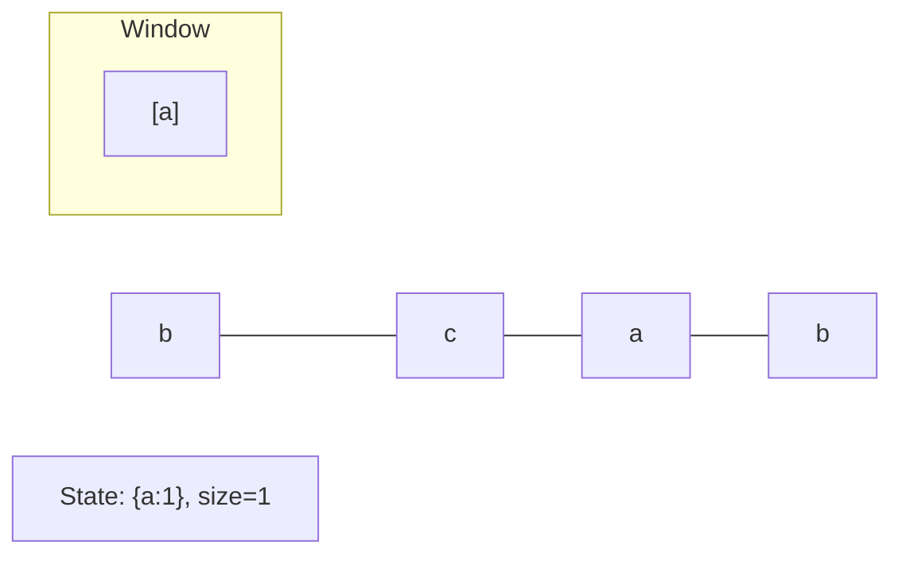
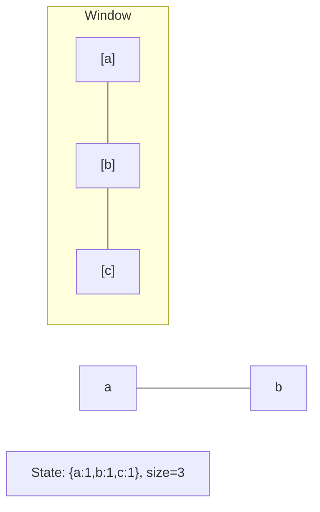
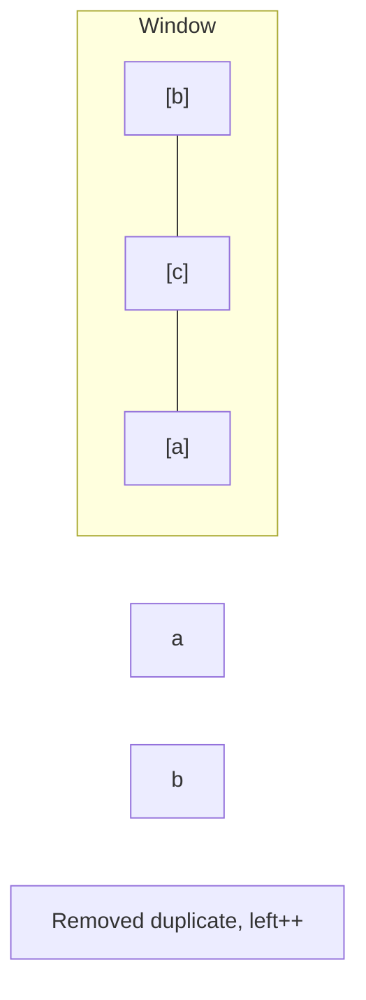
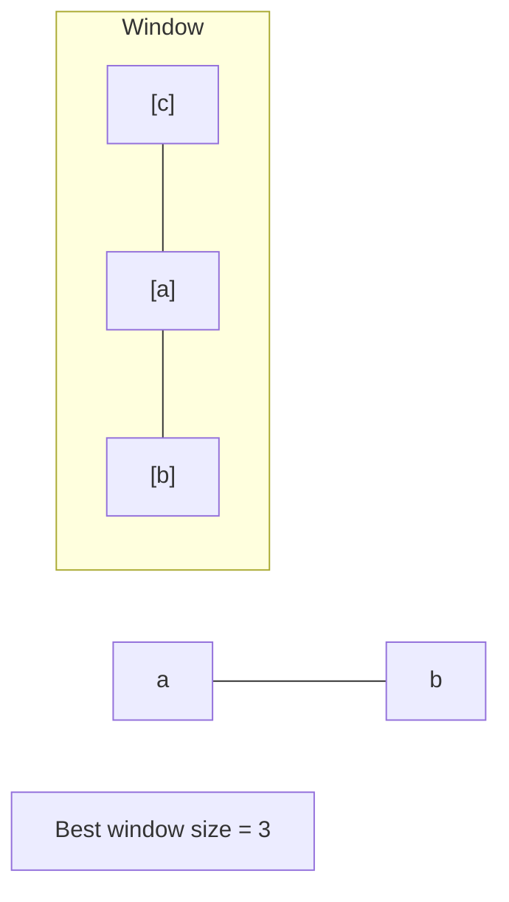

# Problem 643: Maximum Average Subarray I

**Difficulty:** Easy  
**Tags:** Array, Sliding Window  
**Pattern:** Sliding Window (Fixed)  
**Link:** [leetcode.com/problems/maximum-average-subarray-i](https://leetcode.com/problems/maximum-average-subarray-i/)

## Description

You are given an integer array `nums` consisting of `n` elements, and an integer `k`.

Find a contiguous subarray whose **length is equal to** `k` that has the maximum average value and return *this value*. Any answer with a calculation error less than `10^-5` will be accepted.

 

Example 1:

```

**Input:** nums = [1,12,-5,-6,50,3], k = 4
**Output:** 12.75000
**Explanation:** Maximum average is (12 - 5 - 6 + 50) / 4 = 51 / 4 = 12.75

```

Example 2:

```

**Input:** nums = [5], k = 1
**Output:** 5.00000

```

 

**Constraints:**

	- `n == nums.length`
	- `1 <= k <= n <= 10^5`
	- `-10^4 <= nums[i] <= 10^4`

## Approach: Sliding Window (Fixed)

Fixed-size sliding window of size k. Track maximum window sum.

## Pseudocode

```
1. Initialize left = 0, result = initial_value
2. For right in range(n):
   a. Add element at right to window state
   b. While window is invalid:
      - Remove element at left from window state
      - left++
   c. Update result = best of (result, window size/value)
3. Return result
```

## Algorithm Flow



## Visual State Transitions

**Sliding Window Step-by-Step:**

**Frame 1: Initial window (left=0, right=0)**


**Frame 2: Expand right (right=2)**


**Frame 3: Violation - shrink left**


**Frame 4: Continue expanding**



## Complexity Analysis

- **Time:** O(n)
- **Space:** O(1)

## Solution (Python3)

```python
class Solution:
    def findMaxAverage(self, nums: list[int], k: int) -> float:
        window_sum = sum(nums[:k])
        max_sum = window_sum
        for i in range(k, len(nums)):
            window_sum += nums[i] - nums[i - k]
            max_sum = max(max_sum, window_sum)
        return max_sum / k
```

## Solution (C++)

```cpp
#include <algorithm>
#include <string>
#include <unordered_map>
#include <vector>
using namespace std;

class Solution {
public:
    double findMaxAverage(vector<int>& nums, int k) {
        // Sliding window approach - O(n) time, O(k) space
        unordered_map<char, int> window;
        int left = 0, result = 0;
        for (int right = 0; right < nums.size(); right++) {
            window[nums[right]]++;
            while ((int)window.size() > k) {
                window[nums[left]]--;
                if (window[nums[left]] == 0)
                    window.erase(nums[left]);
                left++;
            }
            result = max(result, right - left + 1);
        }
        return result;
    }
};
```
