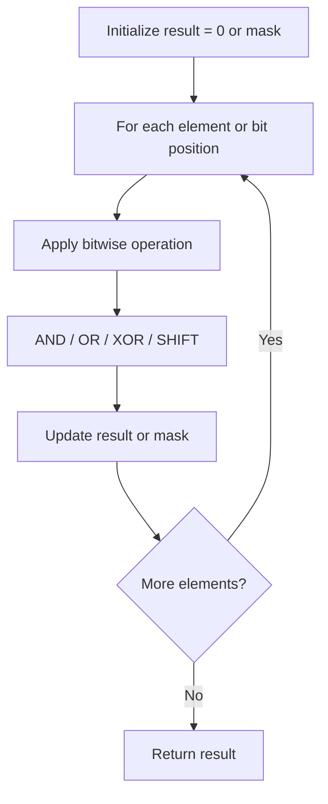

# Problem 645: Set Mismatch

**Difficulty:** Easy  
**Tags:** Array, Hash Table, Bit Manipulation, Sorting  
**Pattern:** Bit Manipulation  
**Link:** [leetcode.com/problems/set-mismatch](https://leetcode.com/problems/set-mismatch/)

## Description

You have a set of integers `s`, which originally contains all the numbers from `1` to `n`. Unfortunately, due to some error, one of the numbers in `s` got duplicated to another number in the set, which results in **repetition of one** number and **loss of another** number.

You are given an integer array `nums` representing the data status of this set after the error.

Find the number that occurs twice and the number that is missing and return *them in the form of an array*.

 

Example 1:

```
**Input:** nums = [1,2,2,4]
**Output:** [2,3]

```
Example 2:

```
**Input:** nums = [1,1]
**Output:** [1,2]

```

 

**Constraints:**

	- `2 <= nums.length <= 10^4`
	- `1 <= nums[i] <= 10^4`

## Approach: Bit Manipulation

Operate on individual bits using bitwise operators (AND, OR, XOR, shift). Common tricks: x & (x-1) removes lowest set bit, x ^ x = 0, XOR all elements to find unique.

## Pseudocode

```
1. Apply bitwise operations:
   - XOR all elements to cancel paired bits
   - Use bitmask to track state
   - Shift and mask to extract/set individual bits
2. Return result
```

## Algorithm Flow



## Complexity Analysis

- **Time:** O(n) or O(log n)
- **Space:** O(1)

## Solution (Python3)

```python
class Solution:
    def findErrorNums(self, nums: List[int]) -> List[int]:
        # Bit manipulation - O(n) time, O(1) space
        result = 0
        for val in nums:
            result ^= val
        return result
```

## Solution (C++)

```cpp
#include <string>
#include <vector>
using namespace std;

class Solution {
public:
    vector<int> findErrorNums(vector<int>& nums) {
        // Bit manipulation - O(n) time, O(1) space
        int result = 0;
        for (int val : nums) {
            result ^= val;
        }
        return result;
    }
};
```
