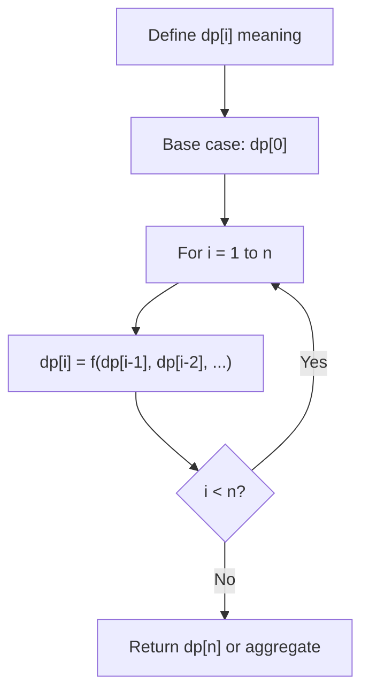
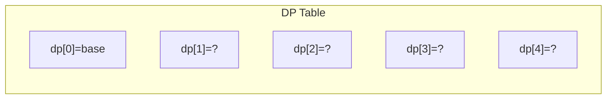
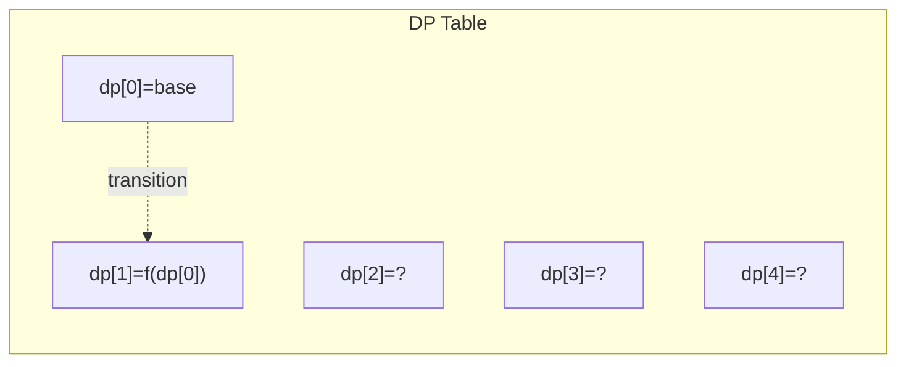
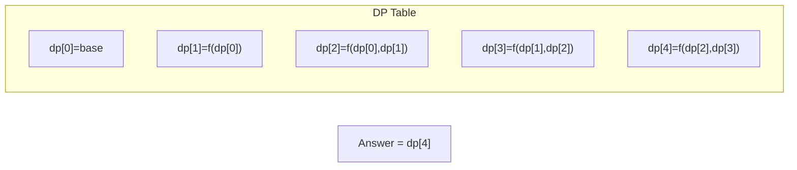

# Problem 646: Maximum Length of Pair Chain

**Difficulty:** Medium  
**Tags:** Array, Dynamic Programming, Greedy, Sorting  
**Pattern:** Dynamic Programming (1D)  
**Link:** [leetcode.com/problems/maximum-length-of-pair-chain](https://leetcode.com/problems/maximum-length-of-pair-chain/)

## Description

You are given an array of `n` pairs `pairs` where `pairs[i] = [lefti, righti]` and `lefti < righti`.

A pair `p2 = [c, d]` **follows** a pair `p1 = [a, b]` if `b < c`. A **chain** of pairs can be formed in this fashion.

Return *the length longest chain which can be formed*.

You do not need to use up all the given intervals. You can select pairs in any order.

 

Example 1:

```

**Input:** pairs = [[1,2],[2,3],[3,4]]
**Output:** 2
**Explanation:** The longest chain is [1,2] -> [3,4].

```

Example 2:

```

**Input:** pairs = [[1,2],[7,8],[4,5]]
**Output:** 3
**Explanation:** The longest chain is [1,2] -> [4,5] -> [7,8].

```

 

**Constraints:**

	- `n == pairs.length`
	- `1 <= n <= 1000`
	- `-1000 <= lefti < righti <= 1000`

## Approach: Dynamic Programming (1D)

Break the problem into overlapping subproblems. Define dp[i] as the optimal value for the subproblem ending at or considering index i. Build the solution bottom-up, using previously computed dp values.

## Pseudocode

```
1. Define dp[i] = optimal value for subproblem i
2. Base case: dp[0] = initial value
3. For i from 1 to n:
   a. dp[i] = recurrence(dp[i-1], dp[i-2], ...)
4. Return dp[n] or max/min of dp
```

## Algorithm Flow



## Visual State Transitions

**1D Dynamic Programming Table Build:**

**Frame 1: Initialize base cases**


**Frame 2: Fill dp[1] from dp[0]**


**Frame 3: Fill remaining cells**



## Complexity Analysis

- **Time:** O(n)
- **Space:** O(n)

## Solution (Python3)

```python
class Solution:
    def findLongestChain(self, pairs: List[List[int]]) -> int:
        # Dynamic programming (1D) - O(n) time, O(n) space
        if not pairs:
            return 0
        n = len(pairs) if isinstance(pairs, list) else pairs
        dp = [0] * (n + 1)
        dp[0] = 1  # base case
        for i in range(1, n + 1):
            dp[i] = dp[i-1]  # transition (customize per problem)
            if i >= 2:
                dp[i] += dp[i-2]
        return dp[n]
```

## Solution (C++)

```cpp
#include <string>
#include <vector>
using namespace std;

class Solution {
public:
    int findLongestChain(vector<vector<int>>& pairs) {
        // Dynamic programming (1D) - O(n) time, O(n) space
        int n = pairs;
        if (n <= 0) return 0;
        vector<int> dp(n + 1, 0);
        dp[0] = 1;
        for (int i = 1; i <= n; i++) {
            dp[i] = dp[i-1];
            if (i >= 2) dp[i] += dp[i-2];
        }
        return dp[n];
    }
};
```
