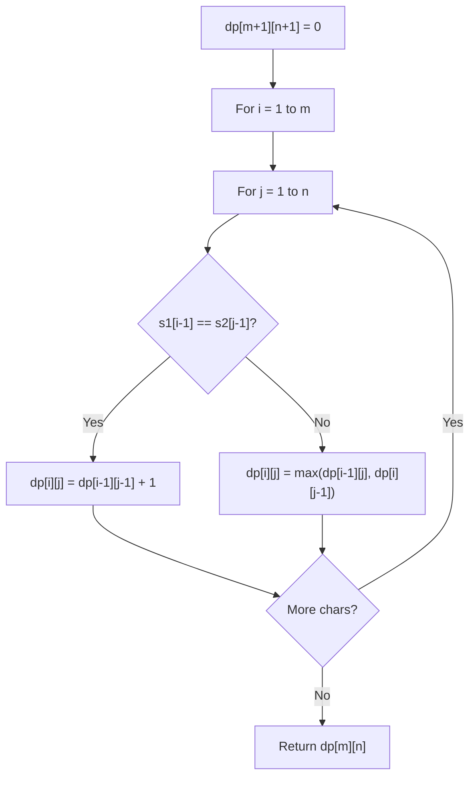

# Problem 647: Palindromic Substrings

**Difficulty:** Medium  
**Tags:** Two Pointers, String, Dynamic Programming  
**Pattern:** Expand Around Center  
**Link:** [leetcode.com/problems/palindromic-substrings](https://leetcode.com/problems/palindromic-substrings/)

## Description

Given a string `s`, return *the number of **palindromic substrings** in it*.

A string is a **palindrome** when it reads the same backward as forward.

A **substring** is a contiguous sequence of characters within the string.

 

Example 1:

```

**Input:** s = "abc"
**Output:** 3
**Explanation:** Three palindromic strings: "a", "b", "c".

```

Example 2:

```

**Input:** s = "aaa"
**Output:** 6
**Explanation:** Six palindromic strings: "a", "a", "a", "aa", "aa", "aaa".

```

 

**Constraints:**

	- `1 <= s.length <= 1000`
	- `s` consists of lowercase English letters.

## Approach: Expand Around Center

Expand around each center (odd and even). Count each palindrome found.

## Pseudocode

```
1. Create dp[m+1][n+1]
2. Initialize base cases
3. For i from 1 to m:
   For j from 1 to n:
     If s1[i-1] == s2[j-1]: dp[i][j] = dp[i-1][j-1] + 1
     Else: dp[i][j] = best of (dp[i-1][j], dp[i][j-1], dp[i-1][j-1])
4. Return dp[m][n]
```

## Algorithm Flow



## Complexity Analysis

- **Time:** O(n^2)
- **Space:** O(1)

## Solution (Python3)

```python
class Solution:
    def countSubstrings(self, s: str) -> int:
        count = 0
        for i in range(len(s)):
            for l, r in [(i, i), (i, i + 1)]:
                while l >= 0 and r < len(s) and s[l] == s[r]:
                    count += 1
                    l -= 1
                    r += 1
        return count
```

## Solution (C++)

```cpp
#include <algorithm>
#include <string>
#include <vector>
using namespace std;

class Solution {
public:
    int countSubstrings(string& s) {
        // String DP - O(m*n) time and space
        int m = s.size(), n = s.size();
        vector<vector<int>> dp(m + 1, vector<int>(n + 1, 0));
        for (int i = 1; i <= m; i++) {
            for (int j = 1; j <= n; j++) {
                if (s[i-1] == s[j-1])
                    dp[i][j] = dp[i-1][j-1] + 1;
                else
                    dp[i][j] = max(dp[i-1][j], dp[i][j-1]);
            }
        }
        return dp[m][n];
    }
};
```
