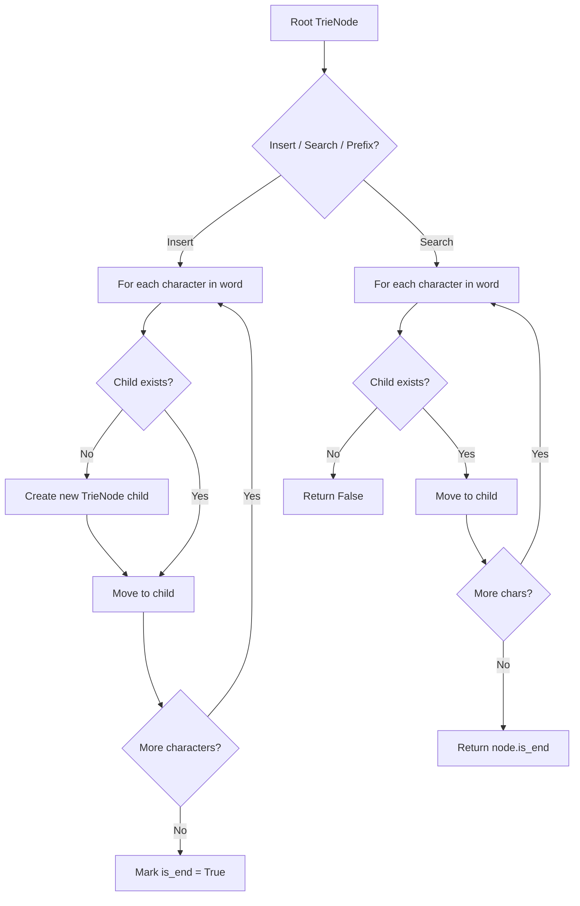
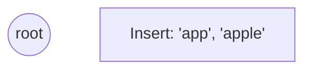
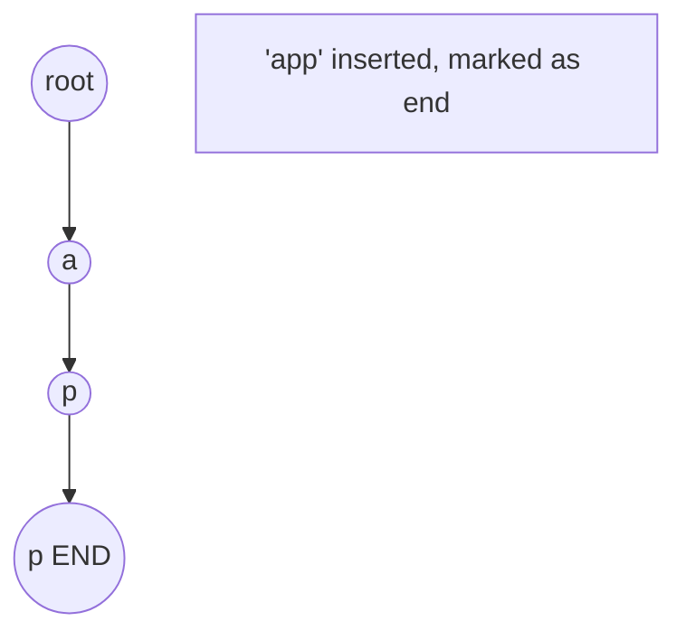
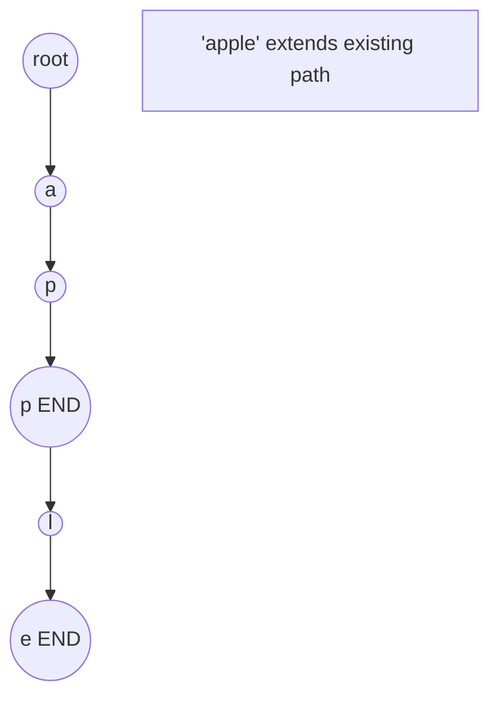
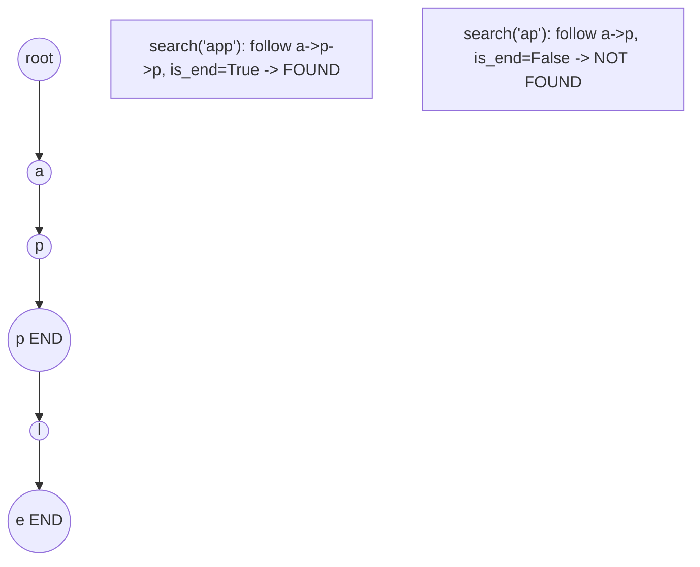

# Problem 648: Replace Words

**Difficulty:** Medium  
**Tags:** Array, Hash Table, String, Trie  
**Pattern:** Trie / Prefix Tree  
**Link:** [leetcode.com/problems/replace-words](https://leetcode.com/problems/replace-words/)

## Description

In English, we have a concept called **root**, which can be followed by some other word to form another longer word - let's call this word **derivative**. For example, when the **root** `"help"` is followed by the word `"ful"`, we can form a derivative `"helpful"`.

Given a `dictionary` consisting of many **roots** and a `sentence` consisting of words separated by spaces, replace all the derivatives in the sentence with the **root** forming it. If a derivative can be replaced by more than one **root**, replace it with the **root** that has **the shortest length**.

Return *the `sentence`* after the replacement.

 

Example 1:

```

**Input:** dictionary = ["cat","bat","rat"], sentence = "the cattle was rattled by the battery"
**Output:** "the cat was rat by the bat"

```

Example 2:

```

**Input:** dictionary = ["a","b","c"], sentence = "aadsfasf absbs bbab cadsfafs"
**Output:** "a a b c"

```

 

**Constraints:**

	- `1 <= dictionary.length <= 1000`
	- `1 <= dictionary[i].length <= 100`
	- `dictionary[i]` consists of only lower-case letters.
	- `1 <= sentence.length <= 10^6`
	- `sentence` consists of only lower-case letters and spaces.
	- The number of words in `sentence` is in the range `[1, 1000]`
	- The length of each word in `sentence` is in the range `[1, 1000]`
	- Every two consecutive words in `sentence` will be separated by exactly one space.
	- `sentence` does not have leading or trailing spaces.

## Approach: Trie / Prefix Tree

Build a trie (prefix tree) where each node represents a character. Insert words character by character, and search by following child pointers. Supports efficient prefix matching.

## Pseudocode

```
1. TrieNode: children = {}, is_end = False
2. Insert(word):
   - For each char: create child if absent, move to child
   - Mark last node as end
3. Search(word):
   - For each char: if child absent return False, move to child
   - Return node.is_end
4. StartsWith(prefix): same as search but return True at end
```

## Algorithm Flow



## Visual State Transitions

**Trie Insert and Search:**

**Frame 1: Empty trie**


**Frame 2: Insert 'app'**


**Frame 3: Insert 'apple'**


**Frame 4: Search 'app' = True, 'ap' = False**



## Complexity Analysis

- **Time:** O(L) per operation
- **Space:** O(N * L)

## Solution (Python3)

```python
class Solution:
    def replaceWords(self, dictionary: List[str], sentence: str) -> str:
        # Trie-based approach
        trie = {}
        # Build trie from word list
        words = dictionary if isinstance(dictionary, list) else [dictionary]
        for word in words:
            node = trie
            for ch in word:
                if ch not in node:
                    node[ch] = {}
                node = node[ch]
            node['#'] = True
        
        # Search in trie
        def search(word):
            node = trie
            for ch in word:
                if ch not in node:
                    return False
                node = node[ch]
            return '#' in node
        
        return ""
```

## Solution (C++)

```cpp
#include <string>
#include <vector>
using namespace std;

class Solution {
public:
    string replaceWords(vector<string>& dictionary, string& sentence) {
        // Trie-based approach
        struct TrieNode {
            TrieNode* children[26] = {};
            bool isEnd = false;
        };
        TrieNode* root = new TrieNode();
        // Build trie
        for (auto& word : dictionary) {
            TrieNode* node = root;
            for (char ch : word) {
                int idx = ch - 'a';
                if (!node->children[idx])
                    node->children[idx] = new TrieNode();
                node = node->children[idx];
            }
            node->isEnd = true;
        }
        return "";
    }
};
```
