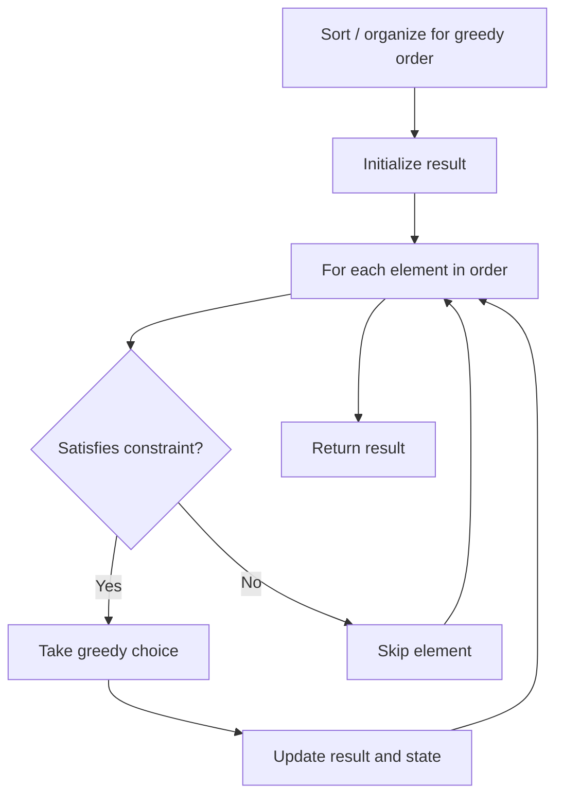

# Problem 649: Dota2 Senate

**Difficulty:** Medium  
**Tags:** String, Greedy, Queue  
**Pattern:** Greedy  
**Link:** [leetcode.com/problems/dota2-senate](https://leetcode.com/problems/dota2-senate/)

## Description

In the world of Dota2, there are two parties: the Radiant and the Dire.

The Dota2 senate consists of senators coming from two parties. Now the Senate wants to decide on a change in the Dota2 game. The voting for this change is a round-based procedure. In each round, each senator can exercise **one** of the two rights:

	- **Ban one senator's right:** A senator can make another senator lose all his rights in this and all the following rounds.
	- **Announce the victory:** If this senator found the senators who still have rights to vote are all from the same party, he can announce the victory and decide on the change in the game.

Given a string `senate` representing each senator's party belonging. The character `'R'` and `'D'` represent the Radiant party and the Dire party. Then if there are `n` senators, the size of the given string will be `n`.

The round-based procedure starts from the first senator to the last senator in the given order. This procedure will last until the end of voting. All the senators who have lost their rights will be skipped during the procedure.

Suppose every senator is smart enough and will play the best strategy for his own party. Predict which party will finally announce the victory and change the Dota2 game. The output should be `"Radiant"` or `"Dire"`.

 

Example 1:

```

**Input:** senate = "RD"
**Output:** "Radiant"
**Explanation:** 
The first senator comes from Radiant and he can just ban the next senator's right in round 1. 
And the second senator can't exercise any rights anymore since his right has been banned. 
And in round 2, the first senator can just announce the victory since he is the only guy in the senate who can vote.

```

Example 2:

```

**Input:** senate = "RDD"
**Output:** "Dire"
**Explanation:** 
The first senator comes from Radiant and he can just ban the next senator's right in round 1. 
And the second senator can't exercise any rights anymore since his right has been banned. 
And the third senator comes from Dire and he can ban the first senator's right in round 1. 
And in round 2, the third senator can just announce the victory since he is the only guy in the senate who can vote.

```

 

**Constraints:**

	- `n == senate.length`
	- `1 <= n <= 10^4`
	- `senate[i]` is either `'R'` or `'D'`.

## Approach: Greedy

Make the locally optimal choice at each step, trusting it leads to a global optimum. Greedy works when the problem has the greedy-choice property and optimal substructure.

## Pseudocode

```
1. Sort or organize data for greedy ordering
2. Initialize result
3. For each element in greedy order:
   a. If element satisfies constraint:
      - Take the greedy choice
      - Update result and state
4. Return result
```

## Algorithm Flow



## Complexity Analysis

- **Time:** O(n log n)
- **Space:** O(1)

## Solution (Python3)

```python
class Solution:
    def predictPartyVictory(self, senate: str) -> str:
        # Greedy approach - O(n) time
        result = 0
        curr_max = 0
        for i in range(len(senate)):
            if isinstance(senate[i], int):
                curr_max = max(curr_max, senate[i])
                result = max(result, curr_max)
            else:
                result += 1
        return result
```

## Solution (C++)

```cpp
#include <algorithm>
#include <string>
#include <vector>
using namespace std;

class Solution {
public:
    string predictPartyVictory(string& senate) {
        // Greedy approach - O(n) time
        int result = 0, curr_max = 0;
        for (int i = 0; i < (int)senate.size(); i++) {
            curr_max = max(curr_max, senate[i]);
            result = max(result, curr_max);
        }
        return result;
    }
};
```
