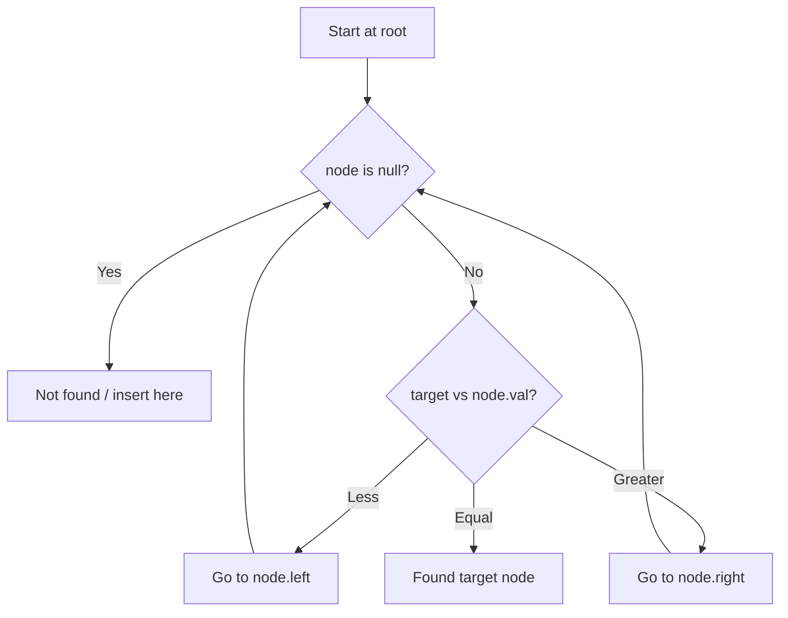

# Problem 653: Two Sum IV - Input is a BST

**Difficulty:** Easy  
**Tags:** Hash Table, Two Pointers, Tree, Depth-First Search, Breadth-First Search, Binary Search Tree, Binary Tree  
**Pattern:** Binary Search Tree  
**Link:** [leetcode.com/problems/two-sum-iv-input-is-a-bst](https://leetcode.com/problems/two-sum-iv-input-is-a-bst/)

## Description

Given the `root` of a binary search tree and an integer `k`, return `true` *if there exist two elements in the BST such that their sum is equal to* `k`, *or* `false` *otherwise*.

 

Example 1:

```

**Input:** root = [5,3,6,2,4,null,7], k = 9
**Output:** true

```

Example 2:

```

**Input:** root = [5,3,6,2,4,null,7], k = 28
**Output:** false

```

 

**Constraints:**

	- The number of nodes in the tree is in the range `[1, 10^4]`.
	- `-10^4 <= Node.val <= 10^4`
	- `root` is guaranteed to be a **valid** binary search tree.
	- `-10^5 <= k <= 10^5`

## Approach: Binary Search Tree

Leverage BST property: left < root < right. Navigate left for smaller values, right for larger values. Inorder traversal yields sorted order.

## Pseudocode

```
1. Start at root
2. Compare target with current node:
   a. If target < node.val: go left
   b. If target > node.val: go right
   c. If equal: found
3. Return result
```

## Algorithm Flow



## Complexity Analysis

- **Time:** O(h)
- **Space:** O(h)

## Solution (Python3)

```python
class Solution:
    def findTarget(self, root: Optional[TreeNode], k: int) -> bool:
        # BST search/insert - O(h) time
        def search(node, target):
            if not node:
                return None
            if target == node.val:
                return node
            elif target < node.val:
                return search(node.left, target)
            else:
                return search(node.right, target)
        return search(root, k if 'k' != 'root' else 0)
```

## Solution (C++)

```cpp
#include <functional>
#include <string>
#include <vector>
using namespace std;

class Solution {
public:
    bool findTarget(TreeNode* root, int k) {
        // BST search/insert - O(h) time
        function<TreeNode*(TreeNode*, int)> search = [&](TreeNode* node, int target) -> TreeNode* {
            if (!node) return nullptr;
            if (target == node->val) return node;
            else if (target < node->val) return search(node->left, target);
            else return search(node->right, target);
        };
        return search(root, k);
    }
};
```
