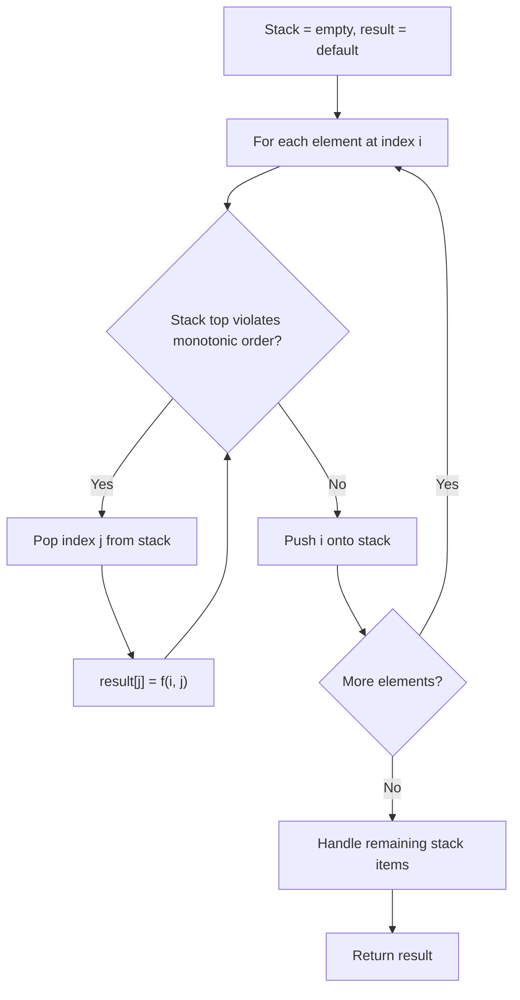
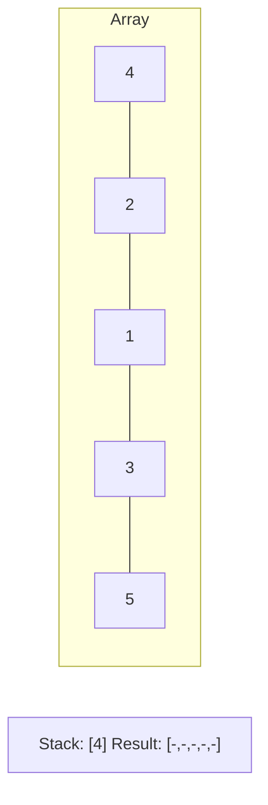
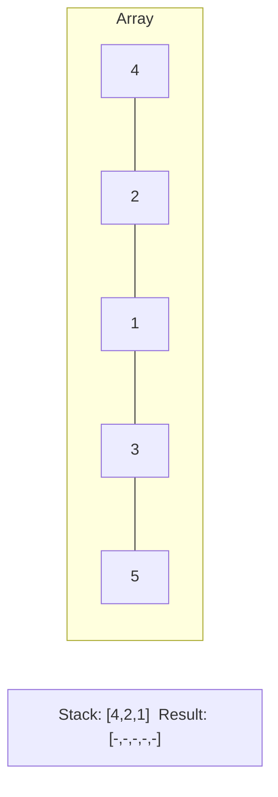
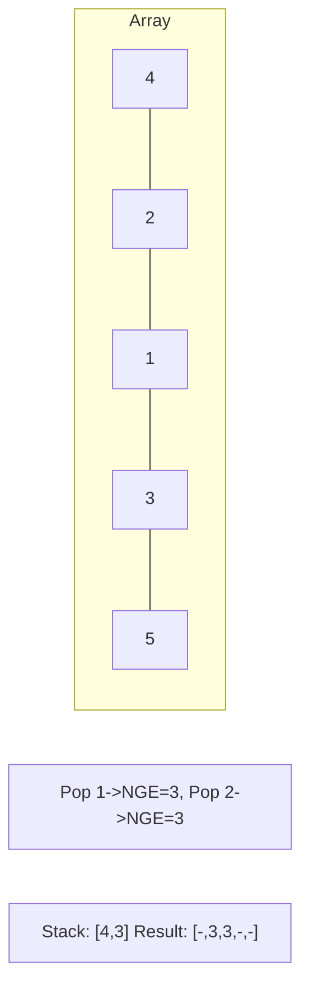
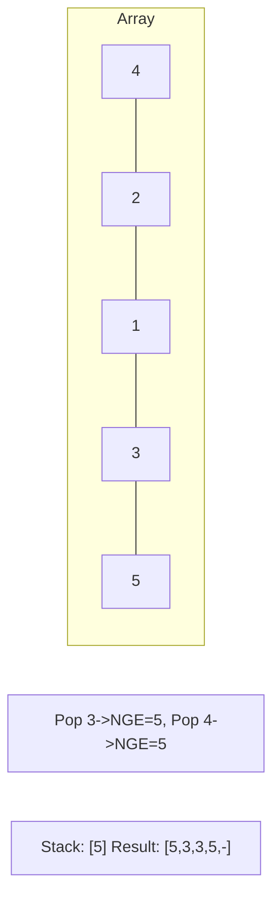

# Problem 654: Maximum Binary Tree

**Difficulty:** Medium  
**Tags:** Array, Divide and Conquer, Stack, Tree, Monotonic Stack, Binary Tree  
**Pattern:** Monotonic Stack  
**Link:** [leetcode.com/problems/maximum-binary-tree](https://leetcode.com/problems/maximum-binary-tree/)

## Description

You are given an integer array `nums` with no duplicates. A **maximum binary tree** can be built recursively from `nums` using the following algorithm:

	- Create a root node whose value is the maximum value in `nums`.
	- Recursively build the left subtree on the **subarray prefix** to the **left** of the maximum value.
	- Recursively build the right subtree on the **subarray suffix** to the **right** of the maximum value.

Return *the **maximum binary tree** built from *`nums`.

 

Example 1:

```

**Input:** nums = [3,2,1,6,0,5]
**Output:** [6,3,5,null,2,0,null,null,1]
**Explanation:** The recursive calls are as follow:
- The largest value in [3,2,1,6,0,5] is 6. Left prefix is [3,2,1] and right suffix is [0,5].
    - The largest value in [3,2,1] is 3. Left prefix is [] and right suffix is [2,1].
        - Empty array, so no child.
        - The largest value in [2,1] is 2. Left prefix is [] and right suffix is [1].
            - Empty array, so no child.
            - Only one element, so child is a node with value 1.
    - The largest value in [0,5] is 5. Left prefix is [0] and right suffix is [].
        - Only one element, so child is a node with value 0.
        - Empty array, so no child.

```

Example 2:

```

**Input:** nums = [3,2,1]
**Output:** [3,null,2,null,1]

```

 

**Constraints:**

	- `1 <= nums.length <= 1000`
	- `0 <= nums[i] <= 1000`
	- All integers in `nums` are **unique**.

## Approach: Monotonic Stack

Maintain a stack where elements are always in monotonic order (increasing or decreasing). When a new element violates the monotonic property, pop elements and compute results (e.g., next greater/smaller element, spans, areas).

## Pseudocode

```
1. Initialize empty stack, result array
2. For each element (index i):
   a. While stack not empty and arr[i] breaks monotonic order:
      - Pop index j from stack
      - result[j] = compute(i, j)
   b. Push i onto stack
3. Handle remaining elements in stack
4. Return result
```

## Algorithm Flow



## Visual State Transitions

**Monotonic Stack (Next Greater Element):**

**Frame 1: Process first elements**


**Frame 2: Push smaller elements**


**Frame 3: Element 3 pops 1 and 2**


**Frame 4: Element 5 pops all**



## Complexity Analysis

- **Time:** O(n)
- **Space:** O(n)

## Solution (Python3)

```python
class Solution:
    def constructMaximumBinaryTree(self, nums: List[int]) -> Optional[TreeNode]:
        # Monotonic stack - O(n) time, O(n) space
        n = len(nums)
        result = [0] * n
        stack = []  # indices
        for i in range(n):
            while stack and nums[i] > nums[stack[-1]]:
                idx = stack.pop()
                result[idx] = i - idx
            stack.append(i)
        return result
```

## Solution (C++)

```cpp
#include <stack>
#include <string>
#include <vector>
using namespace std;

class Solution {
public:
    TreeNode* constructMaximumBinaryTree(vector<int>& nums) {
        // Monotonic stack - O(n) time, O(n) space
        int n = nums.size();
        vector<int> result(n, 0);
        stack<int> st;
        for (int i = 0; i < n; i++) {
            while (!st.empty() && nums[i] > nums[st.top()]) {
                int idx = st.top(); st.pop();
                result[idx] = i - idx;
            }
            st.push(i);
        }
        return result;
    }
};
```
