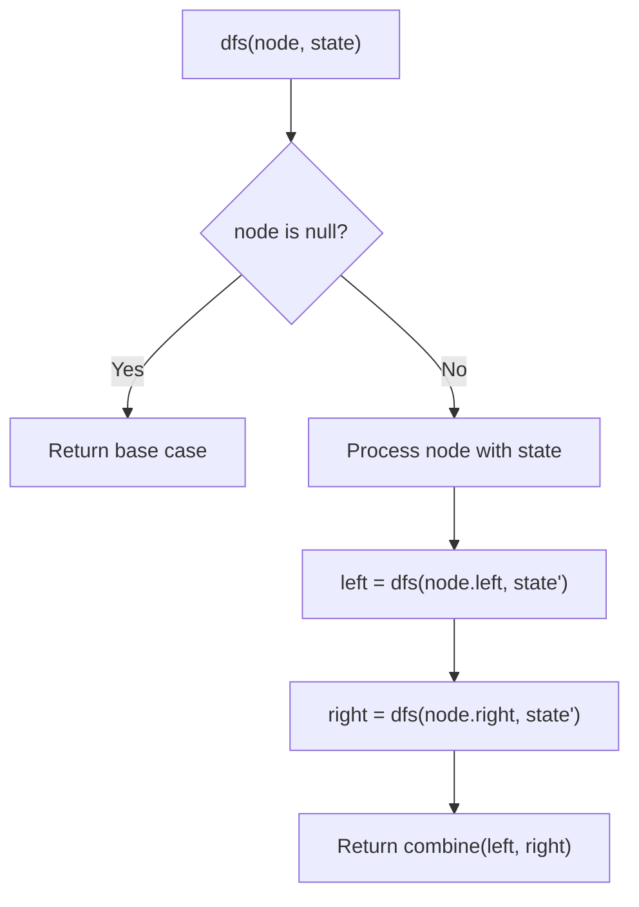
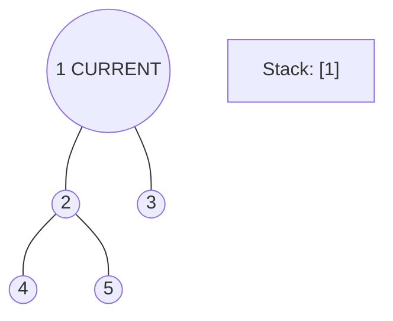
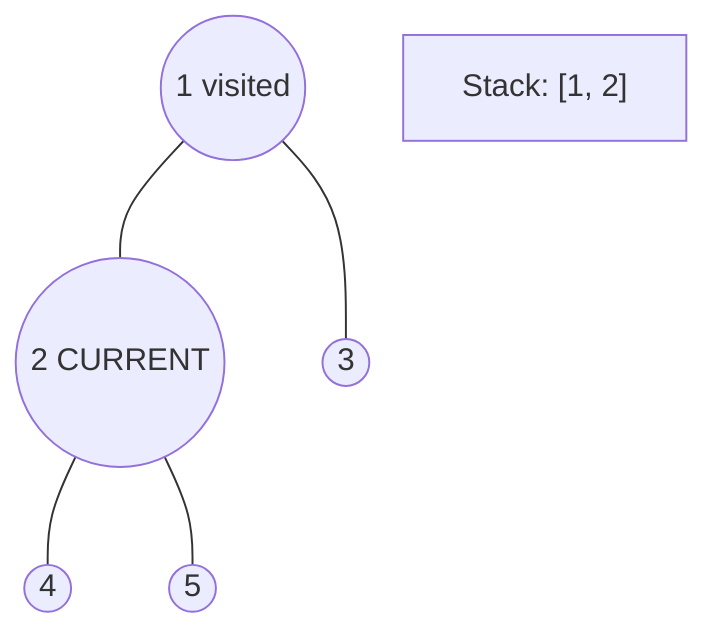
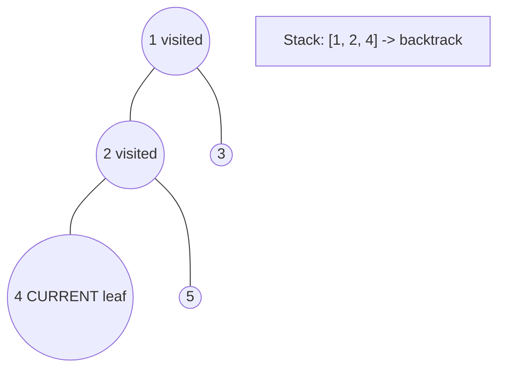
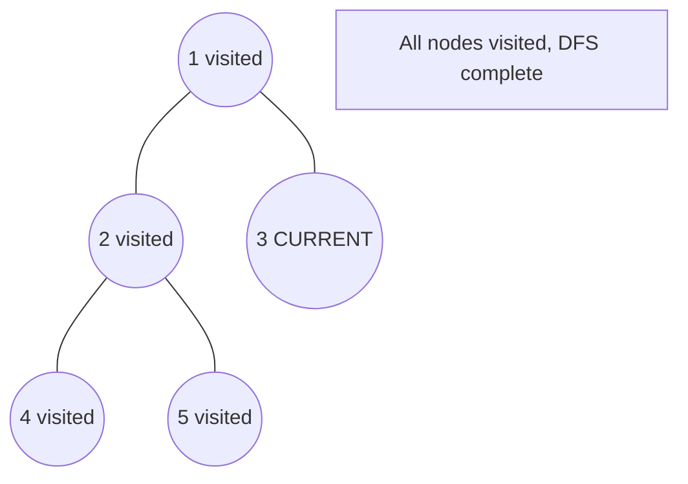

# Problem 655: Print Binary Tree

**Difficulty:** Medium  
**Tags:** Tree, Depth-First Search, Breadth-First Search, Binary Tree  
**Pattern:** DFS Tree Traversal  
**Link:** [leetcode.com/problems/print-binary-tree](https://leetcode.com/problems/print-binary-tree/)

## Description

Given the `root` of a binary tree, construct a **0-indexed** `m x n` string matrix `res` that represents a **formatted layout** of the tree. The formatted layout matrix should be constructed using the following rules:

	- The **height** of the tree is `height` and the number of rows `m` should be equal to `height + 1`.
	- The number of columns `n` should be equal to `2^height+1 - 1`.
	- Place the **root node** in the **middle** of the **top row** (more formally, at location `res[0][(n-1)/2]`).
	- For each node that has been placed in the matrix at position `res[r][c]`, place its **left child** at `res[r+1][c-2^height-r-1]` and its **right child** at `res[r+1][c+2^height-r-1]`.
	- Continue this process until all the nodes in the tree have been placed.
	- Any empty cells should contain the empty string `""`.

Return *the constructed matrix *`res`.

 

Example 1:

```

**Input:** root = [1,2]
**Output:** 
[["","1",""],
 ["2","",""]]

```

Example 2:

```

**Input:** root = [1,2,3,null,4]
**Output:** 
[["","","","1","","",""],
 ["","2","","","","3",""],
 ["","","4","","","",""]]

```

 

**Constraints:**

	- The number of nodes in the tree is in the range `[1, 2^10]`.
	- `-99 <= Node.val <= 99`
	- The depth of the tree will be in the range `[1, 10]`.

## Approach: DFS Tree Traversal

Perform depth-first search on the tree. Recurse on left and right subtrees, combining results bottom-up. Track state (path, depth, sum) during traversal.

## Pseudocode

```
1. Define dfs(node, state):
   a. Base case: if null, return default
   b. Process node with current state
   c. left_result = dfs(node.left, updated_state)
   d. right_result = dfs(node.right, updated_state)
   e. Return combine(left_result, right_result)
2. Return dfs(root, initial_state)
```

## Algorithm Flow



## Visual State Transitions

**DFS Tree Traversal Step-by-Step:**

**Frame 1: Start at root**


**Frame 2: Go left - visit node 2**


**Frame 3: Go left - visit node 4 (leaf)**


**Frame 4: Backtrack, visit node 5, then node 3**



## Complexity Analysis

- **Time:** O(n)
- **Space:** O(h)

## Solution (Python3)

```python
class Solution:
    def printTree(self, root: Optional[TreeNode]) -> List[List[str]]:
        # DFS on binary tree - O(n) time, O(h) space
        def dfs(node):
            if not node:
                return 0
            left = dfs(node.left)
            right = dfs(node.right)
            return 1 + max(left, right)
        
        result = dfs(root)
        return result
```

## Solution (C++)

```cpp
#include <algorithm>
#include <functional>
#include <string>
#include <vector>
using namespace std;

class Solution {
public:
    vector<vector<string>> printTree(TreeNode* root) {
        // DFS on binary tree - O(n) time, O(h) space
        function<int(TreeNode*)> dfs = [&](TreeNode* node) -> int {
            if (!node) return 0;
            int left = dfs(node->left);
            int right = dfs(node->right);
            return 1 + max(left, right);
        };
        return dfs(root);
    }
};
```
