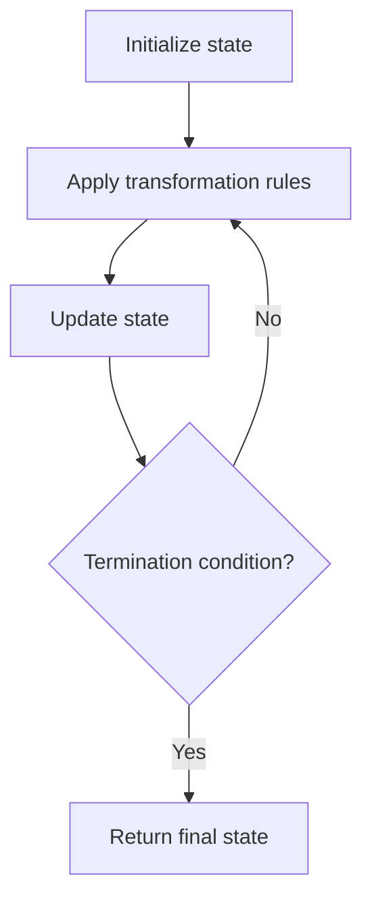

# Problem 657: Robot Return to Origin

**Difficulty:** Easy  
**Tags:** String, Simulation  
**Pattern:** Simulation  
**Link:** [leetcode.com/problems/robot-return-to-origin](https://leetcode.com/problems/robot-return-to-origin/)

## Description

There is a robot starting at the position `(0, 0)`, the origin, on a 2D plane. Given a sequence of its moves, judge if this robot **ends up at **`(0, 0)` after it completes its moves.

You are given a string `moves` that represents the move sequence of the robot where `moves[i]` represents its `i^th` move. Valid moves are `'R'` (right), `'L'` (left), `'U'` (up), and `'D'` (down).

Return `true`* if the robot returns to the origin after it finishes all of its moves, or *`false`* otherwise*.

**Note**: The way that the robot is "facing" is irrelevant. `'R'` will always make the robot move to the right once, `'L'` will always make it move left, etc. Also, assume that the magnitude of the robot's movement is the same for each move.

 

Example 1:

```

**Input:** moves = "UD"
**Output:** true
**Explanation**: The robot moves up once, and then down once. All moves have the same magnitude, so it ended up at the origin where it started. Therefore, we return true.

```

Example 2:

```

**Input:** moves = "LL"
**Output:** false
**Explanation**: The robot moves left twice. It ends up two "moves" to the left of the origin. We return false because it is not at the origin at the end of its moves.

```

 

**Constraints:**

	- `1 <= moves.length <= 2 * 10^4`
	- `moves` only contains the characters `'U'`, `'D'`, `'L'` and `'R'`.

## Approach: Simulation

Simulate the process described in the problem step by step. Follow the rules exactly, tracking state at each step.

## Pseudocode

```
1. Initialize state (grid, pointers, counters)
2. For each step / iteration:
   a. Apply the transformation rules
   b. Update state
   c. Check termination condition
3. Return final state or result
```

## Algorithm Flow



## Complexity Analysis

- **Time:** O(n) or O(n * k)
- **Space:** O(n)

## Solution (Python3)

```python
class Solution:
    def judgeCircle(self, moves: str) -> bool:
        # Simulation approach - follow the rules step by step
        result = False
        for i in range(len(moves) if isinstance(moves, list) else moves):
            # Simulate each step
            pass
        return result
```

## Solution (C++)

```cpp
#include <string>
#include <vector>
using namespace std;

class Solution {
public:
    bool judgeCircle(string& moves) {
        // Simulation approach
        int n = moves.size();
        for (int i = 0; i < n; i++) {
            // Simulate each step
        }
        return false;
    }
};
```
