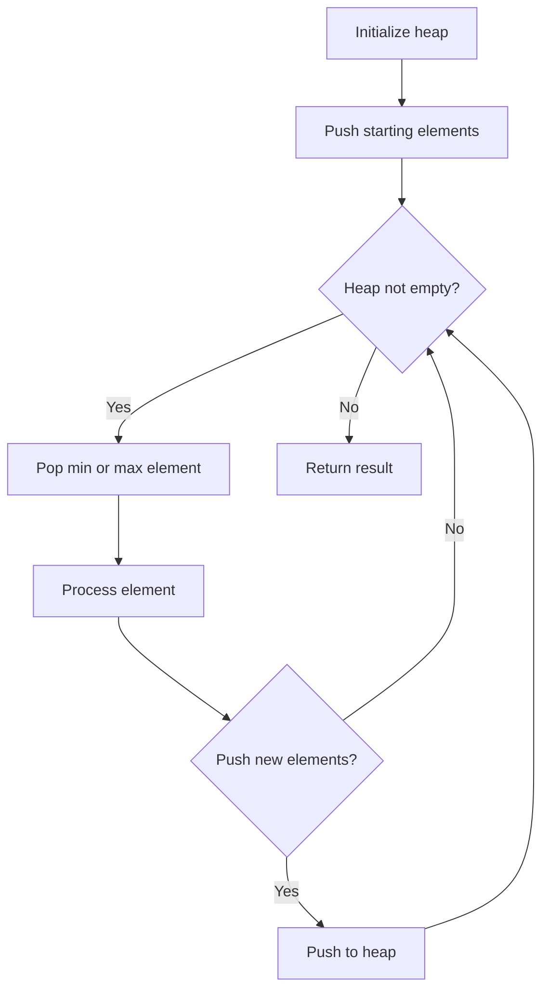
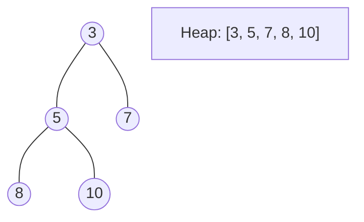
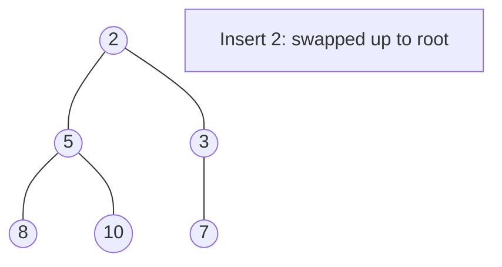
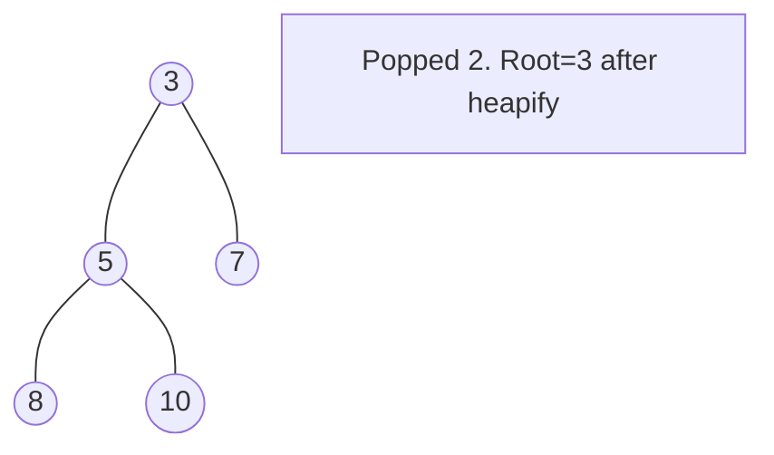

# Problem 659: Split Array into Consecutive Subsequences

**Difficulty:** Medium  
**Tags:** Array, Hash Table, Greedy, Heap (Priority Queue)  
**Pattern:** Heap / Priority Queue  
**Link:** [leetcode.com/problems/split-array-into-consecutive-subsequences](https://leetcode.com/problems/split-array-into-consecutive-subsequences/)

## Description

You are given an integer array `nums` that is **sorted in non-decreasing order**.

Determine if it is possible to split `nums` into **one or more subsequences** such that **both** of the following conditions are true:

	- Each subsequence is a **consecutive increasing sequence** (i.e. each integer is **exactly one** more than the previous integer).
	- All subsequences have a length of `3`** or more**.

Return `true`* if you can split *`nums`* according to the above conditions, or *`false`* otherwise*.

A **subsequence** of an array is a new array that is formed from the original array by deleting some (can be none) of the elements without disturbing the relative positions of the remaining elements. (i.e., `[1,3,5]` is a subsequence of `[1,2,3,4,5]` while `[1,3,2]` is not).

 

Example 1:

```

**Input:** nums = [1,2,3,3,4,5]
**Output:** true
**Explanation:** nums can be split into the following subsequences:
[**1**,**2**,**3**,3,4,5] --> 1, 2, 3
[1,2,3,**3**,**4**,**5**] --> 3, 4, 5

```

Example 2:

```

**Input:** nums = [1,2,3,3,4,4,5,5]
**Output:** true
**Explanation:** nums can be split into the following subsequences:
[**1**,**2**,**3**,3,**4**,4,**5**,5] --> 1, 2, 3, 4, 5
[1,2,3,**3**,4,**4**,5,**5**] --> 3, 4, 5

```

Example 3:

```

**Input:** nums = [1,2,3,4,4,5]
**Output:** false
**Explanation:** It is impossible to split nums into consecutive increasing subsequences of length 3 or more.

```

 

**Constraints:**

	- `1 <= nums.length <= 10^4`
	- `-1000 <= nums[i] <= 1000`
	- `nums` is sorted in **non-decreasing** order.

## Approach: Heap / Priority Queue

Use a min-heap or max-heap to efficiently access the smallest/largest element. Push elements and pop the top to process in priority order.

## Pseudocode

```
1. Initialize heap (min or max)
2. Push initial elements onto heap
3. While heap not empty and condition:
   a. Pop top element (min or max)
   b. Process element
   c. Push new elements if needed
4. Return result
```

## Algorithm Flow



## Visual State Transitions

**Heap Operations (Min-Heap):**

**Frame 1: Initial heap**


**Frame 2: Insert 2 - bubble up**


**Frame 3: Pop minimum (2) - heapify down**



## Complexity Analysis

- **Time:** O(n log n)
- **Space:** O(n)

## Solution (Python3)

```python
class Solution:
    def isPossible(self, nums: List[int]) -> bool:
        # Heap/Priority Queue - O(n log k) time
        import heapq
        if not nums:
            return False
        # Min heap (negate for max heap)
        heap = []
        for val in nums:
            heapq.heappush(heap, val)
            if len(heap) > (nums if isinstance(nums, int) else len(nums)):
                heapq.heappop(heap)
        return heap[0] if heap else False
```

## Solution (C++)

```cpp
#include <queue>
#include <string>
#include <vector>
using namespace std;

class Solution {
public:
    bool isPossible(vector<int>& nums) {
        // Heap/Priority Queue - O(n log k) time
        priority_queue<int, vector<int>, greater<int>> pq;
        for (int val : nums) {
            pq.push(val);
            if ((int)pq.size() > nums)
                pq.pop();
        }
        return pq.empty() ? false : pq.top();
    }
};
```
