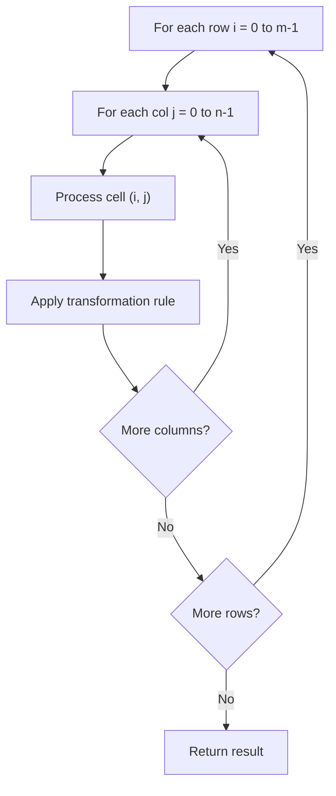

# Problem 661: Image Smoother

**Difficulty:** Easy  
**Tags:** Array, Matrix  
**Pattern:** Matrix / 2D Array  
**Link:** [leetcode.com/problems/image-smoother](https://leetcode.com/problems/image-smoother/)

## Description

An **image smoother** is a filter of the size `3 x 3` that can be applied to each cell of an image by rounding down the average of the cell and the eight surrounding cells (i.e., the average of the nine cells in the blue smoother). If one or more of the surrounding cells of a cell is not present, we do not consider it in the average (i.e., the average of the four cells in the red smoother).

Given an `m x n` integer matrix `img` representing the grayscale of an image, return *the image after applying the smoother on each cell of it*.

 

Example 1:

```

**Input:** img = [[1,1,1],[1,0,1],[1,1,1]]
**Output:** [[0,0,0],[0,0,0],[0,0,0]]
**Explanation:**
For the points (0,0), (0,2), (2,0), (2,2): floor(3/4) = floor(0.75) = 0
For the points (0,1), (1,0), (1,2), (2,1): floor(5/6) = floor(0.83333333) = 0
For the point (1,1): floor(8/9) = floor(0.88888889) = 0

```

Example 2:

```

**Input:** img = [[100,200,100],[200,50,200],[100,200,100]]
**Output:** [[137,141,137],[141,138,141],[137,141,137]]
**Explanation:**
For the points (0,0), (0,2), (2,0), (2,2): floor((100+200+200+50)/4) = floor(137.5) = 137
For the points (0,1), (1,0), (1,2), (2,1): floor((200+200+50+200+100+100)/6) = floor(141.666667) = 141
For the point (1,1): floor((50+200+200+200+200+100+100+100+100)/9) = floor(138.888889) = 138

```

 

**Constraints:**

	- `m == img.length`
	- `n == img[i].length`
	- `1 <= m, n <= 200`
	- `0 <= img[i][j] <= 255`

## Approach: Matrix / 2D Array

Process the matrix row by row or column by column. Common patterns: rotation, spiral traversal, in-place modification, transposition.

## Pseudocode

```
1. For each row i:
   For each column j:
     Process cell (i, j) based on neighbors or rules
2. Handle boundary conditions
3. Return modified matrix or computed result
```

## Algorithm Flow



## Complexity Analysis

- **Time:** O(m * n)
- **Space:** O(1) extra

## Solution (Python3)

```python
class Solution:
    def imageSmoother(self, img: List[List[int]]) -> List[List[int]]:
        # Matrix manipulation - O(m*n) time
        if not img:
            return []
        m, n = len(img), len(img[0])
        # Process matrix in-place or build result
        for i in range(m):
            for j in range(n):
                pass  # Process img[i][j]
        return []
```

## Solution (C++)

```cpp
#include <string>
#include <vector>
using namespace std;

class Solution {
public:
    vector<vector<int>> imageSmoother(vector<vector<int>>& img) {
        // Matrix manipulation - O(m*n) time
        if (img.empty()) return {};
        int m = img.size(), n = img[0].size();
        for (int i = 0; i < m; i++) {
            for (int j = 0; j < n; j++) {
                // Process matrix[i][j]
            }
        }
        return {};
    }
};
```
