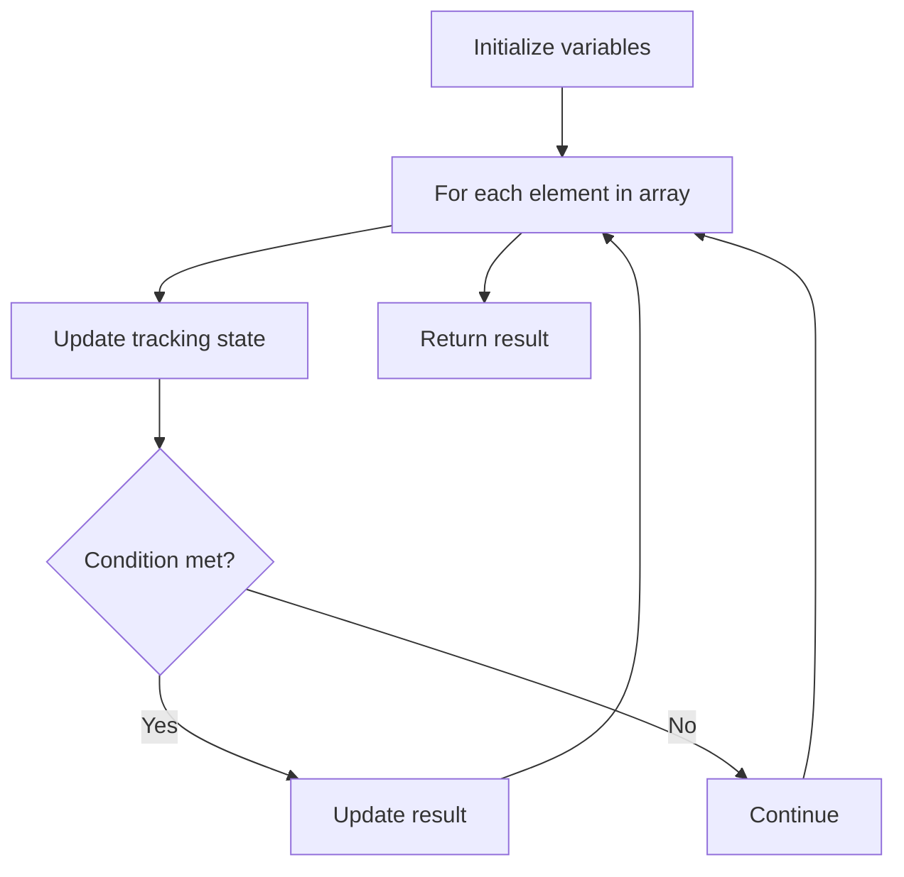

# Problem 665: Non-decreasing Array

**Difficulty:** Medium  
**Tags:** Array  
**Pattern:** Array Processing  
**Link:** [leetcode.com/problems/non-decreasing-array](https://leetcode.com/problems/non-decreasing-array/)

## Description

Given an array `nums` with `n` integers, your task is to check if it could become non-decreasing by modifying **at most one element**.

We define an array is non-decreasing if `nums[i] <= nums[i + 1]` holds for every `i` (**0-based**) such that (`0 <= i <= n - 2`).

 

Example 1:

```

**Input:** nums = [4,2,3]
**Output:** true
**Explanation:** You could modify the first 4 to 1 to get a non-decreasing array.

```

Example 2:

```

**Input:** nums = [4,2,1]
**Output:** false
**Explanation:** You cannot get a non-decreasing array by modifying at most one element.

```

 

**Constraints:**

	- `n == nums.length`
	- `1 <= n <= 10^4`
	- `-10^5 <= nums[i] <= 10^5`

## Approach: Array Processing

Process the array with a linear scan, tracking state variables. Look for patterns: running maximum/minimum, counting, or transformations.

## Pseudocode

```
1. Initialize tracking variables
2. Iterate through array:
   a. Update tracking state
   b. Check conditions
   c. Update result
3. Return result
```

## Algorithm Flow



## Complexity Analysis

- **Time:** O(n)
- **Space:** O(1)

## Solution (Python3)

```python
class Solution:
    def checkPossibility(self, nums: List[int]) -> bool:
        # Array processing - O(n) time
        result = False
        for i in range(len(nums)):
            # Process element
            pass
        return result
```

## Solution (C++)

```cpp
#include <string>
#include <vector>
using namespace std;

class Solution {
public:
    bool checkPossibility(vector<int>& nums) {
        // Array processing - O(n) time
        for (int i = 0; i < (int)nums.size(); i++) {
            // Process element
        }
        return false;
    }
};
```
