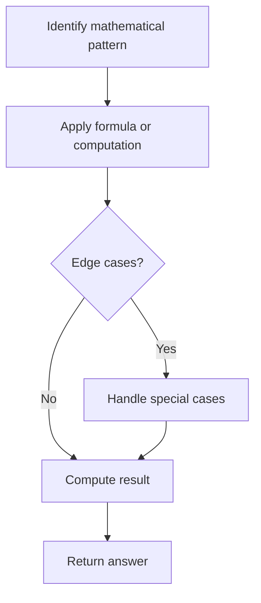

# Problem 667: Beautiful Arrangement II

**Difficulty:** Medium  
**Tags:** Array, Math  
**Pattern:** Math  
**Link:** [leetcode.com/problems/beautiful-arrangement-ii](https://leetcode.com/problems/beautiful-arrangement-ii/)

## Description

Given two integers `n` and `k`, construct a list `answer` that contains `n` different positive integers ranging from `1` to `n` and obeys the following requirement:

	- Suppose this list is `answer = [a1, a2, a3, ... , an]`, then the list `[|a1 - a2|, |a2 - a3|, |a3 - a4|, ... , |an-1 - an|]` has exactly `k` distinct integers.

Return *the list* `answer`. If there multiple valid answers, return **any of them**.

 

Example 1:

```

**Input:** n = 3, k = 1
**Output:** [1,2,3]
Explanation: The [1,2,3] has three different positive integers ranging from 1 to 3, and the [1,1] has exactly 1 distinct integer: 1

```

Example 2:

```

**Input:** n = 3, k = 2
**Output:** [1,3,2]
Explanation: The [1,3,2] has three different positive integers ranging from 1 to 3, and the [2,1] has exactly 2 distinct integers: 1 and 2.

```

 

**Constraints:**

	- `1 <= k < n <= 10^4`

## Approach: Math

Apply mathematical properties, formulas, or number-theoretic concepts. Look for patterns, modular arithmetic, or closed-form solutions.

## Pseudocode

```
1. Identify the mathematical pattern or formula
2. Apply computation:
   - Modular arithmetic for large numbers
   - GCD/LCM for divisibility
   - Sieve for primes
3. Handle edge cases
4. Return result
```

## Algorithm Flow



## Complexity Analysis

- **Time:** O(n) or O(sqrt(n))
- **Space:** O(1)

## Solution (Python3)

```python
class Solution:
    def constructArray(self, n: int, k: int) -> List[int]:
        # Mathematical approach
        result = 0
        x = n
        while x != 0:
            result = result * 10 + x % 10
            x //= 10 if isinstance(x, int) else 1
        return result
```

## Solution (C++)

```cpp
#include <string>
#include <vector>
using namespace std;

class Solution {
public:
    vector<int> constructArray(int n, int k) {
        // Mathematical approach
        long long result = 0;
        int x = n;
        while (x != 0) {
            result = result * 10 + x % 10;
            x /= 10;
        }
        return (int)result;
    }
};
```
