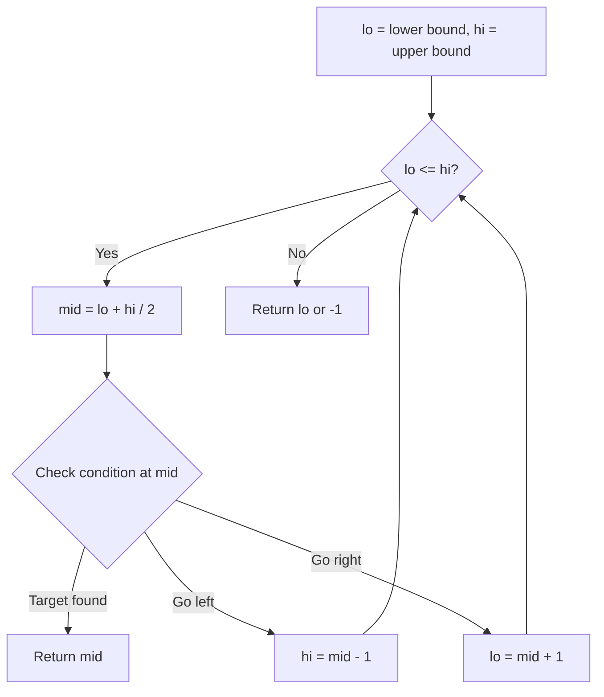
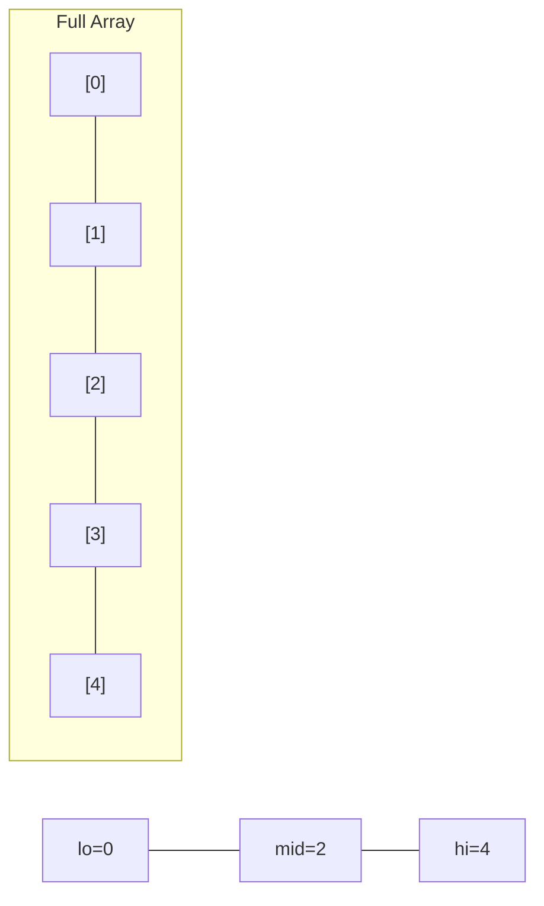
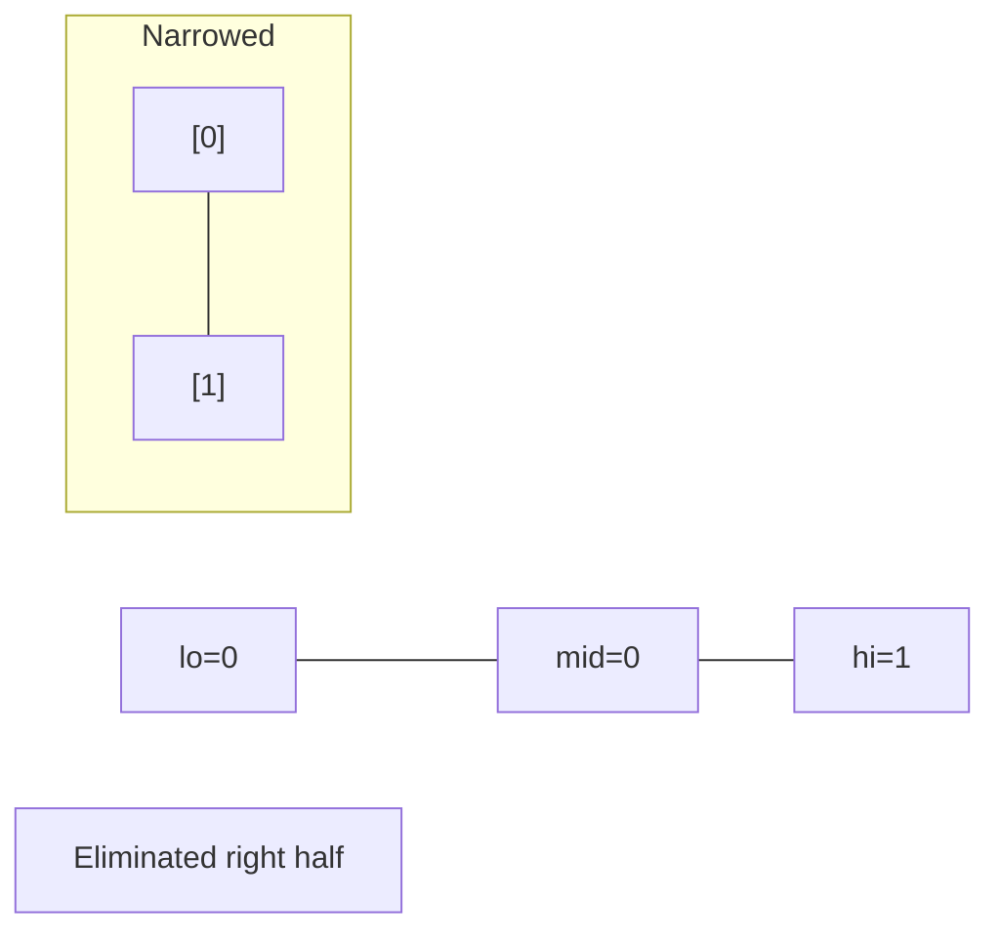
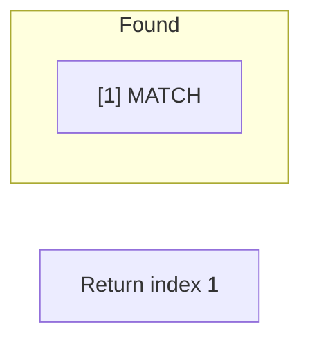

# Problem 668: Kth Smallest Number in Multiplication Table

**Difficulty:** Hard  
**Tags:** Math, Binary Search  
**Pattern:** Binary Search  
**Link:** [leetcode.com/problems/kth-smallest-number-in-multiplication-table](https://leetcode.com/problems/kth-smallest-number-in-multiplication-table/)

## Description

Nearly everyone has used the Multiplication Table. The multiplication table of size `m x n` is an integer matrix `mat` where `mat[i][j] == i * j` (**1-indexed**).

Given three integers `m`, `n`, and `k`, return *the *`k^th`* smallest element in the *`m x n`* multiplication table*.

 

Example 1:

```

**Input:** m = 3, n = 3, k = 5
**Output:** 3
**Explanation:** The 5th smallest number is 3.

```

Example 2:

```

**Input:** m = 2, n = 3, k = 6
**Output:** 6
**Explanation:** The 6th smallest number is 6.

```

 

**Constraints:**

	- `1 <= m, n <= 3 * 10^4`
	- `1 <= k <= m * n`

## Approach: Binary Search

Use binary search to halve the search space each iteration. Define the search range [lo, hi], compute mid, and decide which half to keep based on the problem's monotonic condition.

## Pseudocode

```
1. lo = lower_bound, hi = upper_bound
2. While lo <= hi (or lo < hi):
   a. mid = (lo + hi) // 2
   b. If condition(mid) is satisfied: record answer, search left half
   c. Else: search right half
3. Return answer
```

## Algorithm Flow



## Visual State Transitions

**Binary Search Step-by-Step:**

**Frame 1: Initial search space**


**Frame 2: Compare mid, narrow search**


**Frame 3: Found target**



## Complexity Analysis

- **Time:** O(log n)
- **Space:** O(1)

## Solution (Python3)

```python
class Solution:
    def findKthNumber(self, m: int, n: int, k: int) -> int:
        # Binary search - O(log n) time, O(1) space
        lo, hi = 0, len(m) - 1
        while lo <= hi:
            mid = lo + (hi - lo) // 2
            if m[mid] == n:
                return mid
            elif m[mid] < n:
                lo = mid + 1
            else:
                hi = mid - 1
        return 0
```

## Solution (C++)

```cpp
#include <string>
#include <vector>
using namespace std;

class Solution {
public:
    int findKthNumber(int m, int n, int k) {
        // Binary search - O(log n) time, O(1) space
        int lo = 0, hi = m.size() - 1;
        while (lo <= hi) {
            int mid = lo + (hi - lo) / 2;
            if (m[mid] == n) {
                return mid;
            } else if (m[mid] < n) {
                lo = mid + 1;
            } else {
                hi = mid - 1;
            }
        }
        return 0;
    }
};
```
