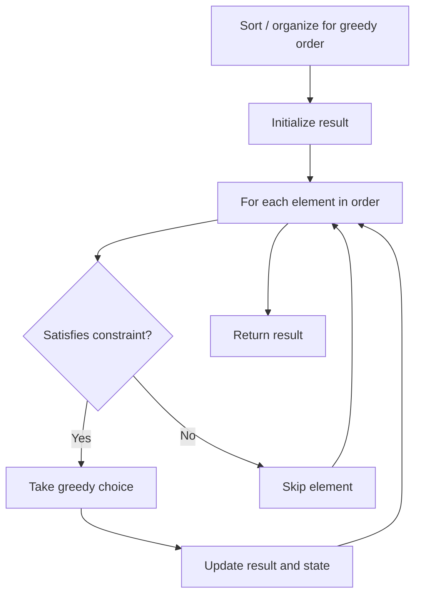

# Problem 670: Maximum Swap

**Difficulty:** Medium  
**Tags:** Math, Greedy  
**Pattern:** Greedy  
**Link:** [leetcode.com/problems/maximum-swap](https://leetcode.com/problems/maximum-swap/)

## Description

You are given an integer `num`. You can swap two digits at most once to get the maximum valued number.

Return *the maximum valued number you can get*.

 

Example 1:

```

**Input:** num = 2736
**Output:** 7236
**Explanation:** Swap the number 2 and the number 7.

```

Example 2:

```

**Input:** num = 9973
**Output:** 9973
**Explanation:** No swap.

```

 

**Constraints:**

	- `0 <= num <= 10^8`

## Approach: Greedy

Make the locally optimal choice at each step, trusting it leads to a global optimum. Greedy works when the problem has the greedy-choice property and optimal substructure.

## Pseudocode

```
1. Sort or organize data for greedy ordering
2. Initialize result
3. For each element in greedy order:
   a. If element satisfies constraint:
      - Take the greedy choice
      - Update result and state
4. Return result
```

## Algorithm Flow



## Complexity Analysis

- **Time:** O(n log n)
- **Space:** O(1)

## Solution (Python3)

```python
class Solution:
    def maximumSwap(self, num: int) -> int:
        # Greedy approach - O(n) time
        result = 0
        curr_max = 0
        for i in range(len(num)):
            if isinstance(num[i], int):
                curr_max = max(curr_max, num[i])
                result = max(result, curr_max)
            else:
                result += 1
        return result
```

## Solution (C++)

```cpp
#include <algorithm>
#include <string>
#include <vector>
using namespace std;

class Solution {
public:
    int maximumSwap(int num) {
        // Greedy approach - O(n) time
        int result = 0, curr_max = 0;
        for (int i = 0; i < (int)num.size(); i++) {
            curr_max = max(curr_max, num[i]);
            result = max(result, curr_max);
        }
        return result;
    }
};
```
