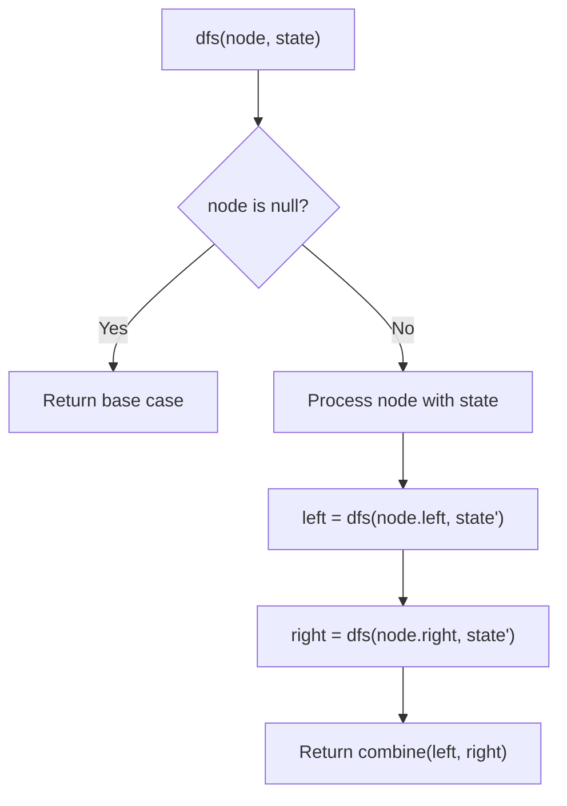
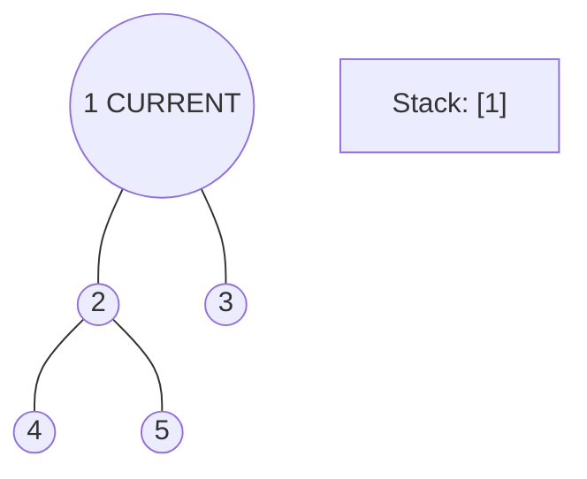
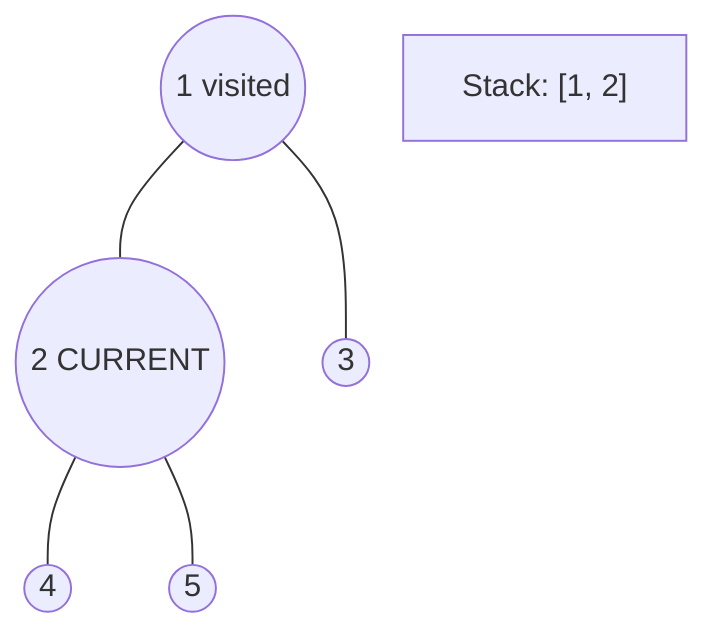
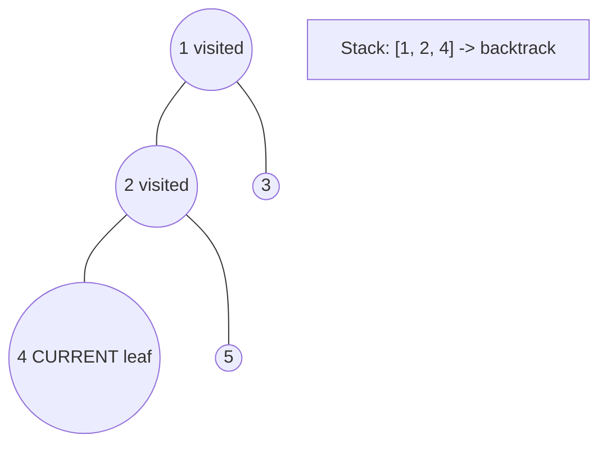
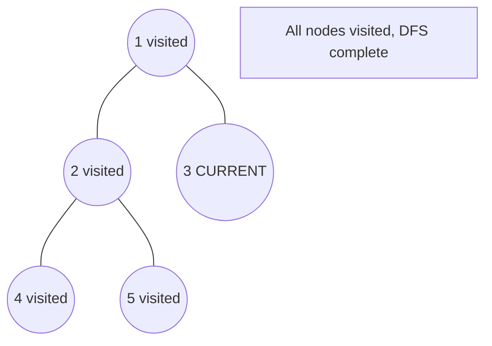

# Problem 671: Second Minimum Node In a Binary Tree

**Difficulty:** Easy  
**Tags:** Tree, Depth-First Search, Binary Tree  
**Pattern:** DFS Tree Traversal  
**Link:** [leetcode.com/problems/second-minimum-node-in-a-binary-tree](https://leetcode.com/problems/second-minimum-node-in-a-binary-tree/)

## Description

Given a non-empty special binary tree consisting of nodes with the non-negative value, where each node in this tree has exactly `two` or `zero` sub-node. If the node has two sub-nodes, then this node's value is the smaller value among its two sub-nodes. More formally, the property `root.val = min(root.left.val, root.right.val)` always holds.

Given such a binary tree, you need to output the **second minimum** value in the set made of all the nodes' value in the whole tree.

If no such second minimum value exists, output -1 instead.

 

 

Example 1:

```

**Input:** root = [2,2,5,null,null,5,7]
**Output:** 5
**Explanation:** The smallest value is 2, the second smallest value is 5.

```

Example 2:

```

**Input:** root = [2,2,2]
**Output:** -1
**Explanation:** The smallest value is 2, but there isn't any second smallest value.

```

 

**Constraints:**

	- The number of nodes in the tree is in the range `[1, 25]`.
	- `1 <= Node.val <= 2^31 - 1`
	- `root.val == min(root.left.val, root.right.val)` for each internal node of the tree.

## Approach: DFS Tree Traversal

Perform depth-first search on the tree. Recurse on left and right subtrees, combining results bottom-up. Track state (path, depth, sum) during traversal.

## Pseudocode

```
1. Define dfs(node, state):
   a. Base case: if null, return default
   b. Process node with current state
   c. left_result = dfs(node.left, updated_state)
   d. right_result = dfs(node.right, updated_state)
   e. Return combine(left_result, right_result)
2. Return dfs(root, initial_state)
```

## Algorithm Flow



## Visual State Transitions

**DFS Tree Traversal Step-by-Step:**

**Frame 1: Start at root**


**Frame 2: Go left - visit node 2**


**Frame 3: Go left - visit node 4 (leaf)**


**Frame 4: Backtrack, visit node 5, then node 3**



## Complexity Analysis

- **Time:** O(n)
- **Space:** O(h)

## Solution (Python3)

```python
class Solution:
    def findSecondMinimumValue(self, root: Optional[TreeNode]) -> int:
        # DFS on binary tree - O(n) time, O(h) space
        def dfs(node):
            if not node:
                return 0
            left = dfs(node.left)
            right = dfs(node.right)
            return 1 + max(left, right)
        
        result = dfs(root)
        return result
```

## Solution (C++)

```cpp
#include <algorithm>
#include <functional>
#include <string>
#include <vector>
using namespace std;

class Solution {
public:
    int findSecondMinimumValue(TreeNode* root) {
        // DFS on binary tree - O(n) time, O(h) space
        function<int(TreeNode*)> dfs = [&](TreeNode* node) -> int {
            if (!node) return 0;
            int left = dfs(node->left);
            int right = dfs(node->right);
            return 1 + max(left, right);
        };
        return dfs(root);
    }
};
```
