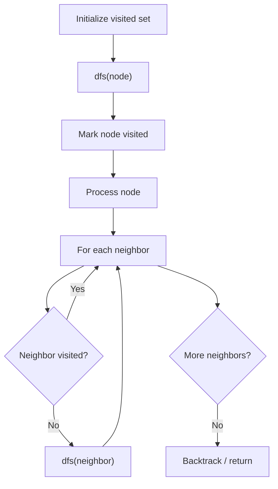

# Problem 672: Bulb Switcher II

**Difficulty:** Medium  
**Tags:** Math, Bit Manipulation, Depth-First Search, Breadth-First Search  
**Pattern:** DFS Graph Traversal  
**Link:** [leetcode.com/problems/bulb-switcher-ii](https://leetcode.com/problems/bulb-switcher-ii/)

## Description

There is a room with `n` bulbs labeled from `1` to `n` that all are turned on initially, and **four buttons** on the wall. Each of the four buttons has a different functionality where:

	- **Button 1:** Flips the status of all the bulbs.
	- **Button 2:** Flips the status of all the bulbs with even labels (i.e., `2, 4, ...`).
	- **Button 3:** Flips the status of all the bulbs with odd labels (i.e., `1, 3, ...`).
	- **Button 4:** Flips the status of all the bulbs with a label `j = 3k + 1` where `k = 0, 1, 2, ...` (i.e., `1, 4, 7, 10, ...`).

You must make **exactly** `presses` button presses in total. For each press, you may pick **any** of the four buttons to press.

Given the two integers `n` and `presses`, return *the number of **different possible statuses** after performing all *`presses`* button presses*.

 

Example 1:

```

**Input:** n = 1, presses = 1
**Output:** 2
**Explanation:** Status can be:
- [off] by pressing button 1
- [on] by pressing button 2

```

Example 2:

```

**Input:** n = 2, presses = 1
**Output:** 3
**Explanation:** Status can be:
- [off, off] by pressing button 1
- [on, off] by pressing button 2
- [off, on] by pressing button 3

```

Example 3:

```

**Input:** n = 3, presses = 1
**Output:** 4
**Explanation:** Status can be:
- [off, off, off] by pressing button 1
- [on, off, on] by pressing button 2
- [off, on, off] by pressing button 3
- [off, on, on] by pressing button 4

```

 

**Constraints:**

	- `1 <= n <= 1000`
	- `0 <= presses <= 1000`

## Approach: DFS Graph Traversal

Explore the graph depth-first using recursion or a stack. Mark nodes as visited to avoid cycles. Process each node and explore all unvisited neighbors.

## Pseudocode

```
1. Initialize visited set
2. Define dfs(node):
   a. Mark node as visited
   b. Process node
   c. For each neighbor of node:
      - If not visited: dfs(neighbor)
3. Call dfs(start) for each unvisited node
```

## Algorithm Flow



## Complexity Analysis

- **Time:** O(V + E)
- **Space:** O(V)

## Solution (Python3)

```python
class Solution:
    def flipLights(self, n: int, presses: int) -> int:
        # DFS on graph - O(V+E) time
        visited = set()
        result = []
        
        def dfs(node):
            if node in visited:
                return
            visited.add(node)
            result.append(node)
            # Traverse neighbors (adjust based on adjacency representation)
        
        dfs(0)
        return result if isinstance(0, list) else len(result)
```

## Solution (C++)

```cpp
#include <functional>
#include <string>
#include <vector>
using namespace std;

class Solution {
public:
    int flipLights(int n, int presses) {
        // DFS on graph - O(V+E) time
        vector<bool> visited(n.size(), false);
        vector<int> result;
        function<void(int)> dfs = [&](int node) {
            if (visited[node]) return;
            visited[node] = true;
            result.push_back(node);
            // Traverse neighbors
        };
        dfs(0);
        return result;
    }
};
```
