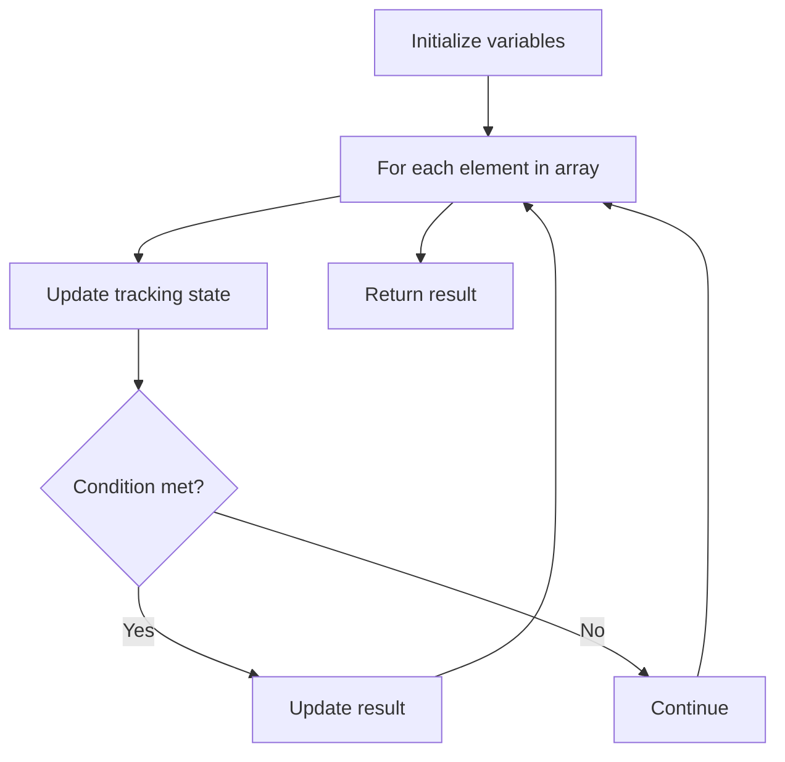

# Problem 674: Longest Continuous Increasing Subsequence

**Difficulty:** Easy  
**Tags:** Array  
**Pattern:** Array Processing  
**Link:** [leetcode.com/problems/longest-continuous-increasing-subsequence](https://leetcode.com/problems/longest-continuous-increasing-subsequence/)

## Description

Given an unsorted array of integers `nums`, return *the length of the longest **continuous increasing subsequence** (i.e. subarray)*. The subsequence must be **strictly** increasing.

A **continuous increasing subsequence** is defined by two indices `l` and `r` (`l < r`) such that it is `[nums[l], nums[l + 1], ..., nums[r - 1], nums[r]]` and for each `l <= i < r`, `nums[i] < nums[i + 1]`.

 

Example 1:

```

**Input:** nums = [1,3,5,4,7]
**Output:** 3
**Explanation:** The longest continuous increasing subsequence is [1,3,5] with length 3.
Even though [1,3,5,7] is an increasing subsequence, it is not continuous as elements 5 and 7 are separated by element
4.

```

Example 2:

```

**Input:** nums = [2,2,2,2,2]
**Output:** 1
**Explanation:** The longest continuous increasing subsequence is [2] with length 1. Note that it must be strictly
increasing.

```

 

**Constraints:**

	- `1 <= nums.length <= 10^4`
	- `-10^9 <= nums[i] <= 10^9`

## Approach: Array Processing

Process the array with a linear scan, tracking state variables. Look for patterns: running maximum/minimum, counting, or transformations.

## Pseudocode

```
1. Initialize tracking variables
2. Iterate through array:
   a. Update tracking state
   b. Check conditions
   c. Update result
3. Return result
```

## Algorithm Flow



## Complexity Analysis

- **Time:** O(n)
- **Space:** O(1)

## Solution (Python3)

```python
class Solution:
    def findLengthOfLCIS(self, nums: List[int]) -> int:
        # Array processing - O(n) time
        result = 0
        for i in range(len(nums)):
            # Process element
            pass
        return result
```

## Solution (C++)

```cpp
#include <string>
#include <vector>
using namespace std;

class Solution {
public:
    int findLengthOfLCIS(vector<int>& nums) {
        // Array processing - O(n) time
        for (int i = 0; i < (int)nums.size(); i++) {
            // Process element
        }
        return 0;
    }
};
```
