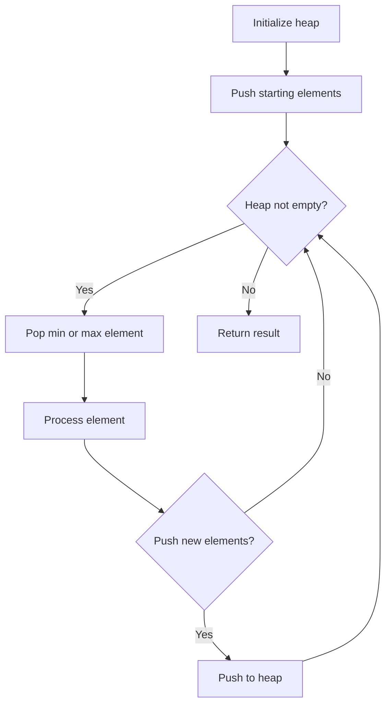
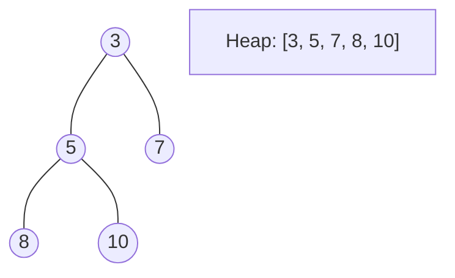
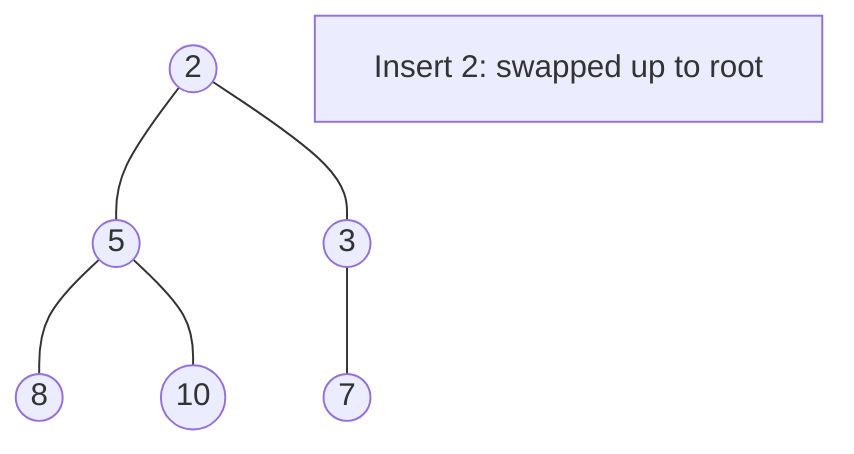
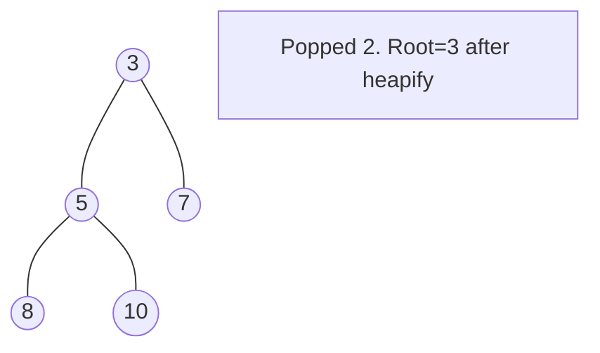

# Problem 675: Cut Off Trees for Golf Event

**Difficulty:** Hard  
**Tags:** Array, Breadth-First Search, Heap (Priority Queue), Matrix  
**Pattern:** Heap / Priority Queue  
**Link:** [leetcode.com/problems/cut-off-trees-for-golf-event](https://leetcode.com/problems/cut-off-trees-for-golf-event/)

## Description

You are asked to cut off all the trees in a forest for a golf event. The forest is represented as an `m x n` matrix. In this matrix:

	- `0` means the cell cannot be walked through.
	- `1` represents an empty cell that can be walked through.
	- A number greater than `1` represents a tree in a cell that can be walked through, and this number is the tree's height.

In one step, you can walk in any of the four directions: north, east, south, and west. If you are standing in a cell with a tree, you can choose whether to cut it off.

You must cut off the trees in order from shortest to tallest. When you cut off a tree, the value at its cell becomes `1` (an empty cell).

Starting from the point `(0, 0)`, return *the minimum steps you need to walk to cut off all the trees*. If you cannot cut off all the trees, return `-1`.

**Note:** The input is generated such that no two trees have the same height, and there is at least one tree needs to be cut off.

 

Example 1:

```

**Input:** forest = [[1,2,3],[0,0,4],[7,6,5]]
**Output:** 6
**Explanation:** Following the path above allows you to cut off the trees from shortest to tallest in 6 steps.

```

Example 2:

```

**Input:** forest = [[1,2,3],[0,0,0],[7,6,5]]
**Output:** -1
**Explanation:** The trees in the bottom row cannot be accessed as the middle row is blocked.

```

Example 3:

```

**Input:** forest = [[2,3,4],[0,0,5],[8,7,6]]
**Output:** 6
**Explanation:** You can follow the same path as Example 1 to cut off all the trees.
Note that you can cut off the first tree at (0, 0) before making any steps.

```

 

**Constraints:**

	- `m == forest.length`
	- `n == forest[i].length`
	- `1 <= m, n <= 50`
	- `0 <= forest[i][j] <= 10^9`
	- Heights of all trees are **distinct**.

## Approach: Heap / Priority Queue

Use a min-heap or max-heap to efficiently access the smallest/largest element. Push elements and pop the top to process in priority order.

## Pseudocode

```
1. Initialize heap (min or max)
2. Push initial elements onto heap
3. While heap not empty and condition:
   a. Pop top element (min or max)
   b. Process element
   c. Push new elements if needed
4. Return result
```

## Algorithm Flow



## Visual State Transitions

**Heap Operations (Min-Heap):**

**Frame 1: Initial heap**


**Frame 2: Insert 2 - bubble up**


**Frame 3: Pop minimum (2) - heapify down**



## Complexity Analysis

- **Time:** O(n log n)
- **Space:** O(n)

## Solution (Python3)

```python
class Solution:
    def cutOffTree(self, forest: List[List[int]]) -> int:
        # Heap/Priority Queue - O(n log k) time
        import heapq
        if not forest:
            return 0
        # Min heap (negate for max heap)
        heap = []
        for val in forest:
            heapq.heappush(heap, val)
            if len(heap) > (forest if isinstance(forest, int) else len(forest)):
                heapq.heappop(heap)
        return heap[0] if heap else 0
```

## Solution (C++)

```cpp
#include <queue>
#include <string>
#include <vector>
using namespace std;

class Solution {
public:
    int cutOffTree(vector<vector<int>>& forest) {
        // Heap/Priority Queue - O(n log k) time
        priority_queue<int, vector<int>, greater<int>> pq;
        for (int val : forest) {
            pq.push(val);
            if ((int)pq.size() > forest)
                pq.pop();
        }
        return pq.empty() ? 0 : pq.top();
    }
};
```
